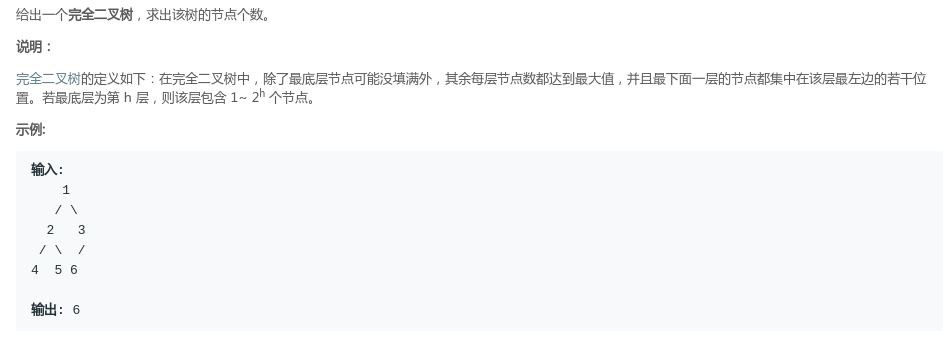
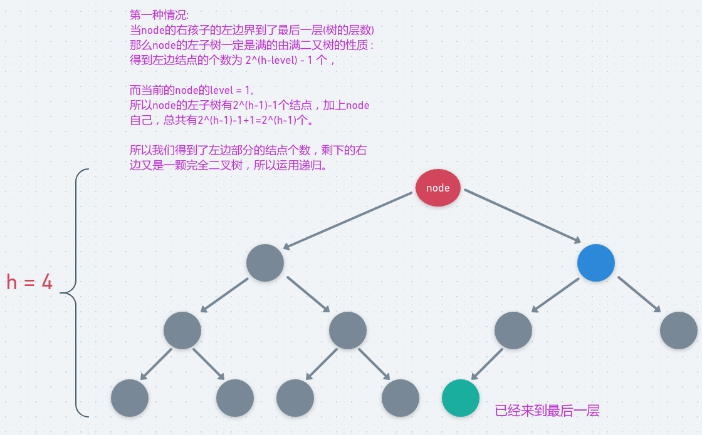
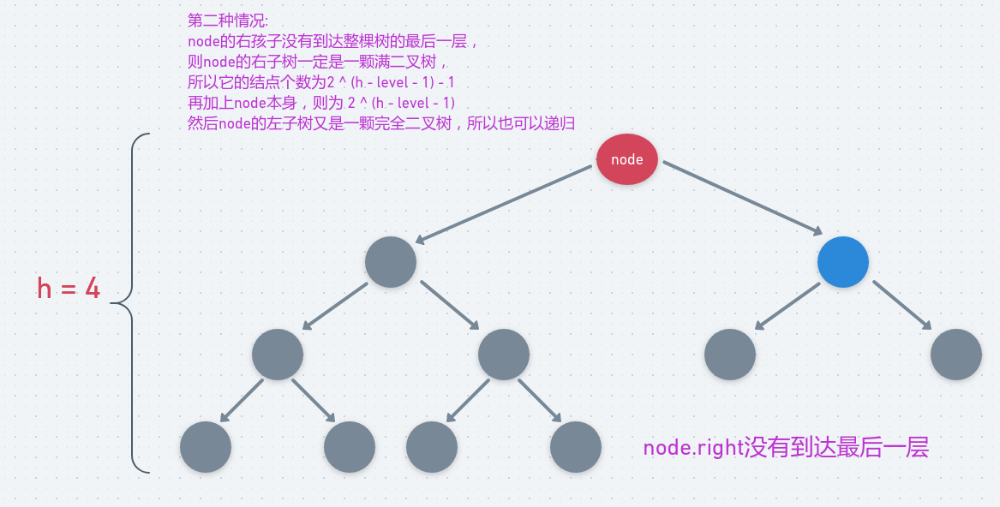

## LeetCode - 222. Count Complete Tree Nodes(统计完全二叉树的结点个数)
#### [题目链接](https://leetcode.com/problems/count-complete-tree-nodes/description/)

> https://leetcode.com/problems/count-complete-tree-nodes/description/

#### 题目


### 解析
 遍历整个二叉树的方法是不行的，因为时间复杂度要求小于`O(n)`。

 具体求法如下 :  

 - 先求树的高度，也就是看树的最左结点能到哪一层，层数记为`h`。
 - 然后下面求解要分两种情况，都是递归过程，`node`表示当前结点，`level`表示当前结点所在的层数(根节点为第一层)，`h`是整棵树的层数。

先看第一种情况 : 当`node`的右孩子的左边界到最后一层: 



再看第二种情况，这种情况是`node`的右子树没有来到最后一层 : 




所以经过上面的分析 ，可以写出下面的代码 :

```java
class Solution {
    public int countNodes(TreeNode root) {
        if(root == null)
            return 0;
        return ct(root,1,mostLeftLevel(root,1));
    }
    
    private int ct(TreeNode node, int level, int h) {
        if(level == h)     //叶子结点,只有一个结点
            return 1;
        
        if(mostLeftLevel(node.right,level + 1) == h)             //如果右孩子的最左边界到了最后一层
            return (1 << (h-level)) + ct(node.right,level+1,h);
        else
            return (1 << (h-level-1)) + ct(node.left,level+1,h);
    }

    //求某个结点最左边的层数
    private int mostLeftLevel(TreeNode node, int level) {
        while(node != null){
            level++;
            node = node.left;
        }
        return --level;
    }
}
```

稍微改动一下，不用记录层数，用下面的写法意思是一样的 : 

```java
class Solution {
    public int countNodes(TreeNode root) {
        if(root == null)
            return 0;
        int LH = mostLeftLevel(root.left);  //求出左结点 最左边高度
        int RH = mostLeftLevel(root.right); //求出右结点 最左边高度
        
        if(LH == RH){
            return (1 << LH) + countNodes(root.right);
        }else { //高度right = left - 1
            return (1 << RH) + countNodes(root.left);
        }
    }

    //求某个结点最左边的层数  递归
    private int mostLeftLevel(TreeNode node) {
        if(node == null)
            return 0;
        return mostLeftLevel(node.left) + 1;
    }
}
```

