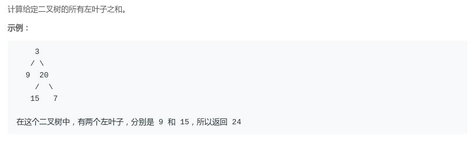
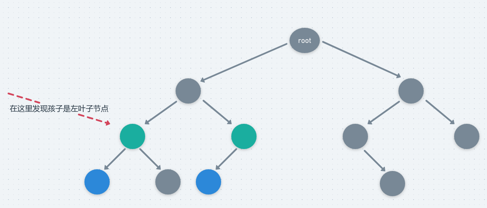

# LeetCode - 404. Sum of Left Leaves(左叶子结点之和)(递归和非递归)
 - 递归
 - 非递归

#### [题目链接](https://leetcode.com/problems/sum-of-left-leaves/description/)

> https://leetcode.com/problems/sum-of-left-leaves/description/

#### 题目

***
#### 递归
 - **当我们访问一个结点的时候，不是判断结点本身是不是左叶子结点(无法判断)，而是去判断它的左孩子是不是左叶子结点**。
 - 而以一个结点为头的左叶子结点的数量是它本身能不能发现左叶子结点，以及它的左右孩子总共得到的左叶子结点的数量之和。

图:



代码:


```java
class Solution {
    public int sumOfLeftLeaves(TreeNode root) {
        if (root == null)
            return 0;
        int sum = 0;
        if (root.left != null && root.left.left == null && root.left.right == null)
            sum = root.left.val;//检查左叶子结点
        return sum + sumOfLeftLeaves(root.left) + sumOfLeftLeaves(root.right);
    }
}
```
**如果一个结点它能检测到左叶子结点，那么它的左边一定只有一个，所以可以优化**。
```java
class Solution {
    public int sumOfLeftLeaves(TreeNode root) {
        if (root == null)
            return 0;
        int sum = 0;
        if (root.left != null) {
            if (root.left.left == null && root.left.right == null) {
                sum = root.left.val;
            } else {
                sum = sumOfLeftLeaves(root.left);
            }
        }
        return sum + sumOfLeftLeaves(root.right);
    }
}

```

**上面的方法是统计以访问的结点出发检测下面有没有叶子结点，这个方法是检测自己本身是不是左叶子，方法就是递归的时候，左边的孩子用一个`isLeft`标记`true`，然后只要同时满足`isLeft && node.right == null && node.left == null` 就可以判断是左叶子**。
```java
class Solution {
    
    private int sum;

    public int sumOfLeftLeaves(TreeNode root) {
        if (root == null) return 0;
        sum = 0;
        rec(root, false); //根不是叶子
        return sum;
    } 

    public void rec(TreeNode root, boolean isLeaf) {
        if (root == null) return;
        if (root.left == null && root.right == null && isLeaf) {
            sum += root.val;
            return;
        }
        rec(root.left, true);
        rec(root.right, false);
    }
}

```
***
### 非递归
非递归只是把访问改成了非递归，判断左叶子的逻辑没有变化。

前序访问: 
```java
class Solution {

    public int sumOfLeftLeaves(TreeNode root) {
        if (root == null) 
            return 0;
        int sum = 0;
        Stack<TreeNode> stack = new Stack<>();
        stack.push(root);
        TreeNode cur;
        while (!stack.isEmpty()) {
            cur = stack.pop();
            if (cur.left == null && cur.right == null) 
                continue;
            if (cur.left != null && cur.left.left == null && cur.left.right == null) 
                sum += cur.left.val;
            if (cur.right != null) 
                stack.push(cur.right);
            if (cur.left != null)
                stack.push(cur.left);
        }
        return sum;
    }
}

```
同样可以优化: 
```java
class Solution {

    public int sumOfLeftLeaves(TreeNode root) {
        if (root == null) return 0;
        int sum = 0;
        Stack<TreeNode> stack = new Stack<>();
        stack.push(root);
        TreeNode cur;
        while (!stack.isEmpty()) {
            cur = stack.pop();
            if (cur.right != null) {
                if (cur.right.left != null || cur.right.right != null) {
                    stack.push(cur.right);
                }
            }
            if (cur.left != null) {
                if (cur.left.left == null && cur.left.right == null) {
                    sum += cur.left.val;
                } else {
                    stack.push(cur.left);
                }
            }
        }
        return sum;
    }
}

```
