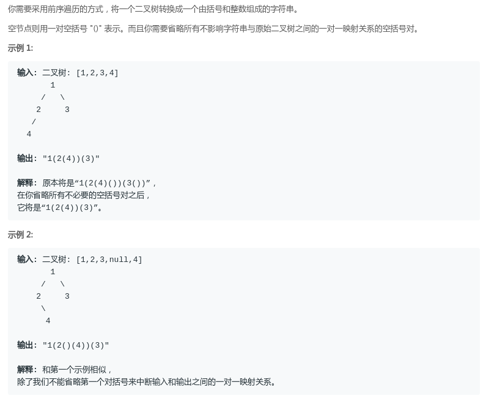
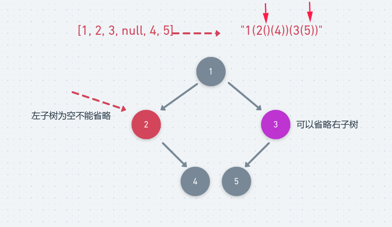

# LeetCode - 606. Construct String from Binary Tree(根据二叉树生成字符串)
* 递归解法
* 非递归解法

***
#### [题目链接](https://leetcode.com/problems/construct-string-from-binary-tree/)

> https://leetcode.com/problems/construct-string-from-binary-tree/

#### 题目

## 1、递归解法
注意这个题目的意思

* 如果结点`node`的左右子树为空，则可以省略空的括号`"()"`；
* 如果结点`node`的右子树为空，也可以省略右子树的括号`"()"`；
* **但是如果结点`node`的左子树为空就不能省略，因为如果省略就不能唯一的标识一颗二叉树** ；

递归做法比较简单，具体如下: 
* 对于当前结点，生成一个`String`类型的`res`变量，先加上自己结点的值；
* 如果左右子树都为`null`，直接返回`res`；
* 如果左子树不为空，则加上左子树，而且在加上左子树的时候，两边加上括号。如果左子树为空，则加上一对空的字符串；
* 右子树的如果不为空，就类似处理，**但是如果为空，不需要加上`"()"`**；

图:



代码:

```java
class Solution {
    public String tree2str(TreeNode t) {
        if (t == null)
            return "";
        String res = String.valueOf(t.val);
        if (t.left == null && t.right == null) //左右子树都为空的话可以省略
            return res;
        if (t.left != null) {
            res += "(";
            res += tree2str(t.left);
            res += ")";
        } else {   //注意左子树的括号不能省略
            res += "()";
        }
        if (t.right != null) {
            res += "(";
            res += tree2str(t.right);
            res += ")";
        } //else 右子树可以省略
        return res;
    }
}
```
显然使用`StringBuilder`可以加快速度。
```java
class Solution {
    
    public String tree2str(TreeNode t) {
        StringBuilder sb = new StringBuilder();
        helper(t, sb);
        return sb.toString();
    }

    private void helper(TreeNode node, StringBuilder sb) {
        if (node == null) {
            sb.append("");
            return;
        }
        sb.append(String.valueOf(node.val));
        if (node.left == null && node.right == null)// case 1
            return;
        if (node.right == null) {// case 2
            sb.append("(");
            helper(node.left, sb);
            sb.append(")");
            return;
        }
        // general case
        sb.append("(");
        helper(node.left, sb);
        sb.append(")(");
        helper(node.right, sb);
        sb.append(")");
    }
}
```

## 2、非递归解法
非递归写法稍微有一点特殊。

* 不能只是单纯的每次`pop()`掉栈里面的东西，因为后面还要加上一个右括号`")"`；

* 要访问一个结点两次，这里使用一个类似`vis`数组的`set`集合来记录之前是否已经访问过了一次这个结点；

* 如果是第一次访问就`append("(")`和结点的`val`，并且进行相应的子结点的判断；

* 子结点判断还是类似递归的做法，如果是左右结点都为空，直接不需要处理。否则，因为是前序，压栈的时候先处理右子树，对于右子树，只要不空就压栈，因为右子树如果为空也不需要加上多余的`"()"`，而左子树需要特殊处理，因为左子树为空的时候，我们需要加上`"()"`；

* 如果是第二次访问，我们就可以填上右括号了，然后那个结点也没用了，所以可以弹出来了；

* **最后记得去除根结点对应的左右括号，然后返回结果**；

代码:

```java
class Solution {
    public String tree2str(TreeNode t) {
        if (t == null)
            return "";
        StringBuilder sb = new StringBuilder();
        Stack<TreeNode> stack = new Stack<>();
        HashSet<TreeNode> set = new HashSet<>();
        stack.push(t);
        TreeNode cur = null;
        while (!stack.isEmpty()) {
            cur = stack.peek();
            if (set.contains(cur)) {
                sb.append(")");//第二次来到这里
                stack.pop();
            } else {// 第一次 !set.contains(cur)
                set.add(cur);//设置已经访问了
                sb.append("(" + cur.val);
                if (cur.left == null && cur.right == null)
                    continue;
                //前序先处理右子树，后处理左子树

                //right   这里注意如果right == null也不要额外的 sb.append("()"); 因为可以省略
                if (cur.right != null)
                    stack.push(cur.right);
                //left
                if (cur.left == null)
                    sb.append("()");//这个要加上
                else
                    stack.push(cur.left);
            }
        }
        //最后要去除根结点的左右两个括号
        return sb.substring(1, sb.length() - 1).toString();//注意 substring(s,e)取的是[s,e)之间的字符串
    }
}
```

