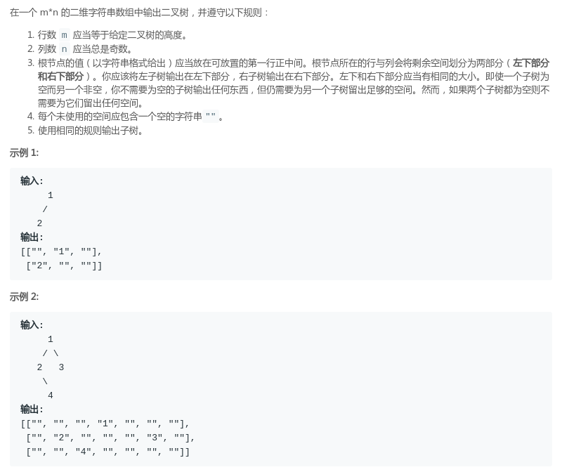
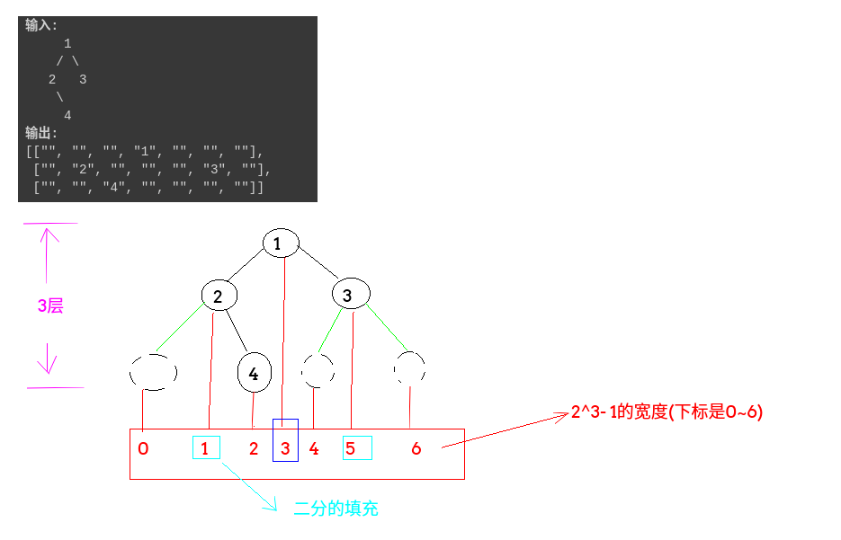

## LeetCode - 655. Print Binary Tree(按照字符矩阵的形式打印二叉树)(二分和递归)
#### [题目链接](https://leetcode.com/problems/print-binary-tree/description/)

> https://leetcode.com/problems/print-binary-tree/description/

#### 题目

#### 解析
找出对应的下标，然后二分递归遍历填充，先求出高度`h`，然后求出宽度为**w = 2<sup>h</sup>-1**，然后填充一个`h`行`w`列的字符矩阵即可，上下递归和左右二分夹杂在一起的感觉。具体看下图: 

图:



图:

```java
class Solution {

    private List<List<String>> res;

    public List<List<String>> printTree(TreeNode root) {
        res = new ArrayList<>();
        int h = height(root);
        int w = (1 << h) - 1;
        List<String> temp = new ArrayList<>();
        for (int i = 0; i < w; i++) temp.add("");
        for (int i = 0; i < h; i++)
            res.add(new ArrayList<>(temp)); //这个不能直接写成temp必须要写成new ArrayList
        rec(root, 0, 0, w - 1); 
        return res;
    }

    public void rec(TreeNode root, int level, int l, int r) {
        if (root == null) return;
        int m = l + (r - l) / 2;
        res.get(level).set(m, String.valueOf(root.val));
        rec(root.left, level + 1, l, m - 1);
        rec(root.right, level + 1, m + 1, r);
    }
    
    public int height(TreeNode root) {
        if (root == null)
            return 0;
        return Math.max(height(root.left), height(root.right)) + 1;
    }
}
```
或者使用二维字符矩阵:  
```java
class Solution {

    private String[][] str;

    public List<List<String>> printTree(TreeNode root) {
        int height = height(root);
        str = new String[height][(1 << height) - 1];
        for (String[] arr : str)
            Arrays.fill(arr, "");

        rec(root, 0, 0, str[0].length);

        List<List<String>> res = new ArrayList<>();
        for (String[] arr : str)
            res.add(Arrays.asList(arr)); //asList()将一个数组转换成容器
        return res;
    }

    public void rec(TreeNode root, int level, int l, int r) {
        if (root == null)
            return;
        int m = l + (r - l) / 2;
        str[level][m] = "" + root.val;
        rec(root.left, level + 1, l, m - 1);
        rec(root.right, level + 1, m + 1, r);
    }

    public int height(TreeNode root) {
        if (root == null)
            return 0;
        return Math.max(height(root.left), height(root.right)) + 1;
    }
}
```
