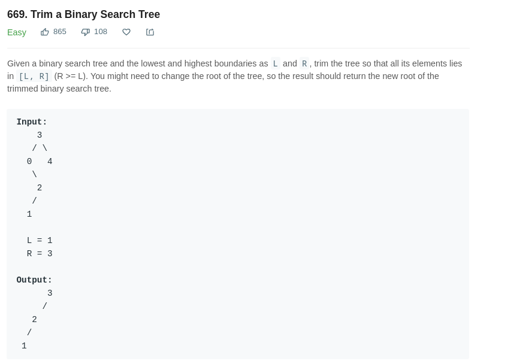
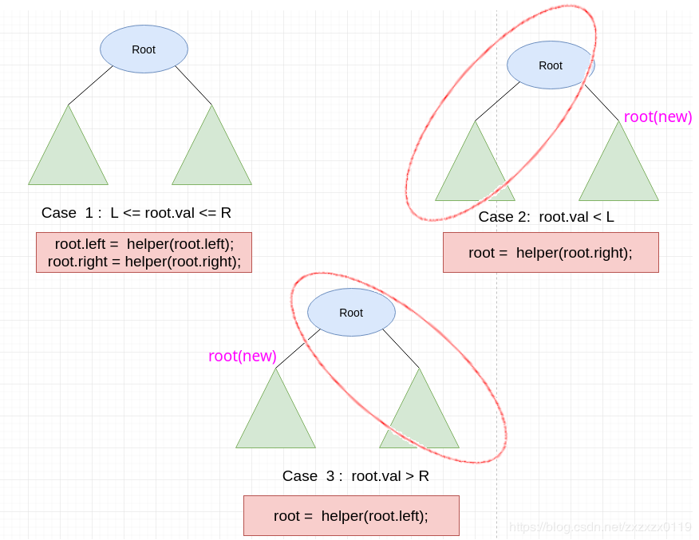

## LeetCode - 669. Trim a Binary Search Tree(删除搜索树中不在`[L，R]`范围内的节点)

* 递归
* 非递归

***

#### [题目链接](https://leetcode.com/problems/trim-a-binary-search-tree/)

> https://leetcode.com/problems/trim-a-binary-search-tree/

#### 题目


***
####  递归解法
递归解法的思路利用了二叉搜索树的性质，即<font color = red>左子树<根<右子树</font>。
递归函数递归到当前节点，有三种情况: 
* 第一种情况: `L <= node.val <= R`，则不需要将当前节点删除，只需要递归去调用函数删除左右子树即可；
* 第二种情况: `node.val < L`，则左边子树和当前节点都要删掉，此时用`node.right`顶替`node`即可；
* 第三种情况: `node.val > R`，则右边子树和当前节点都要删掉，此时用`node.left`顶替`node`即可；



```java
class Solution {
    public TreeNode trimBST(TreeNode root, int L, int R) {
        return helper(root, L, R);
    }
    private TreeNode helper(TreeNode node, int L, int R){
        if(node == null)
            return null;
        if(node.val >= L && node.val <= R){ // itself shouldn't be trimed, just go recursive to it's child
            node.left = helper(node.left, L, R);
            node.right = helper(node.right, L, R);
        }
        else if(node.val < L)              // itself and it's sub-left-node should be trimed
            node = helper(node.right, L, R);
        else                               // itself and it's sub-right-node should be trimed
            node = helper(node.left, L, R);
        return node;
    }
}
```

***
#### 非递归解法
非递归解法也很明了。

* 先判断三种特殊情况：①传入节点为`null`②`root.val < L`且右子树为`null`③`root.val > R`且左子树为`null`，<font color = blue>这三种情况都返回`null`即可；
* 判断完之后，找到第一个不需要删除的节点(迭代找)，如果没有找到，就一直迭代找，如果一开始就有，就跳过了这一步；
* 然后从这个不需要删除的节点开始，分成两步，分别删除它的左右孩子即可，删除的过程也是用替代的方式；
```java
class Solution {
    public TreeNode trimBST(TreeNode root, int L, int R) {
        // 1. three special situation should be judged
        if(root == null)
            return null;
        if(root.val < L && root.right == null)
            return null;
        if(root.val > R && root.left == null)
            return null;
        
        // 2. find a appropriate value to return 
        while(root.val < L || root.val > R){  // be careful, this is 'while' instead of 'if'
            if(root.val < L)
                root = root.right;
            else 
                root = root.left;
        }
        TreeNode p = root;
        
        // 3. Remove the invalid value from the left sub-tree
        while(p != null){
            while(p.left != null && p.left.val < L)// use it's right to replace 
                p.left = p.left.right;
            p = p.left;
        }
        
        p = root;
        // Remove the invalid value from the right sub-tree
        while(p != null){
            while(p.right != null && p.right.val > R)// use it's left to replace 
                p.right = p.right.left;
            p = p.right;
        }
        return root;
    }
}
```
***
其他代码:

`C++`:

```cpp
class Solution {
public:
    TreeNode* trimBST(TreeNode* root, int L, int R) {
        if(!root)
            return nullptr;
        if(root->val < L)
            return trimBST(root->right, L, R);
        if(root->val > R)
            return trimBST(root->left, L, R);
        root->left = trimBST(root->left, L, R);
        root->right = trimBST(root->right, L, R);
        return root;
    }
};
```

```cpp
class Solution {
public:
    TreeNode* trimBST(TreeNode* root, int L, int R) {
        if(!root)
            return nullptr;
        if(root->val < L && !root->right)
            return nullptr;
        if(root->val > R && !root->left)
            return nullptr;
        
        
        while(root->val < L || root->val > R){
            if(root->val < L)
                root = root->right;
            else
                root = root->left;
        }
        
        TreeNode* p = root;
        while(p != nullptr){
            while(p->left != nullptr && p->left->val < L)
                p->left = p->left->right;
            p = p->left;
        }
        
        p = root;
        while(p != nullptr){
            while(p->right != nullptr && p->right->val > R)
                p->right = p->right->left;
            p = p->right;
        }
        return root;
    }
};
```

`Python`:

```python
class Solution:
    def trimBST(self, root, L, R):
        if root is None:
            return None
        l_res = self.trimBST(root.left, L, R)
        r_res = self.trimBST(root.right, L, R)
        if L <= root.val <= R:
            root.left = l_res
            root.right = r_res
        elif root.val < L:
            root = r_res
        else:
            root = l_res
        return root
```

```python
class Solution:
    def trimBST(self, root, L, R):
        if root is None:
            return None
        if root.val < L and root.right is None:
            return None
        if root.val > R and root.left is None:
            return None
        
        while root.val < L or root.val > R:
            if root.val < L:
                root = root.right
            else:
                root = root.left

        p = root
        while p is not None:
            while p.left is not None and p.left.val < L:
                p.left = p.left.right
            p = p.left
        p = root
        while p is not None:
            while p.right is not None and p.right.val > R:
                p.right = p.right.left
            p = p.right
        return root
```

