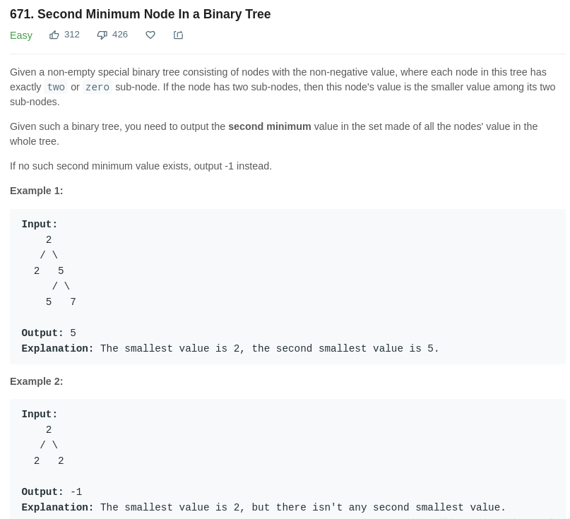
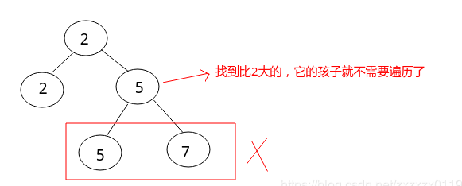

# LeetCode - 671. Second Minimum Node In a Binary Tree(寻找二叉树中第二小的结点)
* 非递归
* 递归

***
#### [题目链接](https://leetcode.com/problems/second-minimum-node-in-a-binary-tree/)

> https://leetcode.com/problems/second-minimum-node-in-a-binary-tree/

#### 题目



### 1、非递归

* 使用一个变量`min`来记录比`root.val`大的数，而且这个数将会是这些比`root.val`大的数中的最小的数；
* 直接使用`BFS`遍历即可，但是这个题目有个性质，这可以让我们优化这个题目，**即任意一个结点的孩子结点都不会小于这个结点，所以，当我们取到某个结点，这个结点比`root.val`大的时候，我们不需要将这个结点加入到队列中并去遍历它的孩子结点了，而是直接跳过即可**。

图:




`Java`代码: 

```java
class Solution {
    public int findSecondMinimumValue(TreeNode root) {
        if(root == null)
            return -1;
        Queue<TreeNode>queue = new LinkedList<>();
        queue.add(root);
        int min = Integer.MAX_VALUE;
        while(!queue.isEmpty()){
            TreeNode top = queue.poll();
            if(top.val > root.val && top.val < min){
                min = top.val;
                continue; // Optimization,Needn't to add sub-node to queue
            }
            if(top.left == null)  // special tree 
                continue;
            queue.add(top.left);
            queue.add(top.right);
        }
        if(min != Integer.MAX_VALUE)
            return min;
        return -1;
    }    
}
```

***
## 2、递归

* 递归的方式也很简单，先判断边界条件，然后当当前遍历结点`node`， 如果当前`node.val > root.val `直接返回`node.val`；
* 否则，先递归求出左右子树的答案，返回的是左右子树中的最小的结果(如果只有一边满足的话，就返回这一边)；


`Java`代码: 


```java
class Solution {
    public int findSecondMinimumValue(TreeNode root) {
        return dfs(root, root.val);
    }    
    private int dfs(TreeNode node,int rootVal){
        if(node == null)
            return -1;
        if(node.val > rootVal)
            return node.val;   //Needn't to visit sub-node, itself is the second-largest
        int L = dfs(node.left, rootVal);
        int R = dfs(node.right,rootVal);
        if(L == -1)
            return R;
        if(R == -1)
            return L;
        return Math.min(L,R);
    }
}
```

***
其他代码: 

`C++`: 

```cpp
class Solution {
public:
    int findSecondMinimumValue(TreeNode* root) {
        if(!root)
            return -1;
        queue<TreeNode*>q;
        int min = INT_MAX; // second-min
        q.push(root);
        while(!q.empty()){
            TreeNode* now = q.front();
            q.pop();
            if(now->val > root->val && now->val < min){
                min = now->val;
                continue;
            }
            if(!now->left)
                continue;
            q.push(now->left);
            q.push(now->right);
        }
        if(min == INT_MAX)
            return -1;
        return min;
    }
};

```

```cpp
class Solution {
public:
    int findSecondMinimumValue(TreeNode* root) {
        return dfs(root, root->val);        
    }
private:
    int dfs(TreeNode* root, int rootVal){
        if(!root)
            return -1;
        if(root->val > rootVal)
            return root->val;
        int L = dfs(root->left, rootVal);
        int R = dfs(root->right, rootVal);
        if(L == -1)
            return R;
        if(R == -1)
            return L;
        return min(L, R); // maybe -1
    }
};
```


`Python`: 

```python
from queue import Queue

class Solution:
    def findSecondMinimumValue(self, root):
        if root is None:
            return -1
        q = Queue()
        q.put(root)
        minn = float('inf')
        while not q.empty():
            node = q.get()
            if root.val < node.val < minn:
                minn = node.val
                continue
            if not node.left:
                continue
            q.put(node.left)
            q.put(node.right)
        if minn == float('inf'):
            return -1
        return minn
        
```

```python
class Solution:

    def findSecondMinimumValue(self, root):
        return self.dfs(root, root.val)

    def dfs(self, node, root_val):
        if not node:
            return -1
        if node.val > root_val:
            return node.val
        l_res = self.dfs(node.left, root_val)
        r_res = self.dfs(node.right, root_val)
        if l_res == -1:
            return r_res
        if r_res == -1:
            return l_res
        return min(l_res, r_res)
```

