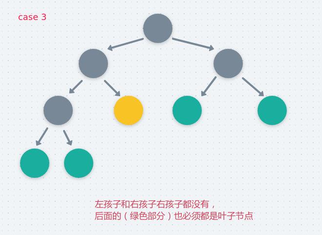

# LeetCode - 98. Validate Binary Search Tree(判断是不是一颗二叉搜索树以及判断完全二叉树)

 - LeetCode - 98. Validate Binary Search Tree (判断一颗二叉树是不是一颗二叉搜索树)
 - 判断一颗二叉树是不是一颗完全二叉树
 - 完整测试代码

***


## 1、LeetCode - 98. Validate Binary Search Tree (判断一颗二叉树是不是一颗二叉搜索树)
#### [题目链接](https://leetcode.com/problems/validate-binary-search-tree/)

> https://leetcode.com/problems/validate-binary-search-tree/

#### 题目


 首先要知道什么是二叉搜索树(二叉排序树)(二叉查找树) : 

 - 任意节点的左子树不空，则左子树上**所有**结点的值均小于它的根结点的值；
 - 任意节点的右子树不空，则右子树上**所有**结点的值均大于它的根结点的值;
 - 任意节点的左、右子树也分别为二叉搜索树；
 - 一般没有键值相等的节点。

例如下面的树就是一颗二叉搜索树 : 


怎么判断一颗二叉树是不是搜索二叉树呢? 其实很简单，只要这颗二叉树的**中序遍历的顺序是升序的**，那么就是一颗二叉搜索树，因为中序遍历的顺序是　**左->中->右**　，所以当中序遍历升序的时候，就有**左<中<右**，所以就可以判断。

```java
class Solution {
    public boolean isValidBST(TreeNode root) {
        if (root == null) return true;
        Stack<TreeNode> stack = new Stack<>();
        TreeNode cur = root;
        TreeNode pre = null;
        while (!stack.isEmpty() || cur != null) {
            if (cur != null) {
                stack.push(cur);
                cur = cur.left;
            } else {
                cur = stack.pop();
                if (pre != null && cur.val <= pre.val)
                    return false;
                pre = cur;
                cur = cur.right;
            }
        }
        return true;
    }
}
```

代码中使用的是非递归的中序遍历，不懂的可以看[**这个博客**](https://github.com/ZXZxin/ZXBlog/blob/master/%E6%95%B0%E6%8D%AE%E7%BB%93%E6%9E%84%E7%AE%97%E6%B3%95/Tree/%E4%BA%8C%E5%8F%89%E6%A0%91%E7%9A%84%E5%90%84%E7%A7%8D%E6%93%8D%E4%BD%9C(%E9%80%92%E5%BD%92%E5%92%8C%E9%9D%9E%E9%80%92%E5%BD%92%E9%81%8D%E5%8E%86%2C%E6%A0%91%E6%B7%B1%E5%BA%A6%2C%E7%BB%93%E7%82%B9%E4%B8%AA%E6%95%B0%E7%AD%89%E7%AD%89).md#1%E9%80%92%E5%BD%92%E4%B8%AD%E5%BA%8F)。

当然也可以使用中序的递归，记录一个全局的`pre`变量：

```java
class Solution {
    private TreeNode pre;
    public boolean isValidBST(TreeNode root) {
        if(root == null)
            return true;
        pre = null;
        return inOrder(root);
    }
    
    private boolean inOrder(TreeNode node){
        if(node == null)
            return true;
        if(!inOrder(node.left))
            return false;
        if(pre != null && node.val <= pre.val)
            return false;
        pre = node;
        if(!inOrder(node.right))
            return false;
        return true;
    }
}
```

还有一种解法就是利用左右两边的`min`和`max`: 

* 递归函数有三个值，当前结点`node`，`node`在中序遍历中的前一个结点`pre`的值`min`，`node`在中序遍历中的后一个节点`next`的值`max`；
* 在递归的过程中，先判断当前的结点是否满足`min < node.val && node.val < max`，如果不满足就返回`false`；
* 判断完之后，还要判断孩子是否满足；

图:

```java
class Solution {
    public boolean isValidBST(TreeNode root) {
        if(root == null)
            return true;
        return helper(root,null,null);
    }
    
    //min、max 也可以看做是 pre、next  就是root的前一个、后一个
    private boolean helper(TreeNode node,Integer min,Integer max){
        if(node == null)
            return true;
        //先判断自己
        if( (min != null && node.val <= min) || (max != null && node.val >= max) )
           return false;
        // 判断左孩子
        if( !helper(node.left,min,node.val))
           return false;
        //判断右孩子
        if( !helper(node.right,node.val,max))
           return false;
        return true;
    }
}
```

这里还需要注意当`node = Integer.MIN_VALUE`或者`Integer.MAX_VALUE`这两个值的影响。

***
## 2、判断一颗二叉树是不是一颗完全二叉树

 首先知道什么是完全二叉树:

 - 完全二叉树是由满二叉树(一个二叉树，如果每一个层的结点数都达到最大值，则这个二叉树就是满二叉树。即如果一个二叉树的层数为`K`，且结点总数是(2<sup>k</sup>) -1</font> ，则它就是满二叉树)而引出来的。对于深度为`K`的，有`n`个结点的二叉树，当且仅当其每一个结点都与深度为`K`的满二叉树中编号从`1`至`n`的结点一一对应时称之为完全二叉树。
 - 若设二叉树的深度为`h`，除第 `h` 层外，其它各层 `(1～h-1) `的结点数都达到最大个数，第` h` 层所有的结点都连续**集中在最左边**，这就是完全二叉树。
 - 或者说: 一棵二叉树至多只有最下面的一层上的结点的**度数**可以小于`2`，并且最下层上的结点都集中在该层最左边的若干位置上，而在最后一层上，右边的若干结点缺失的二叉树，则此二叉树成为完全二叉树。

 那么如何判断一棵二叉树是否为完全二叉树呢? 按照下面的标准 : 

 - **按照**层次遍历**的顺序遍历二叉树，每一层从左到右；**
 - **如果当前结点有右孩子但没有左孩子，直接返回`false`；**
 - 如果当前结点**不是左右孩子都全**(包括两种情况)，那之后的结点必须都为叶节点，否则返回`false`；
 - **遍历过程中如果没有返回`false`，就返回`true`；**

怎么理解上面的过程呢? 图。

 - 如果当前结点有右孩子但没有左孩子，按照完全二叉树的定义，不符合，如下面的情况:

<div align="center"></div><br>

 - 当前结点不是左右孩子都全包括两种情况(前面的那种已经判断了)，第一，有左孩子没有右孩子，那么后面的结点必须全部为叶子结点，如果出现非叶子结点，就返回`false`。如下：

<div align="center"></div><br>

第二种情况就是左右孩子都没有，也要开启判断后面的结点必须全部都是叶子结点的过程，如下：

<div align="center"></div><br>

所以综上，我们就可以写出代码，使用层次遍历，用一个`bool`型变量`leaf`记录是否遇到了左右孩子是不是不全的情况(这时就开始判断后面的结点是不是叶子结点)，代码如下 : 

```java
public class Main {

    //判断一棵二叉树是不是完全二叉树
    static boolean isCBT(TreeNode root) {
        if (root == null)
            return true;
        Queue<TreeNode> queue = new LinkedList<>();
        boolean leaf = false; //如果碰到了 某个结点孩子不全就开始　判断是不是叶子这个过程
        queue.add(root);
        TreeNode top = null, L = null, R = null;
        while (!queue.isEmpty()) {
            top = queue.poll();
            L = top.left;
            R = top.right;
            //第一种情况
            if ((R != null && L == null))
                return false;
            //第二种情况  开启了判断叶子的过程 而且又不是叶子 就返回false
            if (leaf && (L != null || R != null)) //以后的结点必须是 左右孩子都是null
                return false;
            if (L != null)
                queue.add(L);
            //准确的说是　只要孩子不全就开启leaf，
            //但是前面已经否定了有右无左的情况，这里只要判断一下右孩子是不是为空就可以了(如果为空就开启leaf)
            if (R != null)
                queue.add(R);
            else
                leaf = true;
        }
        return true;
    }
}
```


## 3、完整测试代码

测试样例是上面的例子

```java
import java.util.LinkedList;
import java.util.Queue;
import java.util.Stack;

/**
 * 判断一棵二叉树是否为搜索二叉树
 * 判断一棵二叉树是否为完全二叉树
 */
public class IsBSTAndCBT {

    static class TreeNode{
        public int val;
        public TreeNode left;
        public TreeNode right;

        public TreeNode(int value) {
            this.val = value;
        }
    }

    static boolean isBST(TreeNode root){
        if(root == null)
            return true;
        Stack<TreeNode>stack = new Stack<>();
        TreeNode cur = root;
        TreeNode pre = null;
        while(!stack.isEmpty() || cur != null){
            if(cur != null){
                stack.push(cur);
                cur = cur.left;
            }else {
                cur = stack.pop();
                if(pre != null && cur.val <= pre.val)
                    return false;
                pre = cur;
                cur = cur.right;
            }
        }
        return true;
    }

    //判断一棵二叉树是不是完全二叉树
    static boolean isCBT(TreeNode root){
        if(root == null)
            return true;
        Queue<TreeNode>queue = new LinkedList<>();
        boolean leaf = false; //如果碰到了 某个结点孩子不全就开始　判断是不是叶子这个过程
        queue.add(root);
        TreeNode top = null,L = null,R = null;
        while(!queue.isEmpty()){
            top = queue.poll();
            L = top.left;  R = top.right;
            //第一种情况
            if((R != null && L == null))
                return false;
            //第二种情况  开启了判断叶子的过程 而且又不是叶子 就返回false
            if(leaf && (L != null || R != null)) //以后的结点必须是 左右孩子都是null
                return false;

            if(L != null)
                queue.add(L);

            //准确的说是　只要孩子不全就开启leaf，
            //但是前面已经否定了有右无左的情况，这里只要判断一下右孩子是不是为空就可以了(如果为空就开启leaf)
            if(R != null)
                queue.add(R);
            else
                leaf = true;
        }
        return true;
    }


    public static void main(String[] args) {

        System.out.println("===============test for BST================");
        System.out.println("---------test1--------------");
        TreeNode head = new TreeNode(1);
        System.out.println(isBST(head));//true

        System.out.println("---------test2--------------");
        head = new TreeNode(2);
        head.left = new TreeNode(1);
        head.right = new TreeNode(3);
        System.out.println(isBST(head));//true

        System.out.println("---------test3--------------");
        head = new TreeNode(2);
        head.left = new TreeNode(1);
        head.right = new TreeNode(0);
        System.out.println(isBST(head));//false

        System.out.println("---------test4(for example)--------------");
        head = new TreeNode(5);
        head.left = new TreeNode(3);
        head.left.left = new TreeNode(2);
        head.left.right = new TreeNode(4);
        head.left.left.left = new TreeNode(1);
        head.right = new TreeNode(8);
        head.right.left = new TreeNode(6);
        head.right.left.right = new TreeNode(7);
        head.right.right = new TreeNode(10);
        head.right.right.left = new TreeNode(9);
        System.out.println(isBST(head));

        System.out.println();

        System.out.println("===============test for CBT================");
        head = new TreeNode(1);
        head.left = new TreeNode(2);
        head.left.left = new TreeNode(4);
        head.left.right = new TreeNode(5);
        head.left.left.left = new TreeNode(8);
        head.left.left.right = new TreeNode(9);
        head.left.right.right = new TreeNode(10); //false
        head.right = new TreeNode(3);
        head.right.left = new TreeNode(6);
        head.right.right = new TreeNode(7);
        System.out.println(isCBT(head));

        head = new TreeNode(1);
        head.left = new TreeNode(2);
        head.left.left = new TreeNode(4);
        head.left.right = new TreeNode(5);
        head.left.left.left = new TreeNode(8);
        head.left.left.right = new TreeNode(9);
        head.left.right.left = new TreeNode(10); //true
        head.right = new TreeNode(3);
        head.right.left = new TreeNode(6);
        head.right.right = new TreeNode(7);
        System.out.println(isCBT(head));

        head = new TreeNode(1);
        head.left = new TreeNode(2);
        head.left.left = new TreeNode(4);
        head.left.right = new TreeNode(5);
        head.left.left.left = new TreeNode(8);
        head.left.left.right = new TreeNode(9);
       // head.left.right.left = new TreeNode(10); //true
        head.right = new TreeNode(3);
        head.right.left = new TreeNode(6);
        head.right.right = new TreeNode(7);
        System.out.println(isCBT(head));
    }
}

```

运行结果

