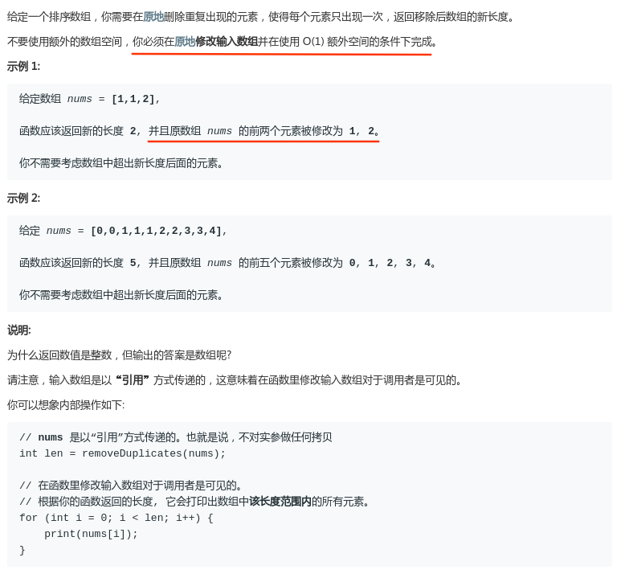
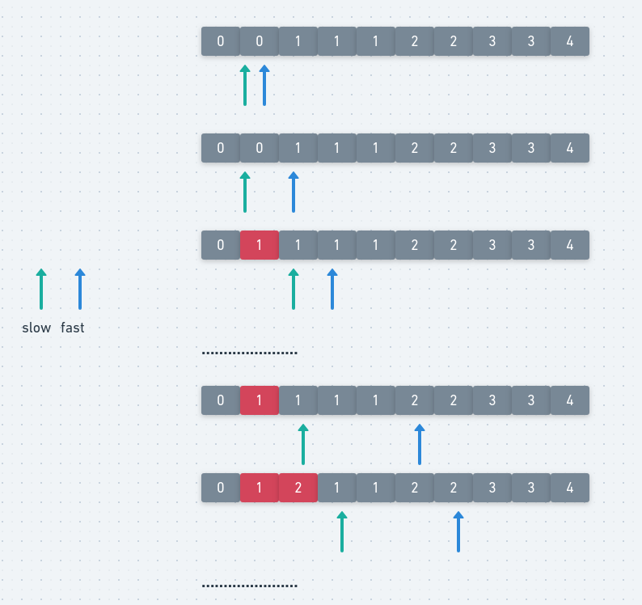

# LeetCode - 26. Remove Duplicates from Sorted Array

#### [题目链接](https://leetcode-cn.com/problems/remove-duplicates-from-sorted-array/)

> https://leetcode-cn.com/problems/remove-duplicates-from-sorted-array/

#### 题目



### 解析

比较简单的双指针问题。走在前面的指针负责判断当前元素是否重复(`nums[i] == nums[i-1]`)，走在后面的指针记录每次需要将前面的指针的不重复的数放的位置。



代码:

```java
class Solution {

    // 返回修改后的数组，并且要修改数组
    public int removeDuplicates(int[] nums) {
        if (nums == null || nums.length == 0) return 0;
        if (nums.length == 1) return 1;
        int slow = 1; // 第一个指针first,第二个second
        for (int fast = 1; fast < nums.length; fast++) {
            if (nums[fast] != nums[fast - 1]) {
                nums[slow++] = nums[fast];
            }
        }
        return slow;
    }
}
```

