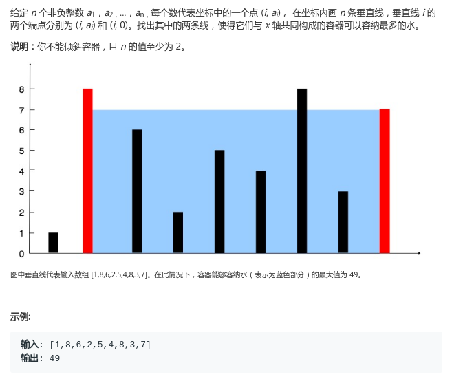
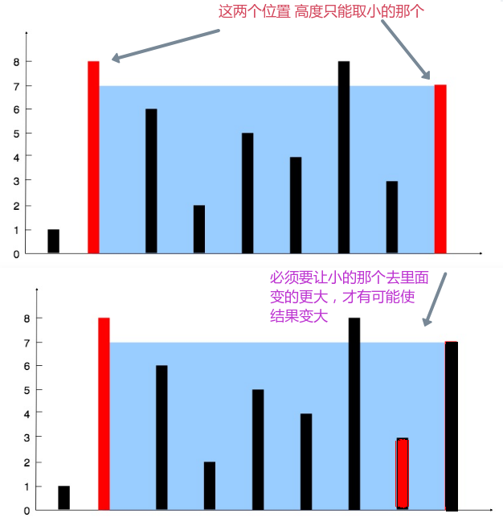

# LeetCode - 11. Container With Most Water

#### [题目链接](https://leetcode.com/problems/container-with-most-water/)

> https://leetcode.com/problems/container-with-most-water/

#### 题目



### 解析

暴力解法，没什么好说的。。

```java
class Solution {
    public int maxArea(int[] height) {
        int res = 0;
        for (int i = 0; i < height.length; i++) {
            for (int j = i + 1; j < height.length; j++) {
                res = Math.max(res, Math.min(height[i], height[j]) * (j - i));
            }
        }
        return res;
    }
}
```
高效的解法是使用双指针。

使用双指针的原因: **两线段之间形成的区域的高总是会受到其中较短那条高的长度的限制。而且，两线段距离越远，得到的面积就越大**。

做法，**一个指针在开头，一个在末尾**。然后两个指针比较，并不断靠拢即可。

<div align="center"></div><br>

代码: 

```java
class Solution {
    public int maxArea(int[] height) {
        int L = 0, R = height.length - 1;
        int max = 0;
        while(L < R){
            // 底是 (R - L), 高只能取height[L]和height[R]中小的那一个
            max = Math.max(max, Math.min(height[L], height[R]) * (R - L));
            // 因为从两边往中间靠，所以只有当小的那一方变大，才有可能让结果变大
            if(height[L] < height[R])
                L++;
            else
                R--;
        }
        return max;
    }
}
```

