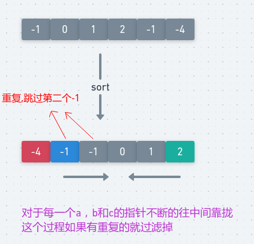

# LeetCode - 15. 3Sum

#### [题目链接](https://leetcode.com/problems/3sum/)

> https://leetcode.com/problems/3sum/

#### 题目


## 解析

两种做法。一种和**LeetCode - 1. Two Sum**一样。另一种是使用双指针。


第一种写法，和**LeetCode - 1. Two Sum**类似的，那个题目是找到两个数的和为`target`。

这里的做法是:

* 枚举每个不重复的`a`(把`a`看做第一题的`target`)，然后去寻找另外的两个数的和`b+c == -a`即可；
* 这个过程主要的麻烦在于去重，为此我们先对数组排序，然后`if(i != 0 && nums[i] == nums[i-1]) continue`对`a`去重；
* 然后每次找到一个结果之后，还需要对`b`去重，具体看代码；

图(图是没有sort之前的，sort只是为了去重，和这个算法没有关系): 

<div align="center"></div><br>
代码:

```java
class Solution {

    public List<List<Integer>> threeSum(int[] nums) {
        List<List<Integer>> res = new ArrayList<>();
        Arrays.sort(nums); // 必须先排序
        for(int i = 0; i < nums.length; i++){
            if(i != 0 && nums[i] == nums[i-1]) continue; // 不处理重复的a
            int a = nums[i];
            HashMap<Integer, Integer> map = new HashMap<>();
            for(int j = i+1; j < nums.length; j++){
                int b = nums[j];
                int c = -a - b;
                if(map.containsKey(c)) {
                    res.add(Arrays.asList(a, b, c));
                    while(j + 1 < nums.length && nums[j] == nums[j+1]) j++; // 不处理重复的b
                }
                map.put(nums[j], j);
            }
        }
        return res;
    }
}
```


第二种做法是使用`Two Pointer`。

* 也是先要对数组排序，这个排序和上面的意义不同，这里排序既要为了去重，更重要的是为了我们的双指针算法；
* 对于每一个`a`，我们设定两个指针`L、R`，L是`a`的后面一个元素，`R`是数组最后的元素；
* 每次我们累加`a + nums[L] + nums[R] `，如果`==0`，就统计答案，并且`L++, R++`，这个过程还需要去除重复的`b、c`；如果`!=0`，就按照大小移动`L`或者`R`即可；

图:

<div align="center"></div><br>
代码:

```java
class Solution {

    public List<List<Integer>> threeSum(int[] nums) {
        List<List<Integer>> res = new ArrayList<>();
        Arrays.sort(nums); // 必须先排序
        for(int i = 0; i < nums.length ; i++){
            if(i != 0 && nums[i] == nums[i-1]) continue; // 不处理重复的a
            int L = i + 1, R = nums.length - 1;
            while(L < R){
                if(nums[i] + nums[L] + nums[R] == 0){
                    res.add(Arrays.asList(nums[i], nums[L], nums[R]));
                    while(L < R && nums[L] == nums[L+1]) L++;//去重
                    while(L < R && nums[R] == nums[R-1]) R--;//去重
                    L++; R--;
                }else if(nums[i] + nums[L] + nums[R] < 0){//增加b
                    L++;
                }else {  // > 0  减小c
                    R--;
                }
            }
        }
        return res;
    }
}
```

