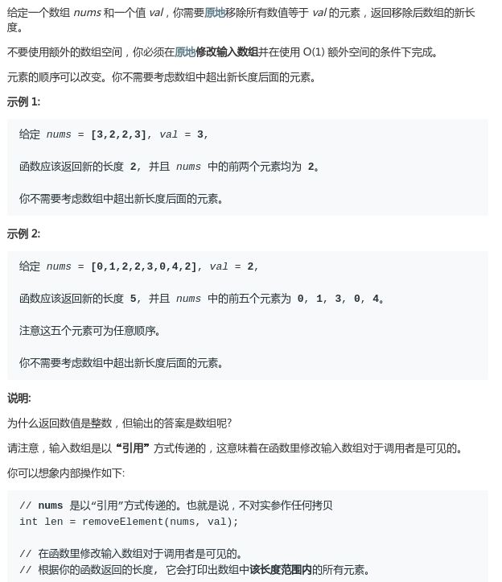

# LeetCode - 27. Remove Element

#### [题目链接](https://leetcode.com/problems/remove-element/)

> https://leetcode.com/problems/remove-element/

#### 题目



### 解析

和上一题(`LeetCode-26`)基本差不多，思想是一样的(双指针)，只不过注意一开始都要从索引`0`开始。具体可以参考上一题，过于简单就不画图了(上一题画图了)。

代码:

```java
class Solution {
    public int removeElement(int[] nums, int val) {
        if(nums == null || nums.length == 0) return 0;
        int slow = 0; // 注意初始不是1了
        for(int f = 0; f < nums.length; f++) if(nums[f] != val){
            nums[slow++] = nums[f];
        }
        return slow;
    }
}
```

