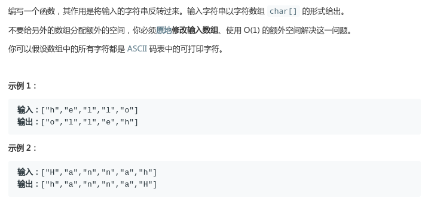

# LeetCode - 344. Reverse String

#### [题目链接](https://leetcode.com/problems/reverse-string/)

> https://leetcode.com/problems/reverse-string/

#### 题目



## 解析

巨简单题。。

```java
class Solution {

    public void reverseString(char[] s) {
        for(int i = 0; i < s.length/2; i++){
            char c = s[i];
            s[i] = s[s.length - 1 - i];
            s[s.length - 1 - i] = c;
        }
    }  
}
```

```java
class Solution {
    public void reverseString(char[] s) {
        for(int l = 0, r = s.length - 1; l < r; l++, r--){
            char c = s[l];
            s[l] = s[r];
            s[r] = c;
        }
    }
}
```

