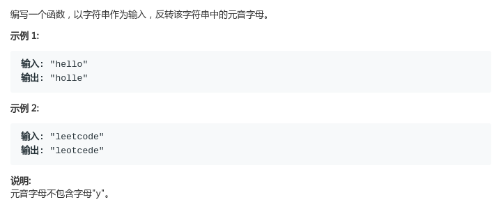
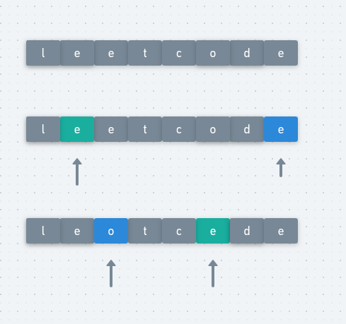

# LeetCode - 345. Reverse Vowels of a String

#### [题目链接](https://leetcode.com/problems/reverse-vowels-of-a-string/)

> https://leetcode.com/problems/reverse-vowels-of-a-string/

#### 题目



## 解析

也比较简单，还是双指针，两边都是元音字母的时候才交换。

<div align="center"></div><br>

代码:

```java
class Solution {

    public boolean isU(char c) {
        return c == 'a' || c == 'o' || c == 'e' || c == 'u' || c == 'i'
                || c == 'A' || c == 'O' || c == 'E' || c == 'U' || c == 'I';
    }
    public String reverseVowels(String s) {
        char[] chs = s.toCharArray();
        for (int l = 0, r = chs.length - 1; l < r; ) {
            while (l < r && !isU(chs[l])) l++;
            while (l < r && !isU(chs[r])) r--;
            char t = chs[l];
            chs[l] = chs[r];
            chs[r] = t;
            l++;
            r--;
        }
        return String.valueOf(chs);
    }
}
```

