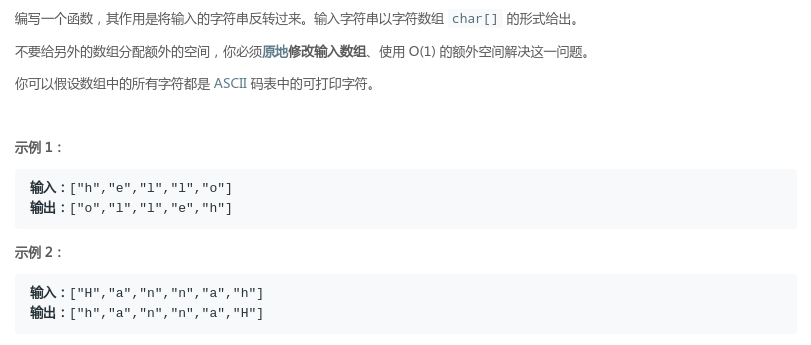
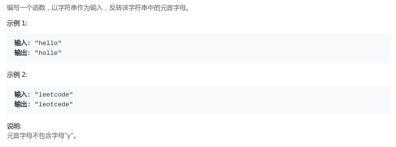
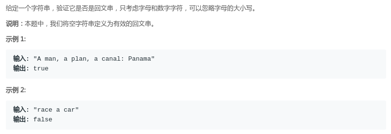
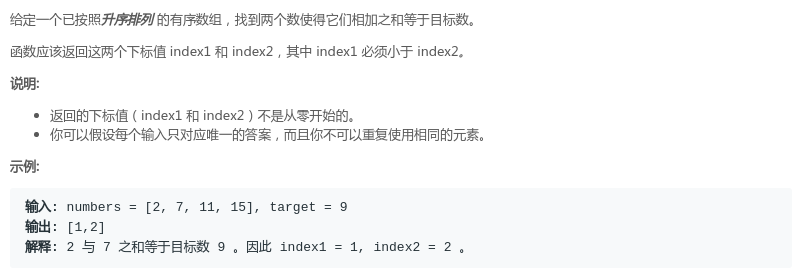
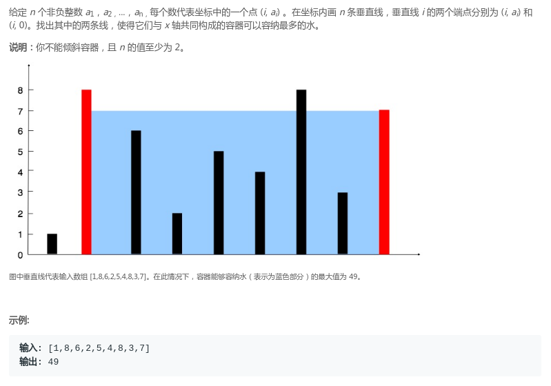

## LeetCode - 双指针题小总结-(LeetCode344、LeetCode345、LeetCode125、LeetCode167、LeetCode11)(简单题)

 - [LeetCode - 344. Reverse String-反转字符串](#leetcode---344-reverse-string-反转字符串)
 - [LeetCode - 345. Reverse Vowels of a String-反转字符串中的元音字母](#leetcode---345-reverse-vowels-of-a-string-反转字符串中的元音字母)
 - [LeetCode - 125. Valid Palindrome-验证回文串](#leetcode---125-valid-palindrome-验证回文串)
 - [LeetCode - 167. Two Sum II - Input array is sorted-两数之和 II - 输入有序数组](#leetcode---167-two-sum-ii---input-array-is-sorted-两数之和-ii---输入有序数组)
 - [LeetCode - 11. Container With Most Water-盛最多水的容器](#leetcode---11-container-with-most-water-盛最多水的容器)

***
### LeetCode - 344. Reverse String-反转字符串
#### [题目链接](https://leetcode.com/problems/reverse-string/description/)

> https://leetcode.com/problems/reverse-string/description/

#### 题目

#### 解析
两种做法: 

 - 可以使用下标的对应关系，调换`i`和`(len - 1 - i)`的位置；
 - 也可以使用两个指针`l`、`r`，分别指向数组的开始和结尾，然后两个指针不停的交换对应的字符，并逐渐向中间移动；

```java
class Solution {
    public void reverseString(char[] s) {
        for(int l = 0, r = s.length-1; l < r; l++, r--){
            char tc = s[l];
            s[l] = s[r];
            s[r] = tc;
        }
    }
}
```

```java
class Solution {
    public void reverseString(char[] s) {
        int n = s.length;
        for(int i = 0; i < n/2; i++){
            char tc = s[i];
            s[i] = s[n - i - 1];
            s[n - i - 1] = tc;
        }
    }
}
```

***
### LeetCode - 345. Reverse Vowels of a String-反转字符串中的元音字母
#### [题目链接](https://leetcode.com/problems/reverse-vowels-of-a-string/description/)

> https://leetcode.com/problems/reverse-vowels-of-a-string/description/

#### 题目

#### 解析
也是使用两个指针扫描，从两边到中间扫: 

 - 只要其中一个不是元音字母，那个指针就往中间移动，继续下一次循环；
 - 只有两个都是元音字母，才交换位置；

```java
class Solution {

    public boolean isU(char c) {
        return c == 'a' || c == 'o' || c == 'e' || c == 'u' || c == 'i'
                || c == 'A' || c == 'O' || c == 'E' || c == 'U' || c == 'I';
    }

    public String reverseVowels(String s) {
        char[] str = s.toCharArray();
        for (int l = 0, r = str.length - 1; l < r; ) {
            if (!isU(str[l])) {
                l++;
                continue;
            }
            if (!isU(str[r])) {
                r--;
                continue;
            }
            if (isU(str[l]) && isU(str[r])) {
                char t = str[l];
                str[l] = str[r];
                str[r] = t;
                l++;
                r--;
            }
        }
        return String.valueOf(str);
    }
}
```
***
### LeetCode - 125. Valid Palindrome-验证回文串
#### [题目链接](https://leetcode.com/problems/valid-palindrome/description/)
> https://leetcode.com/problems/valid-palindrome/description/

#### 题目


#### 解析
也是使用双指针，过程和上面的类似，不过要处理一下大小写和数字的问题；
```java
class Solution {
    
    public boolean isC(char c) {
        return Character.isLetter(c);
    }

    public boolean isD(char c) {
        return Character.isDigit(c);
    }

    public boolean ok(char lc, char rc) {
        return (isD(lc) && isD(rc) && lc == rc) ||
                (isC(lc) && isC(rc) && Character.toLowerCase(lc) == Character.toLowerCase(rc));
    }


    public boolean isPalindrome(String s) {

        boolean flag = true;
        char[] str = s.toCharArray();
        for (int l = 0, r = str.length - 1; l <= r; ) {
            if (!isC(str[l]) && !isD(str[l])) {
                l++;
                continue;

            }
            if (!isC(str[r]) && !isD(str[r])) {
                r--;
                continue;
            }
            if (ok(str[l], str[r])) {
                l++;
                r--;
            } else {
                flag = false;
                break;
            }
        }
        return flag;
    }
}
```

或者更加简单的写法: 

```java
class Solution {

    public boolean isLD(char c) {
        return Character.isLetterOrDigit(c);
    }

    public boolean isPalindrome(String s) {
        s = s.toLowerCase();

        char[] str = s.toCharArray();

        for (int l = 0, r = str.length - 1; l <= r; ) {
            if (!isLD(str[l]))
                l++;
            else if (!isLD(str[r]))
                r--;
            else if (str[l] != str[r])
                return false;
            else {
                l++;
                r--;
            }
        }
        return true;
    }
}
```
***
### LeetCode - 167. Two Sum II - Input array is sorted-两数之和 II - 输入有序数组
#### [题目链接](https://leetcode.com/problems/two-sum-ii-input-array-is-sorted/description/)

> https://leetcode.com/problems/two-sum-ii-input-array-is-sorted/description/

#### 题目

#### 解析
两种做法： 

 - 对于每一个`arr[i]`，在后面的有序数组中二分查找有没有可以匹配的，时间复杂度`n * logn`；
 - 使用双指针，因为是有序的，所以可以通过比较大小决定哪个指针的移动，时间复杂度` n` ；

```java
class Solution {
    //n * logn
    public int[] twoSum(int[] numbers, int target) {
        for (int i = 0; i < numbers.length; i++) {
            // binary search
            int L = i + 1, R = numbers.length - 1;
            while (L <= R) {
                int mid = L + (R - L) / 2;
                if (numbers[mid] + numbers[i] == target)
                    return new int[]{i + 1, mid + 1};
                else if (numbers[mid] + numbers[i] < target)
                    L = mid + 1;
                else
                    R = mid - 1;
            }

        }
        return null;
    }
}
```
双指针: 

```java
class Solution {
    public int[] twoSum(int[] numbers, int target) {
        for (int l = 0, r = numbers.length - 1; l < r; ) {
            if (numbers[l] + numbers[r] == target)
                return new int[]{l + 1, r + 1};
            else if (numbers[l] + numbers[r] < target)
                l++;
            else
                r--;
        }
        return null;
    }
}
```
***
### LeetCode - 11. Container With Most Water-盛最多水的容器
#### [题目链接](https://leetcode.com/problems/container-with-most-water/description/)

> https://leetcode.com/problems/container-with-most-water/description/

#### 题目

#### 解析
这种方法背后的思路在于，**两线段之间形成的区域总是会受到其中较短那条长度的限制。此外，两线段距离越远，得到的面积就越大**。

使用双指针: 

 - 两个指针从两边开始出发，遍历的过程中使用一个变量`max`记录最大值；
 - 因为`x`轴方向每两个之间的宽度是相同的，所以向中间移动的时候，要选择高度更小的那个向中间移动；

```java
class Solution {
    public int maxArea(int[] height) {
        int max = 0;
        for (int l = 0, r = height.length - 1; l < r; ) {
            if (max < (r - l) * (Math.min(height[l], height[r]))) {
                max = (r - l) * (Math.min(height[l], height[r]));
            }
            if (height[l] > height[r])
                r--;
            else
                l++;
        }
        return max;
    }
}
```
