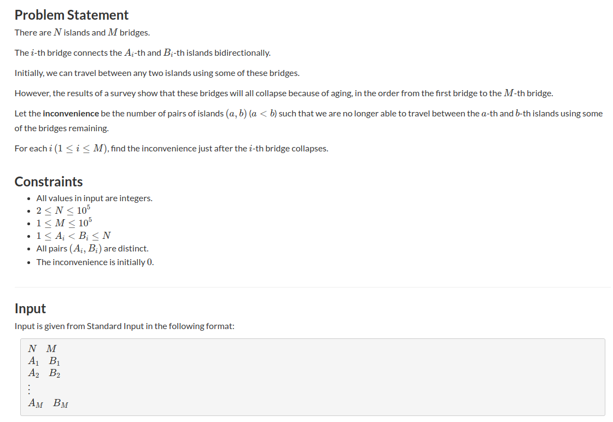

## AtCoder Beginner Contest 120 - D. Decayed(并查集大小(不是rank))

#### [题目链接](https://atcoder.jp/contests/abc120/tasks/abc120_d)

> https://atcoder.jp/contests/abc120/tasks/abc120_d

#### 题目

给你`n`个点、`m`条边，生成了一个无向图。

接下来，这`m`条边将会从`0 ~ m-1`的顺序逐渐的消失，问你每次消失一条边之后，这个图中有多少对点`<v1, v2>`是不能相互到达的。




#### 解析

这题肯定要想到并查集，如果不用并查集，时间复杂度会很高。

用并查集每次来寻找两个在不在同一个集合中。但是这个并查集是基于每一个集合会维护一个`size`，表示这个集合的`size`。

我们的思路是从`m-1 ~ 0`的方向做。

当我们去掉`m`条边之后，不能相互到达的数目肯定是`n * (n-1) / 2`；

然后相当于每次从`m-1 ~ 0`不断的加上一条边，每次加上一条边我们就要合并边对应的两个顶点的集合。

然后`cur`要减去当前边的两个顶点的两个集合的数量之积。

具体自己推敲一下。注意最后一个就不要加入`res`了。

代码:

```java
import java.io.*;
import java.util.*;

public class Main {

    static PrintStream out = System.out;

    static int[] parent;
    static int[] sz;     // sz[i]表示以i为根的集合中元素个数

    static int findRoot(int p) {
        while (p != parent[p]) {
            parent[p] = parent[parent[p]];
            p = parent[p];
        }
        return p;
    }

    static void union(int a, int b) {
        int aRoot = findRoot(a);
        int bRoot = findRoot(b);
        if (aRoot == bRoot)
            return;
        /**
         * 根据两个元素所在树的元素个数不同判断合并方向, 将元素个数少的集合合并到元素个数多的集合上
         */
        if (sz[aRoot] < sz[bRoot]) {
            parent[aRoot] = bRoot;
            sz[bRoot] += sz[aRoot];
            sz[aRoot] = sz[bRoot];//可要可不要
        } else {
            parent[bRoot] = aRoot;
            sz[aRoot] += sz[bRoot];
            sz[bRoot] = sz[aRoot];//可要可不要
        }
    }

    static int n, m;

    static void solve(Scanner in) {
        n = in.nextInt();
        m = in.nextInt();
        parent = new int[n + 1];
        sz = new int[n + 1];
        /** 初始化, 每一个parent[i]指向自己, 表示每一个元素自己自成一个集合 */
        for (int i = 1; i <= n; i++) {
            parent[i] = i;
            sz[i] = 1;
        }
        int[] a = new int[m+1];
        int[] b = new int[m+1];
        for(int i = 0; i < m; i++){
            a[i] = in.nextInt();
            b[i] = in.nextInt();
        }

        long cur = ((long)n * (long)(n-1)) / 2L;//所有的边都去掉之后的不能相互到达的点的对数

        long[] res = new long[m+1];
        int p = m;
        res[p--] = cur;
        for(int i = m - 1; i >= 0; i--){
            int aR = findRoot(a[i]);
            int bR = findRoot(b[i]);
            if(aR == bR ){ //如果 a[i]和b[i]已经在同一个集合了，则不需要-了
                res[p--] = cur;
                continue;
            }
            cur -= (long)sz[aR] * (long)sz[bR];
            res[p--] = cur;
            union(a[i], b[i]);
        }
        for(int i = 1; i <= m; i++) out.println(res[i]);//注意没有要最后一个res[0]
    }

    public static void main(String[] args) {
        Scanner in = new Scanner(new BufferedInputStream(System.in));
        solve(in);
    }
}
```

