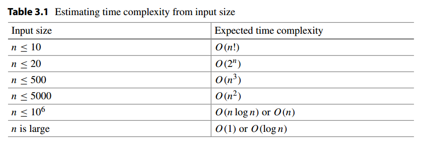
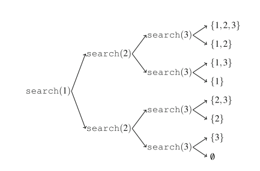

时间复杂度:



### 1、模运算

性质

```c
(a + b) mod m = (a mod m + b mod m) mod m
(a − b) mod m = (a mod m − b mod m) mod m
(a · b) mod m = (a mod m · b mod m) mod m
```

Usually we want the remainder to always be between `0 ... m−1`. However, in C++ and other languages, `the remainder of a negative number is either zero or negative`. An easy way to make sure there are no negative remainders is to first calculate the remainder as usual and then add m if the result is negative:

```cpp
x = x % m;
if (x < 0) x += m;
```

### 2、Generating Subsets

`n = 3`的搜索图:



代码:

```java
import java.util.ArrayList;

public class Code_01_SubSet {

    static ArrayList<Integer> subset;
    static ArrayList<ArrayList<Integer>> res;
    static int n;

    static void search(int k) {
        if (k == n+1) { // process subset
            res.add(new ArrayList<>(subset));
        } else {  // include k in the subset
            subset.add(k);
            search(k+1);
            subset.remove(subset.size() - 1);  // don’t include k in the subset
            search(k+1);
        }
    }

    public static void main(String[] args){
        n = 4;
        subset = new ArrayList<>();
        res = new ArrayList<>();
        search(1);
        System.out.println(res);
    }
}
```

### 3、Permutation

```java
import java.util.ArrayList;

public class Code_02_Permutation {

    static ArrayList<Integer> tmp;
    static ArrayList<ArrayList<Integer>> res;
    static int n;
    static boolean[] vis;

    static void search(){
        if(tmp.size() == n){
            res.add(new ArrayList<>(tmp));
        }else {
            for(int i = 1; i <= n; i++){
                if(vis[i]) continue;
                tmp.add(i);
                vis[i] = true;
                search();
                tmp.remove(tmp.size() - 1);
                vis[i] = false;
            }
        }
    }

    public static void main(String[] args){
        n = 3;
        vis = new boolean[n+1];
        tmp = new ArrayList<>();
        res = new ArrayList<>();
        search();
        System.out.println(res);
    }
}

```

### 4、Bit 

It is also possible to modify single bits of numbers using similar ideas. The formula `x | (1 << k) `sets the kth bit of x to one, the formula `x & ~(1 << k) `sets the kth bit of x to zero, and the formula `x ˆ (1 << k) `inverts the kth bit of x. Then, the formula `x & (x − 1)` sets the last one bit of x to zero, and the formula `x & −x` sets all the one bits to zero, except for the last one bit. The formula `x | (x − 1)` inverts all the bits after the last one bit. Finally, a positive number x is a power of two exactly when `x & (x − 1) = 0`.
One pitfall when using bit masks is that `1<<k` is always an int bit mask. An easy way to create a long long bit mask is `1LL<<k`.

### 5、 Representing Sets

```java
public class Code_03_RepresentingSets {

    public static void main(String[] args){
        int n = 3;
        for(int mask = 0; mask < (1 << n); mask++){
            for(int i = 0; i < n; i++)
//                if( ((mask >> i) & 1) != 0)
                if( ((1 << i) & mask) != 0)
                    System.out.print(i + " ");
            System.out.println();
        }
    }
}
```

