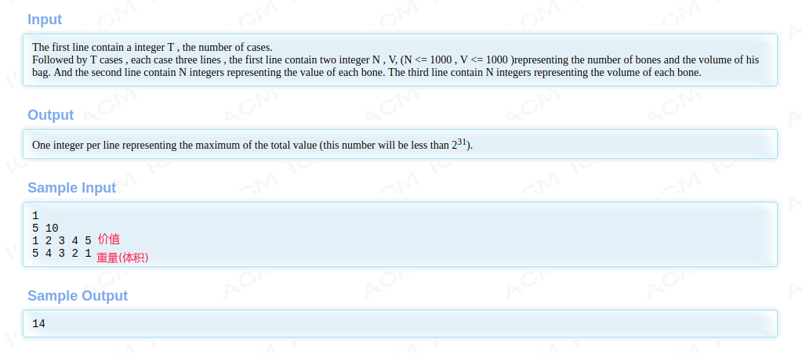
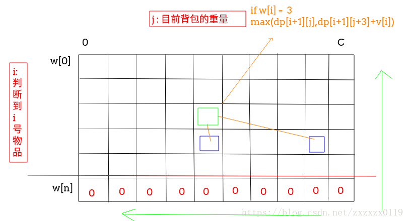
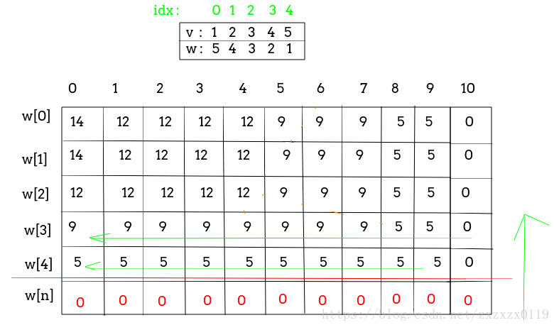
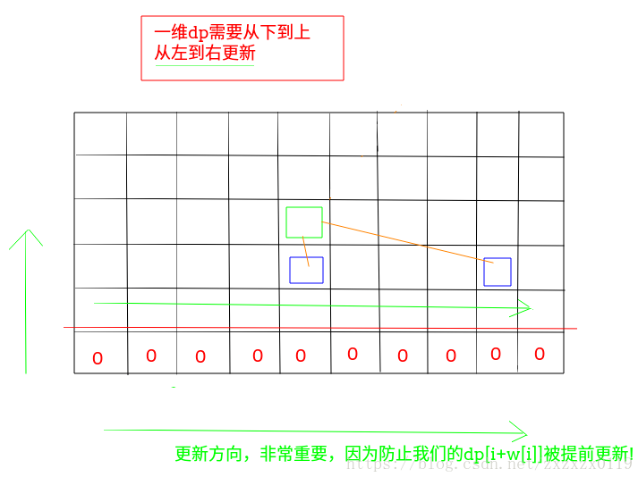

## Hdu - 2602. Bone Collector(01背包问题)
 - 递归写法
 - 二维dp
 - 一维dp

***
#### [题目链接](http://acm.hdu.edu.cn/showproblem.php?pid=2602)

> http://acm.hdu.edu.cn/showproblem.php?pid=2602

#### 题目



### 递归写法

递归的思想就是: 

 - **我要计算的是从第`0`号物体到`n-1`号物体的最大重量；**
 - **记录一个当前判断到`i`号物体时，已经选择的物体的容量`curW`；**
 - 如果当前剩余容量`C - curW < w[i]`，当前物品就不能选；
 - s如果`i`越界的话就返回`0`；
 - 否则我就递归的去求**选择了`i`号物品的最大值和不选择`i`号物品的最大值**中，我们要取的最大值；

因为上面的时间复杂度为`O(2^n)`，我们需要使用一个二维数组来记录计算过的重复子问题。(也就是记忆化)

```java
import java.io.*;
import java.util.*;

public class Main {

    static int[] w;
    static int[] v;
    static int n, C;
    static int[][] dp;

    static int rec(int pos, int curW) {
        if (pos == n)
            return 0; 
        if (dp[pos][curW] != -1) return dp[pos][curW];
        int res;
        if (C - curW < w[pos]) // 这里是 C-curW
            res = rec(pos + 1, curW);
        else     
            res = Math.max(rec(pos + 1, curW), rec(pos + 1, curW + w[pos]) + v[pos]);
        return dp[pos][curW] = res;
    }

    public static void main(String[] args) {
        Scanner in = new Scanner(new BufferedInputStream(System.in));
        int T = in.nextInt();
        while (T-- > 0) {
            n = in.nextInt();
            C = in.nextInt();
            w = new int[n];
            v = new int[n];
            dp = new int[n][C + 1]; // C+1不是C注意
            for (int i = 0; i < n; i++) Arrays.fill(dp[i], -1);
            for (int i = 0; i < n; i++) v[i] = in.nextInt();
            for (int i = 0; i < n; i++) w[i] = in.nextInt();
            System.out.println(rec(0, 0)); //这里是0了
        }
    }
}
```
另一种是从反向记录剩余体积的，从`curW`变成`remain`。

```java
import java.io.*;
import java.util.*;

public class Main {

    static int[] w;
    static int[] v;
    static int n, C;
    static int[][] dp;

    static int rec(int pos, int remain) {
        if (pos == n)
            return 0; // 没有物品了
        if (dp[pos][remain] != -1) return dp[pos][remain];
        int res;
        if (remain < w[pos]) // 无法挑选这个物品
            res = rec(pos + 1, remain);
        else        //挑选和不挑选都尝试一下
            res = Math.max(rec(pos + 1, remain), rec(pos + 1, remain - w[pos]) + v[pos]);
        return dp[pos][remain] = res;
    }

    public static void main(String[] args) {
        Scanner in = new Scanner(new BufferedInputStream(System.in));
        int T = in.nextInt();
        while (T-- > 0) {
            n = in.nextInt();
            C = in.nextInt();
            w = new int[n];
            v = new int[n];
            dp = new int[n][C + 1]; // C+1不是C注意
            for (int i = 0; i < n; i++) Arrays.fill(dp[i], -1);
            for (int i = 0; i < n; i++) v[i] = in.nextInt();
            for (int i = 0; i < n; i++) w[i] = in.nextInt();
            System.out.println(rec(0, C));
        }
    }
}
```

### 二维dp

下面是通过从最后一个物品开始考虑，也可以从第一个物品开始考虑。




(输入就不处理了，和上面的一样)

```java
public class Main {
    
    static int maxValue() {
        int[][] dp = new int[n + 1][C + 1];//注意是n+1，那样我们就不要一开始考虑初始化了
//        for (int j = 0; j <= C; j++) dp[n][j] = 0; //auto initialize to 0
        for (int i = n - 1; i >= 0; i--) {
            for (int j = C; j >= 0; j--) {
                dp[i][j] = j + w[i] > C ? dp[i + 1][j] :
                        Math.max(dp[i + 1][j], dp[i + 1][j + w[i]] + v[i]);
            }
        }
        return dp[0][0];
    }
}
```
空间复杂度可以从`O(n*C)`优化到`O(2*C)`，因为每次都只使用了上下两行的内容:

每次都只使用`0、1`这两个第一维。

```java
public class Main {
    
    static int maxValue2() {
        int[][] dp = new int[2][C + 1];
        for (int i = n - 1; i >= 0; i--) {
            for (int j = C; j >= 0; j--) {
                dp[i&1][j] = j + w[i] > C ? dp[(i + 1)&1][j] :
                        Math.max(dp[(i + 1)&1][j], dp[(i + 1)&1][j + w[i]] + v[i]);
            }
        }
        return dp[0][0];
    }
}
```

### 一维dp

也就是滚动优化，`dp`用来记录列。
```java
public class Main {
    static int maxValue() {
        int[] dp = new int[C + 1];
        for (int i = n - 1; i >= 0; i--) {
            for (int j = 0; j <= C; j++) {
                dp[j] = j + w[i] > C ? dp[j] : Math.max(dp[j], dp[j + w[i]] + v[i]);
            }
        }
        return dp[0];
    }
}
```

 - 这一行代码`for (int j = 0; j <= C; j++)` 千万不能写成下面的样子(也就是不能和二维`dp`一样从`C --> 0`): 
 - 因为这样的话我们的需要的`dp[j + w[i]] `此时已经更新了，不是我们需要的了。

```java
  for (int j = C; j >= 0 ; j--) //万万不可
```


