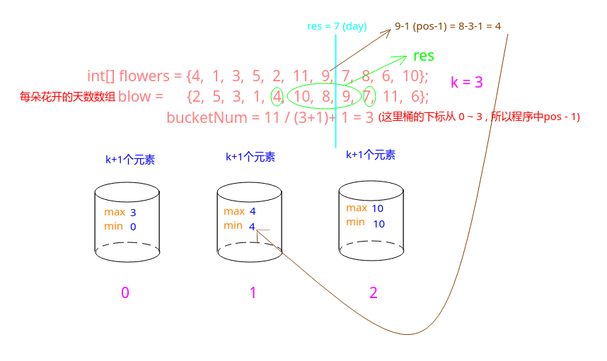

### LintCode - 861. K Empty Slots (BST | 桶)

#### [题目链接](https://www.lintcode.com/problem/k-empty-slots/description)

> https://www.lintcode.com/problem/k-empty-slots/description

#### 题目


#### 解析

一开始的傻逼的想法。。。`O(N ^ 4) -> TLE`。

* 先用一个`blow`数组算出每个位置的花盛开的天数；
* 然后枚举左右端点，看中间是不是刚好是`k`朵花没有盛开，如果是就返回当前天数；

```java
public class Solution {

    public int kEmptySlots(int[] flowers, int k) {
        if(flowers == null || flowers.length == 0 || k >= flowers.length)
            return -1;
        int n = flowers.length;
        int days = 0;
        int[] blow = new int[n+1];
        for(int i = 0; i < n; i++)
            blow[flowers[i]] = i+1;
        while(days <= n){
            days++;
            for(int i = 1; i <= n; i++){
                if(blow[i] > 0)
                    blow[i]--;
            }
            for(int i = 1; i <= n; i++){
                for(int j = i+1; j <= n; j++){
                    if(blow[i] == 0 && blow[j] == 0){
                        int cnt = 0;
                        for(int p = i+1; p < j; p++){
                            if(blow[p] > 0)
                                cnt++;
                            else{ //注意必须中间恰好有k朵花没有开，不能有开的花
                                cnt = -1;
                                break;
                            }
                        }
                        if(cnt == k)
                            return days;
                    }
                }
            }
        }
        return -1;
    }
}
```

##### `O(N * K * 2)`

这个也是暴力的，不过比上面方法好很多(测试最快)：

* 枚举天数，将那一天盛开的话标记成`true`；
* 然后判断那个盛开的花的位置的左边`k`个数是不是没有盛开的，再判断右边`k`个数是不是没有盛开的，只有有其中一个满足，就返回当前天数即可；
```java
public class Solution {

    public int kEmptySlots(int[] flowers, int k) {
        if(flowers == null || flowers.length == 0 || k >= flowers.length)
            return -1;
        int n = flowers.length;
        boolean[] blow = new boolean[n+1];
        
        for(int day = 1; day <= n; day++){
            int pos = flowers[day-1];
            blow[pos] = true;    // day这一天盛开flowers[i]位置上的花
            if(judge(pos, k, blow, n))
                return day;
        }
        return -1;
    }
    
    private boolean judge(int pos, int k, boolean[] blow, int n){
        boolean ok = true;
        for(int i = pos-1; i > 1 && i >= pos-k; i--){
            if(blow[i]){
                ok = false;
                break;
            }
        }
        if(ok & pos-k-1 >= 1 && blow[pos-k-1])
            return true;
        ok = true;
        for(int i = pos+1; i < n && i <= pos+k; i++){
            if(blow[i]){
                ok = false;
                break;
            }
        }
        if(ok && pos+k+1 <= n && blow[pos+k+1])
            return true;
        return false;
    }
}
```

##### `O(N*logN) use BST`

这个就是每天在`BST`中存上当前的盛开的花的位置，然后因为是`BST`，所以可以看`BST`中后一个元素`next`是不是和当前的元素满足`next = pos + k + 1`或者前一个元素`pre = pos - k - 1`，如果满足说明在这之间满足中间有`k`朵花没有盛开，输出天数即可；
```java
public class Solution {

    public int kEmptySlots(int[] flowers, int k) {
        if (flowers == null || flowers.length == 0 || k >= flowers.length)
            return -1;
        int n = flowers.length;
        TreeSet<Integer> set = new TreeSet<>();
        for (int day = 0; day < n; day++) {
            int pos = flowers[day];
            set.add(pos);
            Integer lower = set.lower(pos);//获取pos插入的下一个位置(里面内容是排序的)
            Integer higher = set.higher(pos);
            if (higher != null && higher == pos + k + 1)
                return day + 1;
            if (lower != null && lower == pos - k - 1)
                return day + 1;
        }
        return -1;
    }
}
```

##### `O(N)  use  Buckets`
`O(N)`时间(代码有时候会超内存，有时候可以过。。。)

* 每个桶统管的范围是`k+1`个数，但是每个桶中只存这`k+1`个位置中最小的天数和最大的天数；
* 然后每次更新的时候，查看当前桶中和前后桶是否也满足相应关系即可；

看下面的例子:`int[] flowers = {4, 1, 3, 5, 2, 11, 9, 7, 8, 6, 10};  , k = 3`。

```java
public class Solution {

    public int kEmptySlots(int[] flowers, int k) {
        if (flowers == null || flowers.length == 0 || k >= flowers.length)
            return -1;
        int n = flowers.length;
        int bucketNum = n%(k+1) == 0 ? n/(k+1) : n/(k+1) + 1;
        int[] minBucket = new int[bucketNum];
        Arrays.fill(minBucket, Integer.MAX_VALUE);
        int[] maxBucket = new int[bucketNum];
        Arrays.fill(maxBucket, Integer.MIN_VALUE);
        for (int day = 0; day < n; day++) {
            int pos = flowers[day] - 1;
            int bucketIndex = pos/(k+1);
            if(pos < minBucket[bucketIndex]){
                minBucket[bucketIndex] = pos;
                if(bucketIndex > 0 && pos == maxBucket[bucketIndex-1]+k+1)
                    return day+1;
            }
            if(pos > maxBucket[bucketIndex]){
                maxBucket[bucketIndex] = pos;
                if(bucketIndex < bucketNum-1 && pos == minBucket[bucketIndex+1]-k-1)
                    return day+1;
            }
        }
        return -1;
    }
}
```

