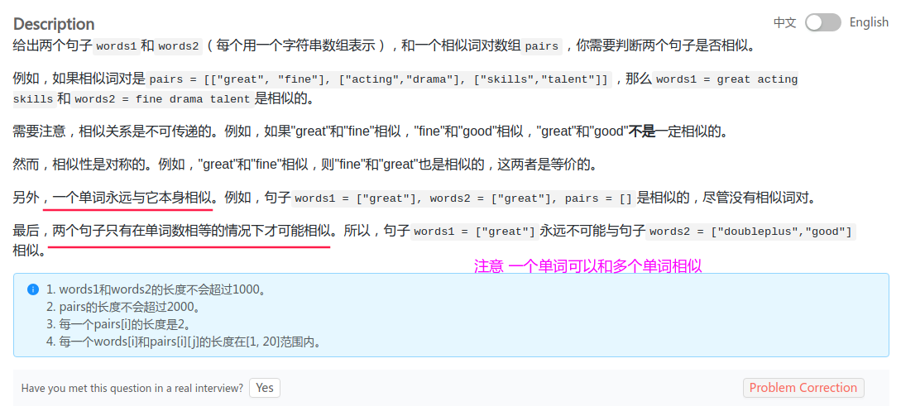

## LintCode - 856. Sentence Similarity

#### [题目链接](https://www.lintcode.com/problem/sentence-similarity/description)

> https://www.lintcode.com/problem/sentence-similarity/description

#### 题目



样例1:

```java
输入: words1 = ["great","acting","skills"], words2 = ["fine","drama","talent"] and pairs = [["great","fine"],["drama","acting"],["skills","talent"]]
输出: true
解释:
"great"和"fine"相似
"acting"和"drama"相似
"skills"和"talent"相似
```

样例2:

```java
输入: words1 = ["fine","skills","acting"], words2 = ["fine","drama","talent"] and pairs = [["great","fine"],["drama","acting"],["skills","talent"]]
输出: false
解释:
"fine"和"fine"相同
"skills"和"drama"不相似
"acting"和"talent"不相似
```

### 解析

需要注意的是，一个单词可能对应多个相似的单词，所以我们要用一个`Set`来存储第二维。

```java
import java.util.*;

public class Solution {

    public boolean isSentenceSimilarity(String[] words1, String[] words2, List<List<String>> pairs) {
        if(words1.length != words2.length) return false;
        HashMap<String, Set<String>> map = new HashMap<>();
        for(List<String> pair : pairs){
            String s1 = pair.get(0);
            String s2 = pair.get(1);
//            if(!map.containsKey(s1))
//                map.put(s1, new HashSet<>());
//            if(!map.containsKey(s2))
//                map.put(s2, new HashSet<>());
            map.putIfAbsent(s1, new HashSet<>());
            map.putIfAbsent(s2, new HashSet<>());
            map.get(s1).add(s2);
            map.get(s2).add(s1);
        }
        for(int i = 0; i < words1.length; i++){
            if(words1[i] == words2[i]) continue;
            if(!map.containsKey(words1[i])) return false;
            if(!map.get(words1[i]).contains(words2[i])) return false;
        }
        return true;
    }
}
```

