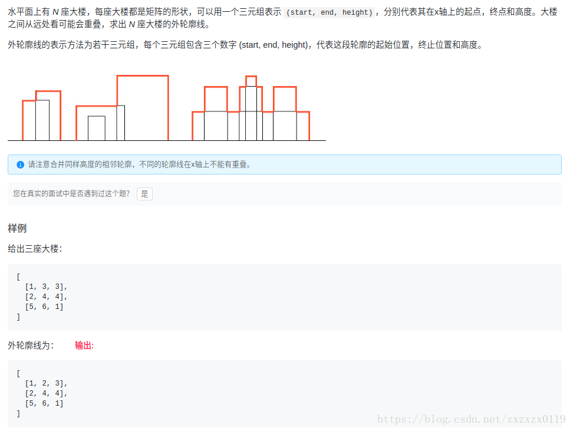
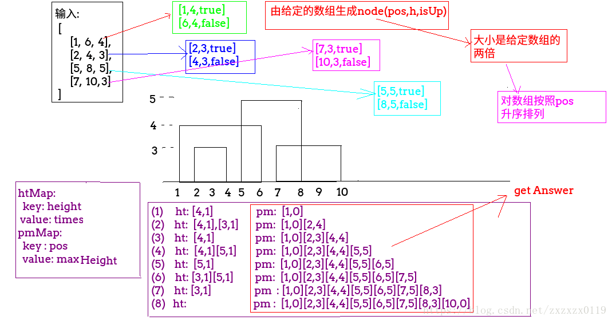

## LintCode - 131. The Skyline Problem(建筑的轮廓)(利用二叉搜索树解决)
#### [题目链接](https://www.lintcode.com/problem/the-skyline-problem/description)

> https://www.lintcode.com/problem/the-skyline-problem/description

#### 题意



### 解析: 

**这题和[LeetCode - 218](https://leetcode.com/problems/the-skyline-problem/)一样的。**


解析过程:

 - 将输入的每一组数据处理成两个`Node`结构，结构中是<font color= red>[位置，高度，上升/下降]</font>的信息；
 - 对上面的`Node`结构数组按照位置进行升序排序；
 - 准备两个`TreeMap`，第一个`htMap`存<font color = blue>[高度，次数]</font>，第二个`pmMap`存<font color = blue>[位置，最大高度]</font> (注意两个`Map`都是按照`key`有序的)；
 - 遍历`Node`数组，如果是上升且没有出现目前的，就加入一个(`1`次)，如果出现过，就`++`；
 - 如果是下降且只有一个了，就移除，否则`--`；
 - 最后要把每个位置的最大高度存到`pmMap`中；
 - 最后使用`pmMap`构造出答案，因为记录了每个位置的最大高度变化，只要前一个高度和当前高度不同，就构造出来；




```java
public class Solution {
    //由一座大楼可以生成两个信息，一个是开始，高度，和上升
    private class Node implements Comparable<Node> {
        public int pos; //position
        public int h; //height
        public boolean isUp;

        public Node(int pos, int h, boolean isUp) {
            this.pos = pos;
            this.h = h;
            this.isUp = isUp;
        }

        @Override
        public int compareTo(Node o) {
            if (pos != o.pos) {
                return pos - o.pos;
            }
            if (isUp != o.isUp) {
                return isUp ? -1 : 1; // 相同的位置下, 向上的排在前面
            }
            return 0;
        }
    }

    public List<List<Integer>> buildingOutline(int[][] buildings) {
        Node[] node = new Node[2 * buildings.length];     // each building to two message
        for (int i = 0; i < buildings.length; i++) {
            node[i * 2] = new Node(buildings[i][0], buildings[i][2], true); //up
            node[i * 2 + 1] = new Node(buildings[i][1], buildings[i][2], false);// down
        }
        Arrays.sort(node); //sorted by start
        TreeMap<Integer, Integer> htMap = new TreeMap<>(); // key : height ; value : times
        TreeMap<Integer, Integer> pmMap = new TreeMap<>(); // key : pos(every) ; value : maxHeight
        for (int i = 0; i < node.length; i++) {
            if (node[i].isUp) {  //if it's up
                if (!htMap.containsKey(node[i].h)) {
                    htMap.put(node[i].h, 1);
                } else {
                    htMap.put(node[i].h, htMap.get(node[i].h) + 1); //add the times
                }
            } else { // down
                if (!htMap.containsKey(node[i].h)) continue;
                if (htMap.get(node[i].h) == 1) {
                    htMap.remove(node[i].h);
                } else {
                    htMap.put(node[i].h, htMap.get(node[i].h) - 1);
                }
            }

            if (htMap.isEmpty()) {
                pmMap.put(node[i].pos, 0);
            } else {
                pmMap.put(node[i].pos, htMap.lastKey()); //存入当前位置和的当前的最大高度
            }
        }

        //根据pmMap 构造出轮廓
        List<List<Integer>> res = new ArrayList<>();
        int start = 0, height = 0; //一开始 = 0
        for (Map.Entry<Integer, Integer> entry : pmMap.entrySet()) {
            int curPosition = entry.getKey();
            int maxHeight = entry.getValue();

            if (height != maxHeight) {    //发现改变  有轮廓
                if (height != 0) {        //这个是第一个要判断一下
                    List<Integer> temp = new ArrayList<>();
                    temp.add(start);    //起点
                    temp.add(curPosition); //当前的
                    temp.add(height);
                    res.add(temp);
                }
                start = curPosition;
                height = maxHeight;
            }
        }
        return res;
    }

    public static void main(String[] args) {
        // 上图的例子
        int[][] buildings = {
                {1, 6, 4},
                {2, 4, 3},
                {5, 8, 5},
                {7, 10, 3}
        };
        System.out.println(new Solution().buildingOutline(buildings));
    }
}
```
