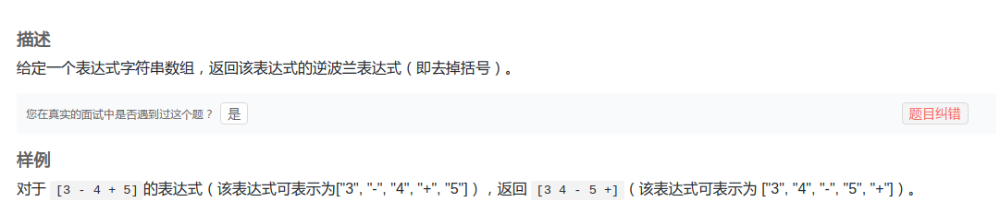
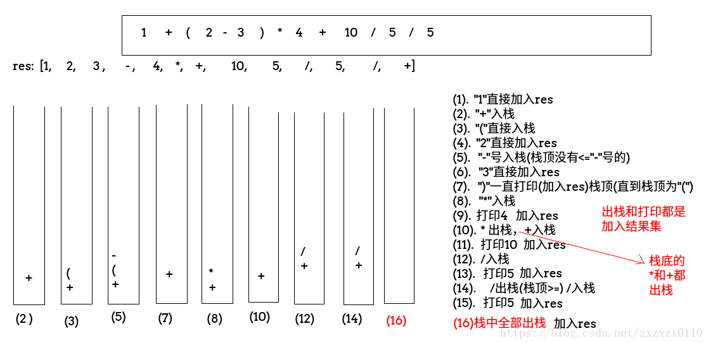

## LintCode - 370. Convert Expression to Reverse Polish Notation(转换为逆波兰表达式)(中缀转后缀表达式)

#### [题目链接](https://www.lintcode.com/problem/convert-expression-to-reverse-polish-notation/description)

> https://www.lintcode.com/problem/convert-expression-to-reverse-polish-notation/description

#### 题目

准备一个栈用来存放**操作符**，注意执行流程: 

 - 当前字符串是数字，直接添加到结果集；
 - 当前字符串是`"("`，直接入栈；
 - **当前字符串是`")"`，从栈中一直弹出操作符，直到操作符为`")“`，并把这些操作符加入结果集(　`")"`不加入　)**；
 - **当前字符串是`"+"`或者`"-"`，如果栈顶的操作符不是`"("`且栈顶操作符`>="+"`或者`"-"`，这些操作符都要出栈，因为`"+"`和`"-"`本来就是最低优先级的(或者可以从运算的<font color = blue>从左到右计算来思考</font>)，所以只要栈不空或者栈顶` != "("`就出栈，最后，`"+"`或者`"-"`入栈**；
 - **当前字符串是`" * "` 或者`"/" `，如果栈顶是`"*"`或者`"/"`，就要先出栈(也是`>=`的(进来这么久了，透透气))，然后入栈当前字符串(即`"*"`或者`"/"`)**；




```java
public class Solution {
    
    public List<String> convertToRPN(String[] expression) {
        List<String> res = new ArrayList<>();
        Stack<String> stack = new Stack<>();
        for (String s : expression) {
            if ("+".equals(s) || "-".equals(s)) {
                while (!stack.isEmpty() && !"(".equals(stack.peek())) {
                    res.add(stack.pop());
                }
                stack.push(s);
            } else if ("*".equals(s) || "/".equals(s)) {
                while (!stack.isEmpty() && ("*".equals(stack.peek()) || "/".equals(stack.peek()))) {
                    res.add(stack.pop());
                }
                stack.push(s);
            } else if (")".equals(s)) {
                while (!stack.isEmpty() && !"(".equals(stack.peek())) {
                    res.add(stack.pop());
                }
                if (!stack.isEmpty() && stack.peek().equals("(")) stack.pop();
            } else if ("(".equals(s)) {
                stack.push(s);
            } else {  //字符直接输出
                res.add(s);
            }
        }
        while (!stack.isEmpty()) 
            res.add(stack.pop());
        return res;
    }
}

```

**再看另一个[SPOJ测试题](https://www.spoj.com/problems/ONP/)**，这里加上了`^`符号，但是也差不多，`^`的优先级比`+-`还要低，所以如果碰到`^`前面的符号就都要出栈。


```java
import java.io.BufferedInputStream;
import java.util.Scanner;
import java.util.Stack;

public class Main {

    //3-4+5
    public static void main(String[] args){
        Scanner cin = new Scanner(new BufferedInputStream(System.in));
        int T = cin.nextInt();
        while(T-- > 0) {
            String str = cin.next();
            StringBuilder sb = new StringBuilder();
            Stack<Character> stack = new Stack<>();
            for (int i = 0; i < str.length(); i++) {
                char c = str.charAt(i);
                if(c == '^'){  //全部出栈
                    while (!stack.isEmpty() && '(' != stack.peek()) {
                        sb.append(stack.pop());
                    }
                    stack.push(c);
                }else if (c == '+' || c == '-') { // != '^'时出栈
                    while (!stack.isEmpty() && '^' != stack.peek() && '(' != stack.peek()) {
                        sb.append(stack.pop());
                    }
                    stack.push(c);
                } else if (c == '*' || c == '/') { // == '*' || '/'时出栈
                    while (!stack.isEmpty() && ('*' == stack.peek() || '/' == stack.peek())) {
                        sb.append(stack.pop());
                    }
                    stack.push(c);
                } else if (')' == c) {
                    while (!stack.isEmpty() && '(' != stack.peek()) {
                        sb.append(stack.pop());
                    }
                    if (!stack.isEmpty() && '(' == stack.peek())
                        stack.pop();
                } else if ('(' == c ) {
                    stack.push(c);
                } else {
                    sb.append(c);
                }
            }
            while (!stack.isEmpty())
                sb.append(stack.pop());
            System.out.println(sb.toString());
        }
    }
}
```

