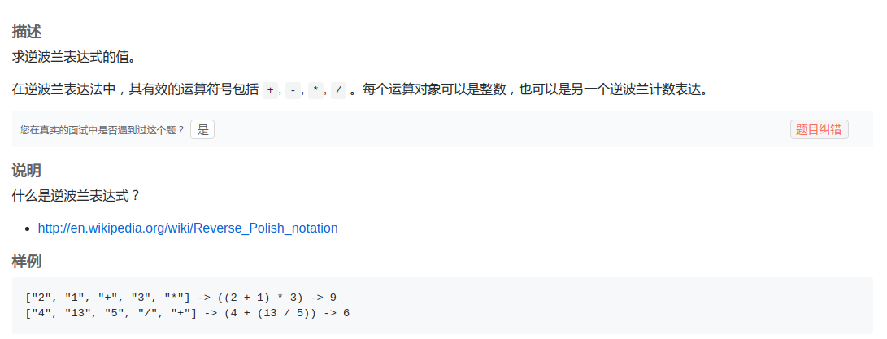

## LintCode - 424. Evaluate Reverse Polish Notation(逆波兰表达式求值)
#### [题目链接](https://www.lintcode.com/problem/evaluate-reverse-polish-notation/description)

> https://www.lintcode.com/problem/evaluate-reverse-polish-notation/description

#### 题目
逆波兰表达式又叫做后缀表达式，**每一运算符都置于其运算对象之后**，故称为后缀表示。
现在给你逆波兰表达式字符串数组，要你求出值。




样例1: 

```c
["2", "1", "+", "3", "*"] -> ((2 + 1) * 3) -> 9
```
样例2
```c
["4", "13", "5", "/", "+"] -> (4 + (13 / 5)) -> 6
```

样例3
```c
Input: ["10", "6", "9", "3", "+", "-11", "*", "/", "*", "17", "+", "5", "+"]
Output: 22
Explanation: 
  ((10 * (6 / ((9 + 3) * -11))) + 17) + 5
= ((10 * (6 / (12 * -11))) + 17) + 5
= ((10 * (6 / -132)) + 17) + 5
= ((10 * 0) + 17) + 5
= (0 + 17) + 5
= 17 + 5
= 22
```
#### 解析
实现很简单，**当前字符串是数字就入栈，是操作符就弹出来两个数计算并入栈。**

```java
public class Solution {

    public int evalRPN(String[] tokens) {
        Stack<Integer> stack = new Stack<>();
        int a, b;
        for (String s : tokens) {
            if (s.equals("+")) {
                stack.push(stack.pop() + stack.pop());
            } else if (s.equals("-")) {
                a = stack.pop();
                b = stack.pop();
                stack.push(b - a);
            } else if (s.equals("*")) {
                stack.push(stack.pop() * stack.pop());
            } else if (s.equals("/")) {
                a = stack.pop();
                b = stack.pop();
                stack.push(b / a);
            } else {  //遇到数字就进栈
                stack.push(Integer.parseInt(s));
            }
        }
        return stack.pop();
    }
}
```
