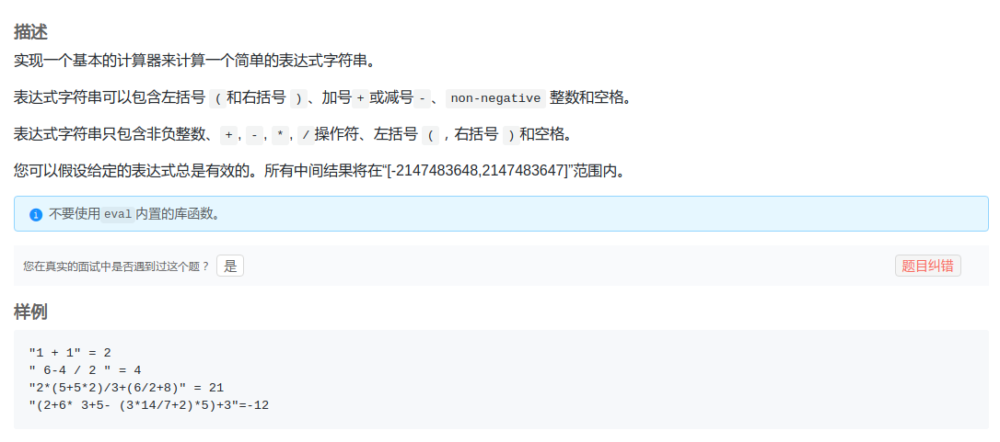
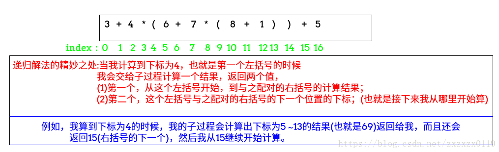

## LintCode - 849. Basic Calculator III(包括+ - * / 和括号的计算器)

 - 解法一: 使用中缀表达式转后缀表达式计算结果
 - 解法二: 使用递归计算

***
#### [题目链接](https://www.lintcode.com/problem/basic-calculator-iii/)

> https://www.lintcode.com/problem/basic-calculator-iii/

#### 题目



***
### 解法一: 使用中缀表达式转后缀表达式计算结果
这个方法可以说是比较简单的方法，先把中缀表达式转换成后缀表达式，然后计算后缀表达式的值，**这两个分别对应两个题目[LintCode370](https://blog.csdn.net/zxzxzx0119/article/details/81871724)和[LintCode424](https://blog.csdn.net/zxzxzx0119/article/details/81868865)；**<font color = red>要注意的地方是　某个数字可能是大于等于两位数的，我们可可以在变成后缀表达式的时候加上一个分割符，我这里用的是`"_"`。</font>
```java
public class Solution {

    //前缀转中缀　>1位的数字后面加上_
    public String infixToSuffix(String str) {
        StringBuffer sb = new StringBuffer();
        Stack<Character> stack = new Stack<>();
        for (int i = 0; i < str.length(); i++) {
            char c = str.charAt(i);
            if (c == ' ') continue;
            if ('+' == c || '-' == c) {
                while (!stack.isEmpty() && stack.peek() != '(') {
                    sb.append(stack.pop());
                }
                stack.push(c);
            } else if ('*' == c || '/' == c) {
                while (!stack.isEmpty() && (stack.peek() == '*' || stack.peek() == '/')) {
                    sb.append(stack.pop());
                }
                stack.push(c);
            } else if ('(' == c) {
                stack.push(c);
            } else if (')' == c) { //数字
                while (!stack.isEmpty() && '(' != stack.peek()) {
                    sb.append(stack.pop());
                }
                stack.pop(); //最后把(弹出来
            } else {
                while (i < str.length() && Character.isDigit(str.charAt(i))) {
                    sb.append(str.charAt(i));
                    i++;
                }
                sb.append("_");//一个数字结尾加上一个符号_
                i--; //上面多加了一次;
            }
        }
        while (!stack.isEmpty()) sb.append(stack.pop());
        return sb.toString();
    }


    public int calculate(String s) {
        //先转换成逆波兰表达式
        String str = infixToSuffix(s);
        Stack<Integer> stack = new Stack<>(); //计算后缀表达式的　栈
        int num = 0;
        int a, b;
        for (int i = 0; i < str.length(); i++) {
            char c = str.charAt(i);
            if (c == '+') {
                stack.push(stack.pop() + stack.pop());
            } else if (c == '-') {
                a = stack.pop();
                b = stack.pop();
                stack.push(b - a);
            } else if (c == '*') {
                stack.push(stack.pop() * stack.pop());
            } else if (c == '/') {
                a = stack.pop();
                b = stack.pop();
                stack.push(b / a);
            } else {
                while (i < str.length() && str.charAt(i) != '_') {
                    num = num * 10 + (str.charAt(i) - '0');
                    i++;
                }
                stack.push(num);
                num = 0;
            }
        }
        return stack.pop();
    }
}

```
***
### 解法二: 使用递归计算
**首先这个解法建立在只有`*,/,+,-`没有括号的基础上，具体请看[这个题](https://blog.csdn.net/zxzxzx0119/article/details/81868177)的第二种解法，这个解法就是改进那个解法而来的。代码基本相似(`add`函数和`getNum`函数完全一致)。**

递归解法的精妙之处在于: 

 - **当我们遇到`(`括号的时候，我们让一个子过程去计算从`(`括号开始，到它对应的右括号结束位置的值，并返回这个值和我原来的字符串要从哪个位置开始算；**
 - 也就是这个子过程的`( `括号的下一个。具体在代码中就是返回`p[0]`和`p[1]`。




```java
public class Solution {
    
    public int calculate(String s) {
        s = s.replace(" ", "");//去除字符串的空格
        return rec(s.toCharArray(), 0)[0];
    }
 
    private int[] rec(char[] s, int idx) {
        Stack<String> stack = new Stack<>();
        int num = 0;
        int[] p; //返回(...)中的值，以及)的下一个位置
        while (idx < s.length && s[idx] != ')') {  //如果是 ')'就要结算返回了
            if (s[idx] >= '0' && s[idx] <= '9') {
                num = num * 10 + s[idx++] - '0';
            } else if (s[idx] != '(') { //也就是s[idx] = + - * /
                add(stack, num);
                stack.push(String.valueOf(s[idx++]));
                num = 0;
            } else { //s[idx] = '('  我不想算，子过程去算
                p = rec(s, idx + 1);
                num = p[0];
                idx = p[1] + 1; //从(的下一个开始算
            }
        }
        add(stack, num);
        return new int[]{getNum(stack), idx};
    }

    private void add(Stack<String> stack, int num) { //放入相应的东西  操作符和num要进行相应的操作
        if (!stack.isEmpty() && (stack.peek().equals("*") || stack.peek().equals("/"))) {
            String op = stack.pop();         //把 * 或者 /pop出来
            int pre = Integer.valueOf(stack.pop());  // *或/的前一个数
            num = op.equals("*") ? pre * num : pre / num;
        }
        stack.add(String.valueOf(num));
    }

    private int getNum(Stack<String> stack) {
        int res = 0;
        String cur = null;
        int pre = Integer.valueOf(stack.pop());
        while (!stack.isEmpty()) {
            cur = stack.pop();
            if (cur.equals("+")) {
                res += pre;
            } else if (cur.equals("-")) {
                res -= pre;
            } else {
                pre = Integer.valueOf(cur);
            }
        }
        return res + pre;
    }
}

```
