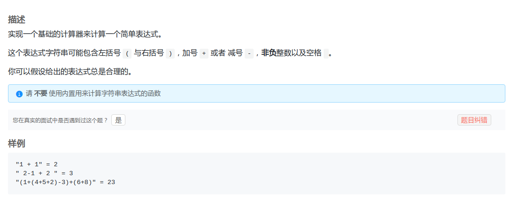
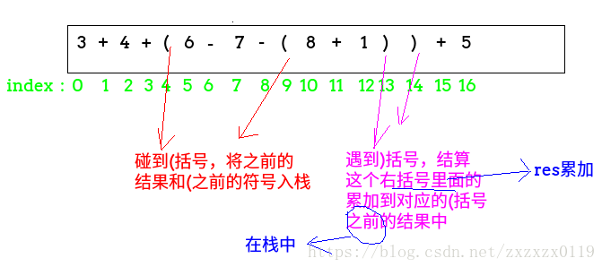

## LintCode - 978. Basic Calculator(只有 + - 号的表达式计算)

 - 转后缀表达式计算
 - 递归解法
 - 栈的灵活操作

***
**这个题目其实就是[LintCode - 849](https://blog.csdn.net/zxzxzx0119/article/details/81880253)的简化版，所以代码都差不多。只需要简单的修改。**

#### [题目链接](https://www.lintcode.com/problem/basic-calculator/description)

> https://www.lintcode.com/problem/basic-calculator/description

#### 题目



### 转后缀表达式计算

比较容易想到的就是**先转换成逆波兰(后缀表达式)**，然后通过计算后缀表达式来解决问题；

```java
public class Solution {

    public String infixToSuffix(String str) {//中缀转后缀　>1位的数字后面加上_
        StringBuffer sb = new StringBuffer();
        Stack<Character> stack = new Stack<>();
        for (int i = 0; i < str.length(); i++) {
            char c = str.charAt(i);
            if (c == ' ') continue;
            if ('+' == c || '-' == c) {
                while (!stack.isEmpty() && stack.peek() != '(') {
                    sb.append(stack.pop());
                }
                stack.push(c);
            } else if ('(' == c) {
                stack.push(c);
            } else if (')' == c) { //数字
                while (!stack.isEmpty() && '(' != stack.peek()) {
                    sb.append(stack.pop());
                }
                stack.pop(); //最后把(弹出来
            } else {
                while (i < str.length() && Character.isDigit(str.charAt(i))) {
                    sb.append(str.charAt(i));
                    i++;
                }
                sb.append("_");//一个数字结尾加上一个符号_
                i--; //上面多加了一次;
            }
        }
        while (!stack.isEmpty()) sb.append(stack.pop());
        return sb.toString();
    }


    public int calculate(String s) {
        //先转换成逆波兰表达式
        String str = infixToSuffix(s);
        System.out.println(str);
        Stack<Integer> stack = new Stack<>(); //计算后缀表达式的　栈
        int num = 0;
        for (int i = 0; i < str.length(); i++) {
            char c = str.charAt(i);
            if (c == '+') {
                stack.push(stack.pop() + stack.pop());
            } else if (c == '-') {
                int a = stack.pop();
                int b = stack.pop();
                stack.push(b - a);
            } else {
                while (i < str.length() && str.charAt(i) != '_') {
                    num = num * 10 + (str.charAt(i) - '0');
                    i++;
                }
                stack.push(num);
                num = 0;
            }
        }
        return stack.pop();
    }
}

```

### 递归解法
也是`LintCode - 849`第二种解法的一点点改化。。

```java
public class Solution {

    public int calculate(String s) {
        s = s.replace(" ", "");//去除字符串的空格
        return rec(s.toCharArray(), 0)[0]; 
    }

    private int[] rec(char[] s, int idx) {
        Stack<String> stack = new Stack<>();
        int num = 0;
        int[] p; //返回(...)中的值，以及)的下一个位置
        while (idx < s.length && s[idx] != ')') {  //如果是 ')'就要结算返回了
            if (s[idx] >= '0' && s[idx] <= '9') {
                num = num * 10 + s[idx++] - '0';
            } else if (s[idx] != '(') { //也就是s[idx] = + - * /
                stack.add(String.valueOf(num));
                stack.push(String.valueOf(s[idx++]));
                num = 0;
            } else { //s[idx] = '('  我不想算，子过程去算
                p = rec(s, idx + 1);
                num = p[0];
                idx = p[1] + 1; //从(的下一个开始算
            }
        }
        stack.add(String.valueOf(num));
        return new int[]{getNum(stack), idx};
    }

    private int getNum(Stack<String> stack) {
        int res = 0;
        String cur = null;
        int pre = Integer.valueOf(stack.pop());
        while (!stack.isEmpty()) {
            cur = stack.pop();
            if (cur.equals("+")) {
                res += pre;
            } else if (cur.equals("-")) {
                res -= pre;
            } else {
                pre = Integer.valueOf(cur);
            }
        }
        return res + pre;
    }
}
```
### 栈的灵活操作
这个是在`discuss`中看到的解法，有点厉害。
就是一旦遇到`(`，就将之前的累加结果和`(`之前的那个符号入栈，遇到右括号`)`，就计算`res`和栈中的累加结果。其余情况累计`res`。



```java
public class Solution {

    public int calculate(String s) {
        Stack<Integer> stack = new Stack<Integer>();
        int res = 0;
        int num = 0;
        int sign = 1;
        for (int i = 0; i < s.length(); i++) {
            char c = s.charAt(i);
            if (Character.isDigit(c)) {
                num = 10 * num + c - '0';
            } else if (c == '+') {
                res += sign * num;
                num = 0;
                sign = 1;
            } else if (c == '-') {
                res += sign * num;
                num = 0;
                sign = -1;
            } else if (c == '(') {
                stack.push(res);//将前面计算的res和括号前面的那个符号sign入栈
                stack.push(sign);
                //重新归位
                sign = 1;
                res = 0;
            } else if (c == ')') {
                res += sign * num;
                res *= stack.pop();    // (括号之前的那个符号
                res += stack.pop();   //stack.pop()是之前的和，而res是自己括号内的和
                num = 0;
            }
        }
        if (num != 0) 
            res += sign * num;
        return res;
    }
}

```
