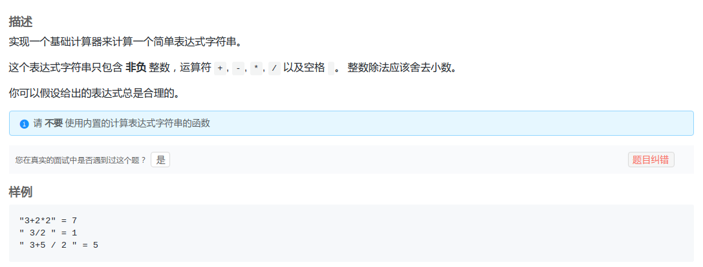
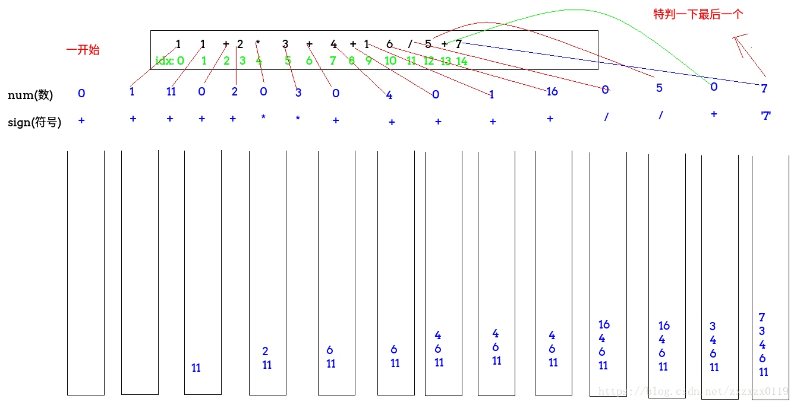

## LintCode - 980. Basic Calculator II(没有括号的计算表达式)

 - 方法一
 - 方法二

#### [题目链接](https://www.lintcode.com/problem/basic-calculator-ii/description)

> https://www.lintcode.com/problem/basic-calculator-ii/description

#### 题目


给你一个字符串，里面是一个计算表达式，字符串表达式仅包含**非负整数**，且里面有`+,-,*,/`但是没有括号，要你计算表达式的值，整数除法仅保留**整数部分**，**注意表达式可能有空格**；
样例: 

```c
"3+2*2" = 7
" 3/2 " = 1
" 3+5 / 2 " = 5
```
### 解析
#### 方法一
 - 如果当前字符是数字，就用一个`num`累加(因为`num`可能是两位数或者以上)；
 - 然后再判断当前当前字符是不是运算符(除了空格和数字都是运算符)或者当前字符是不是最后一个字符，如果是的话就要结算入栈；

当前字符是运算符的具体结算过程: (注意这里使用sign表示前一个运算符(**一定要注意不是当前的运算符**))

 - 如果`sign` (前一个运算符)是` +`  : 直接将`num`入栈；
 - 如果`sign` (前一个运算符) 是`-` : 将`-num`入栈；
 - 如果`sign` (前一个运算符) 是`* `: 将栈顶拿出来和当前`num`相乘之后入栈；
 - 如果`sign` (前一个运算符)是`/` : 将栈顶拿出来和当前`num`相除之后入栈；


**最后将栈中的数累加就是结果。**


```java
public class Solution {

    public int calculate(String s) {
        Stack<Integer> stack = new Stack<>();
        int num = 0; //存储数
        char sign = '+';
        for (int i = 0; i < s.length(); i++) {
            char c = s.charAt(i);
            if (Character.isDigit(c))
                num = num * 10 + c - '0';
            
            if ((!Character.isDigit(c) && ' ' != c) || (i == s.length() - 1)) {   // + - * /
                switch (sign) {
                    case '+':
                        stack.push(num);
                        break;
                    case '-':
                        stack.push(-num);
                        break;
                    case '*':
                        stack.push(stack.pop() * num);
                        break;
                    case '/':
                        stack.push(stack.pop() / num);
                        break;
                }
                sign = c;
                num = 0;
            }
        }
        int res = 0;
        while (!stack.isEmpty())
            res += stack.pop();
        return res;
    }
}

```
#### 方法二
这个方法在`LintCode`上面超内存了，但是在[**LeetCode - 227. Basic Calculator II**](https://leetcode.com/problems/basic-calculator-ii/description/)上面能通过，而且代码也有点长，最好还是用上面的方法。
大体思想是：

 - **每次遇到数字就累计计算`num`，因为`num`有可能大于个位数。**

`add`函数就是处理下面遇到操作符的情况。

 - **遇到操作符，如果是 `*` 或 `/` ，直接将`num`和 `* `或 `/` 入栈；**
 - **如果是`+`,` -`，先判断栈顶是不是 `*` 和 `/`，如果是，就将栈顶和`num`计算然后将计算结果和操作符(`+`,`-`)入栈。**

`getNum`函数: 

 - **`getNum`函数就是当式子里面只有`+`、`-`、数字的时候的计算，计算顺序是从后往前(从栈顶到栈底)；**
 - **例如`2-1+4-2` 这些字符都存在栈中，栈顶到栈底分别是`"2","-","4","+","1","-","2"`，所以要设置一个`pre`变量。**

在[**LeetCode - 227. Basic Calculator II**](https://leetcode.com/problems/basic-calculator-ii/description/)上通过的代码。
```java
public class Solution {

    public int calculate(String s) {
        Stack<String> stack = new Stack<>();
        int num = 0;
        for (int i = 0; i < s.length(); i++) {  //注意最后一个不判断
            char c = s.charAt(i);
            if (c == ' ') continue;
            if (c >= '0' && c <= '9') {
                num = num * 10 + c - '0';
            } else {  //只要有乘除就搞定
                add(stack, num);
                stack.push(String.valueOf(c));
                num = 0;
            }
        }
        add(stack, num); //最后加进去
        return getNum(stack);
    }

    private void add(Stack<String> stack, int num) { //放入相应的东西  操作符和num要进行相应的操作
        if (!stack.isEmpty() && (stack.peek().equals("*") || stack.peek().equals("/"))) {
            String op = stack.pop();         //把 * 或者 /pop出来
            int pre = Integer.valueOf(stack.pop());  // *或/的前一个数
            num = op.equals("*") ? pre * num : pre / num;
        }
        stack.push(String.valueOf(num));
    }

    private int getNum(Stack<String> stack) {
        int res = 0;
        String cur = null;
        int pre = Integer.valueOf(stack.pop());
        while (!stack.isEmpty()) {
            cur = stack.pop();
            if (cur.equals("+")) {
                res += pre;
            } else if (cur.equals("-")) {
                res -= pre;
            } else {
                pre = Integer.valueOf(cur);
            }
        }
        return res + pre;
    }
}

```
