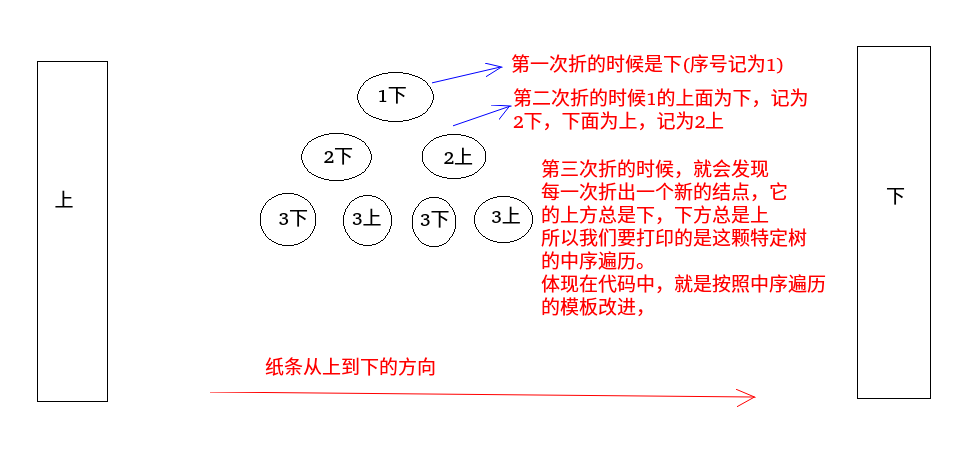
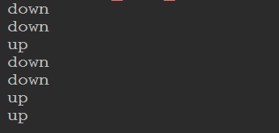

### 折纸问题
#### 题目

 请把一段纸条竖着放在桌子上，然后从纸条的下边向上方对折`1`次，压出折痕后展开。此时折痕是凹下去的，即折痕突起的方向指向纸条的背面。如果从纸条的下边向上方连续对折`2`次，压出折痕后展开，此时有三条折痕，从上到下依次是下折痕,下折痕和上折痕。给定一个输入参数`N`，代表纸条都从下边向上方连续对折`N`次，请从上到下打印所有折痕的方向。例如 :

  `N = 1`时,打印 : 　`down`
   `N = 2`时,打印 : 　`down down up`

#### 解析

 可以用一张纸条自己折一下，会发现: 

 - 第一次折的时候，只有一条折痕，往里凸的，记为`1down`。
 - 第二次折的时候，发现`1down`的上方为往里凸，记为`2down`，而下方为往外凸，记为`2up`。
 - 第三次折的时候，发现`2dowm`的上方往里凸，记为`3down`，`2down`的下方往外凸，记为`3up`； 而`2up`的上方往里凸，记为`3down`，`2up`的下方往外凸，记为`3up`； 

从上面折痕可以发现新的折痕的上面总是为`down`，下面总是为`up`，所以我们可以构造出一颗二叉树，具体看下图




所以当前结点左子树总是`down(true)`,右子树为`up(false)`，所以我们只要按照中序遍历这颗二叉树就解决问题了。

```java
public class PaperFloding {

    //打印的所有折痕方向的函数
    static void printAllFolds(int N){
        printProcess(1,N,true);// 根节点的是down(第一次折的时候是往下的(往里凸))
    }

    static void printProcess(int i, int N, boolean down) {
        if(i > N){ //终止条件(相当于结点为null)
            return;
        }
        printProcess(i+1, N, true);// 相当于往左子树跑(因为左子树永远是down(下))
        System.out.println(down ? "down " : "up ");  //访问中间
        printProcess(i+1, N, false); //往右子树跑
    }


    public static void main(String[] args) {
        int N = 3;
        printAllFolds(N);
    }
}
```
`n  = 3`的测试结果:




