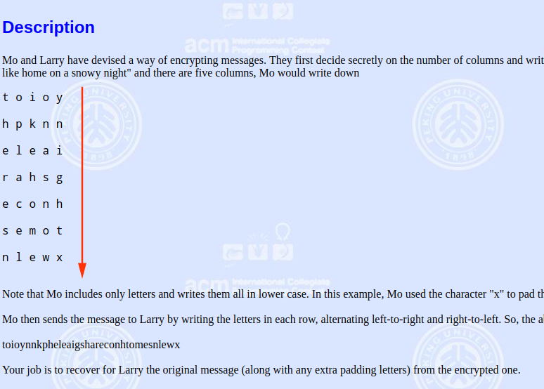

## POJ - 2039. ToAndFro(竖型输出)
#### [题目链接](http://poj.org/problem?id=2039)

> http://poj.org/problem?id=2039

#### 题意

就是给你一个数`n`，和一串字符串，然后要你将这些字符串分成`n`列(蛇形)，并且一竖一竖的打印；




### 解析
 可以定义一个`bool`型变量，表示从左到右还是从右到左，然后，通过行列的关系输出即可。如果是往右边走，对应的下标关系就是`行数*n + 列数`，往左边走的就是`(行数+1)*n-列数-1`；

```java
import java.io.BufferedInputStream;
import java.util.Scanner;

public class Main { //提交时改成Main

    public static void main(String[] args) {
        Scanner in = new Scanner(new BufferedInputStream(System.in));
        PrintStream out = System.out;

        while (in.hasNext()) {
            int n = in.nextInt();
            if (n == 0) 
                break;
            String str = in.next(); //读取// 一行字符串
            char[] chs = str.toCharArray();
            boolean toRight;
            for (int j = 0; j < n; j++) {
                toRight = true;
                for (int i = 0; i < chs.length / n; i++) {
                    if (toRight) {
                        if ((i * n + j) < chs.length)
                            out.print(chs[(i) * n + j]);
                        toRight = false;
                    } else {
                        if (((i + 1) * n - j - 1) < chs.length)
                            out.print(chs[(i + 1) * n - j - 1]);
                        toRight = true;
                    }
                }
            }
            out.println();
        }
    }
}
```
