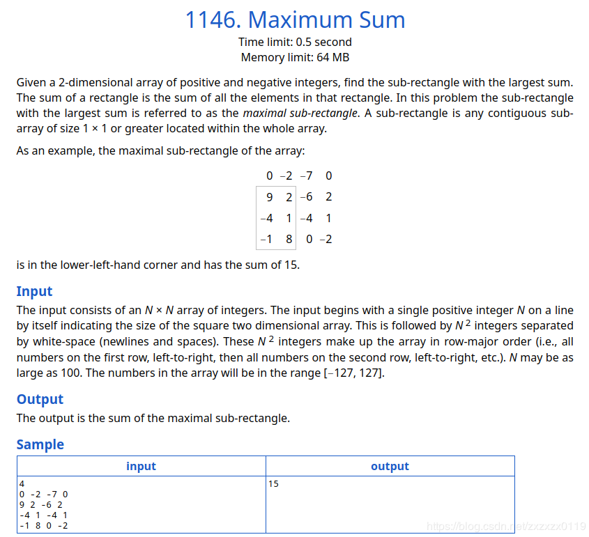
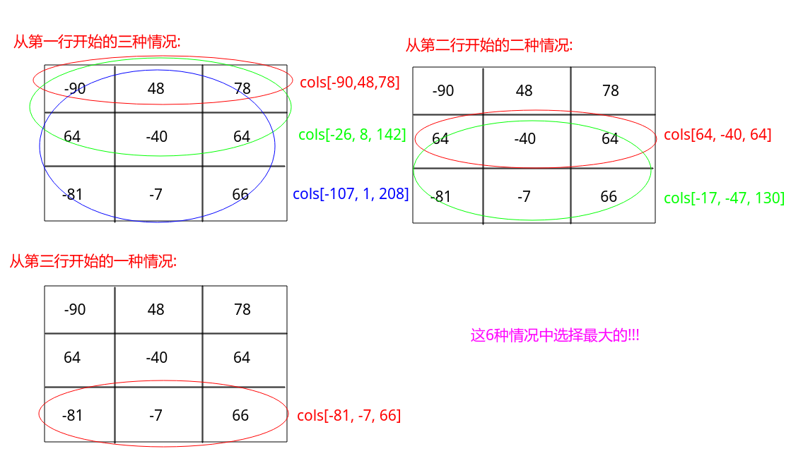

### TimusOJ - 1146. Maximum Sum(子矩阵的最大累加和)

#### [题目链接](http://acm.timus.ru/problem.aspx?space=1&num=1146)

> http://acm.timus.ru/problem.aspx?space=1&num=1146

#### 题目


#### 解析

<font color = red>首先，解这道题之前，先要知道求一维的最大子数组和[**LeetCode53和Hdu1003**](https://blog.csdn.net/zxzxzx0119/article/details/81807083)。</font>


解析: 

假设一个`2`行`4`列的矩阵如下: 
```c
-2  3  -5  7
 1  4  -1 -3
```
如何求<font color = red>必须含有`2`行元素</font>的子矩阵的最大累加和? 做法是将两列的元素累加，然后得到累加数组`[-1, 7, -6, 4]`，然后通过求一维数组的最大累加和的方法求出这个累加数组的最大累加和，结果是`7`。也就是说，<font color = red>必须含有`2`行元素的子矩阵中的最大和为`7`，且这个子矩阵是:
```c
3
4
```

也就是说: 	如果一个矩阵一共有`n`行且限定必须含有`n`行元素的情况下，我们只要把矩阵中的每一列的`n`个元素累加生成一个累加数组，然后求出这个累加数组的最大累加和，这个最大累加和就是必须含有`k`行元素的子矩阵中的最大累加和。
(<font color = blue>类似压缩的思想</font>)


明白了上述的过程，然后就是按照上述过程求出所有的<font color = red> "上下组合"</font>的解的最大值即可。具体过程看下面:

* 注意: 每次`cols`数组的求取，是利用上次求出的结果加上这次的，这样可以将时间复杂度从`O(N^4)`降低到`O(N^3)`；


```java
import java.io.BufferedInputStream;
import java.util.Scanner;

public class Main {

    /** O(N^3) **/
    public static void main(String[] args){
        Scanner cin = new Scanner(new BufferedInputStream(System.in));
        int n = cin.nextInt();
        int[][] matrix = new int[n][n];
        for(int i = 0; i < n; i++){
            for(int j = 0; j < n; j++){
                matrix[i][j] = cin.nextInt();
            }
        }

        // more usual solution not just square matrix (n != m) 
        n = matrix.length;
        int m = matrix[0].length;
        int res = Integer.MIN_VALUE;
        for(int i = 0; i < n; i++){
            int[] cols = new int[m];  // cols
            for(int j = i; j < n; j++){
                for(int k = 0; k < m; k++) {
                    cols[k] = cols[k] + matrix[j][k];
                }
                int preMax = cols[0];
                int maxx = cols[0];
                for(int k = 1; k < m; k++){
                    preMax = preMax > 0 ? preMax + cols[k] : cols[k];
                    maxx = Math.max(preMax, maxx);
                }
                res = Math.max(res, maxx);
            }
        }
        System.out.println(res);
    }
}
```

