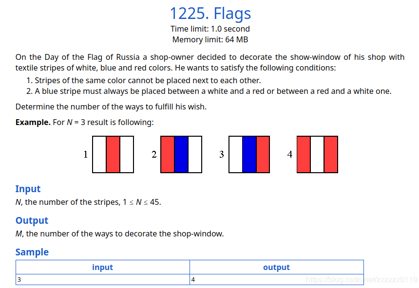
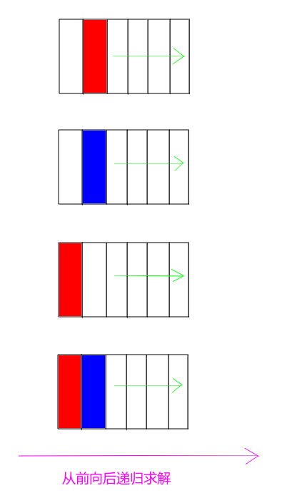
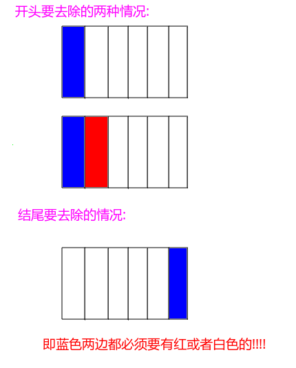
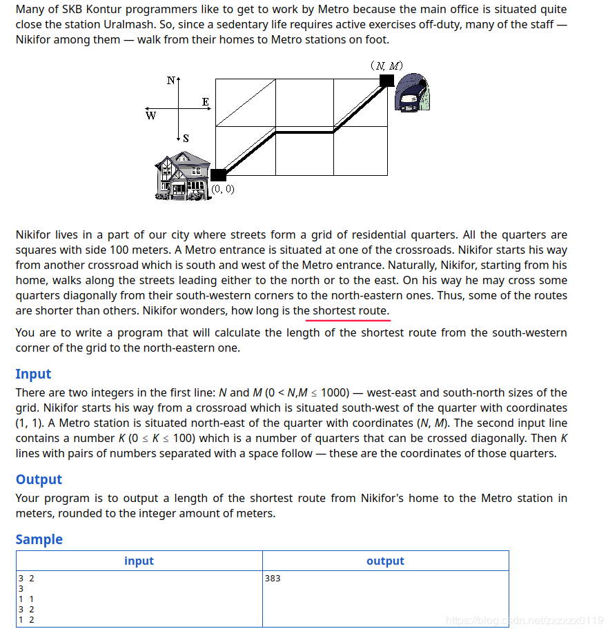
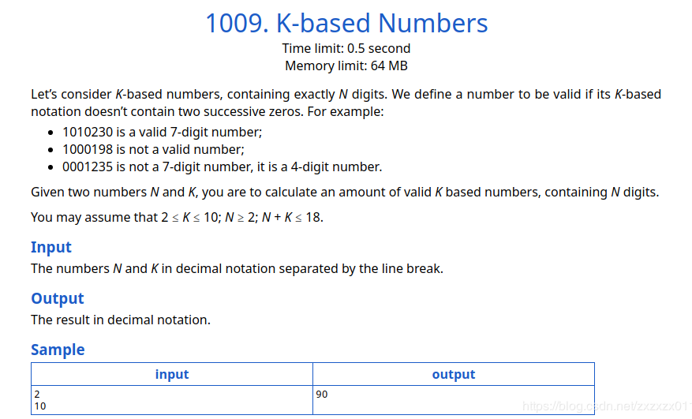

### TimusOJ - 1225.Flags &  1119.Metr &  1009.K-based Numbers (DP简单题)

* [TimusOJ - 1225.Flags](#1)
* [TimusOJ - 1119.Metr](#timusoj---1119metr)
* [TimusOJ - 1009.K-based Numbers](#timusoj---1009k-based-numbers)

***

### <font color = red id = "1">TimusOJ - 1225.Flags
#### [题目链接](http://acm.timus.ru/problem.aspx?space=1&num=1225)

> http://acm.timus.ru/problem.aspx?space=1&num=1225

#### 题目

给你三种颜色，输入`n`代表的是长方形数，向这些长方形中填充颜色，需要满足下面两个条件:

* 其中相邻的方块颜色不能相同；
* <font color = blue>蓝色方块两边必须同时有红色和白色方块；

给你`n`，问你总共有多少种摆放方案。

#### 解析
记忆化的思路(可结合代码查看): 



递归函数的情况(这里用`0`表示白色， `1`表示蓝色， `2`表示红色):

* 递归到当前位置，要判断前一个位置`pre`和前一个位置的前一个位置`prepre`的情况；
	* 如果前一个位置是蓝色，则当前位置只能取和`prepre`相反的颜色(即`2 - prepre`)；
	* 如果前一个位置是红色或者白色，就可以取两种情况，第一种是蓝色，第二种是和`pre`相反的颜色(红色和白色相反)；(<font color = red>但是这里取蓝色的时候要注意不能是最后一个`n`位置)；


```java
import java.io.BufferedInputStream;
import java.util.Arrays;
import java.util.Scanner;

public class Main {

    static long[][] dp;

    static long recur(int pos, int pre, int prepre, int n){
        if(pos == n+1)
            return 1;
        if(dp[pos][pre] != -1)
            return dp[pos][pre];
        int res = 0;
        if(pre == 1){
            res += recur(pos+1, 2 - prepre, pre, n);
        }else { // pre = 0 || pre = 2
            res += recur(pos+1, 2-pre, pre, n);
            if(pos != n)
                res += recur(pos+1, Math.abs(1-pre), pre, n);
        }
        return dp[pos][pre] = res;
    }

    public static void main(String[] args){
        Scanner cin = new Scanner(new BufferedInputStream(System.in));
        int n = cin.nextInt();
        if(n == 1 || n == 2){
            System.out.println(2);
            return;
        }
        dp = new long[n+1][3];
        for(int i = 1; i <= n; i++)
            Arrays.fill(dp[i], -1);
        long res = recur(3, 1, 2, n);
        res += recur(3, 1, 0, n);
        res += recur(3, 0, 2, n);
        res += recur(3, 2, 0, n);
        System.out.println(res);
    }
}
```

***
### <font color = red id = "2">TimusOJ - 1119.Metr
#### [题目链接](http://acm.timus.ru/problem.aspx?space=1&num=1119)

> http://acm.timus.ru/problem.aspx?space=1&num=1119

#### 题目

 给出`N*M`网格，其中一些对角点有边相连(<font color = red>给出的是对角点的右上角的点</font>)，问从`(0,0)`到`(N,M)`的最短路径为多长


#### 解析

这种题目和[**LeetCode-64.Minimum Path Sum**](https://blog.csdn.net/zxzxzx0119/article/details/81227300)和类似。

这题最关键的是 <font color = red>不要将重点放在方块上，而要放在每个顶点上。</font>

递归的想法:

* 当前位置`[i, j]`(顶点)，如果`matrix[i+1][j+1] = true`，也就是`[i, j] ~ [i+1, j+1]`有对角边，就选择对角边，然后去递归求最小值；
* 如果没有对角边，就需要选择走左边和上面的递归函数中选择最小的；

```java
import java.io.BufferedInputStream;
import java.util.Arrays;
import java.util.Scanner;

public class Main {

    static double lenDiag = Math.sqrt(20000); //144
    static int n, m;
    static double[][] dp;

    static double recur(boolean[][] matrix, int i, int j){
        if(i == n && j == m)
            return 0;
        if(dp[i][j] != -1)
            return dp[i][j];
        if(i == n)
            return 100 + recur(matrix, i, j+1);
        if(j == m)
            return 100 + recur(matrix, i+1, j);
        double res = 0;
        if(matrix[i+1][j+1])
            res = lenDiag + recur(matrix, i+1, j+1);
        else
            res = 100 + Math.min(recur(matrix, i+1, j), recur(matrix, i, j+1));
        return dp[i][j] = res;
    }

    public static void main(String[] args){
        Scanner cin = new Scanner(new BufferedInputStream(System.in));
        m = cin.nextInt();
        n = cin.nextInt();
        int k = cin.nextInt();
        boolean[][] matrix = new boolean[n+1][m+1];
        for(int i = 0; i < k; i++){
            int y = cin.nextInt();
            int x = cin.nextInt();
            matrix[x][y] = true;
        }
        dp = new double[n+1][m+1];
        for(int i = 0; i <= n; i++)
            Arrays.fill(dp[i], -1);
        System.out.println(Math.round(recur(matrix, 0, 0)));
    }
}
```

***
### <font color = red id = "3">TimusOJ - 1009.K-based Numbers

#### [题目链接](http://acm.timus.ru/problem.aspx?space=1&num=1009)
#### 题目
给你`n、k`，要你求在`n`位`k`进制数中，有多少个不包含连续两个`0`的数。


#### 解析

递归的思路:

* 使用一个`boolean`变量，记录前一个数是不是`0`；
* 如果是，当前递归就只能枚举从`1 ~ k`的数，然后递归；
* 如果不是，则在上面的基础上，还可以加上`0`去递归；

因为要记忆化，所以不用`boolean`变量，`dp`数组二维只需要两个`size`大小即可。


```java
import java.io.BufferedInputStream;
import java.util.Scanner;

public class Main {

    static int[][] dp;

    static int recur(int pos, int isZ, int n, int k){
        if(pos == n)
            return 1;
        if(dp[pos][isZ] != -1)
            return dp[pos][isZ];
        int res = 0;
        for(int i = 1; i < k; i++)
            res += recur(pos+1, 0, n, k);
        if(isZ == 0)
            res += recur(pos+1, 1, n, k);
        return dp[pos][isZ] = res;
    }

    public static void main(String[] args){
        Scanner cin = new Scanner(new BufferedInputStream(System.in));

        int n = cin.nextInt();
        int k = cin.nextInt();

        dp = new int[n][2];
        for(int i = 0; i < n; i++){
            dp[i][0] = -1;
            dp[i][1] = -1;
        }
        System.out.println(recur(0, 1, n, k));
    }
}
```

***

三个题目都是用记忆化写的。递推之后有时间再改吧。。。

