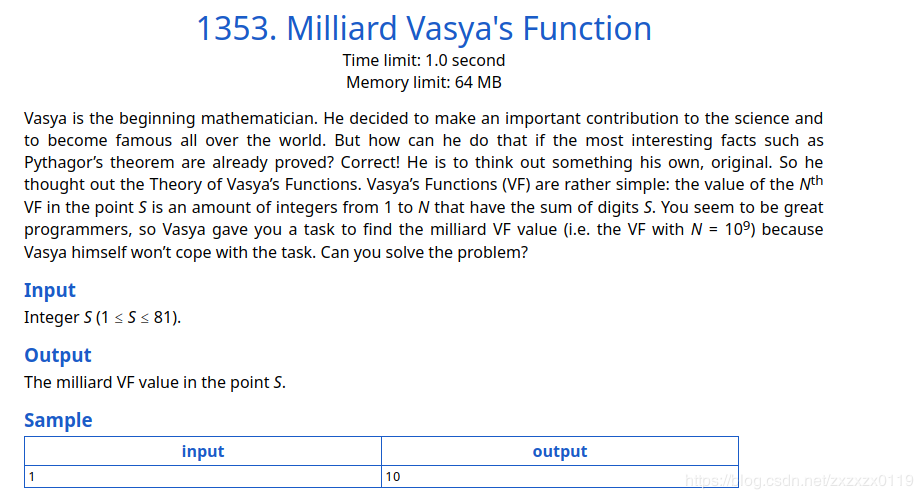
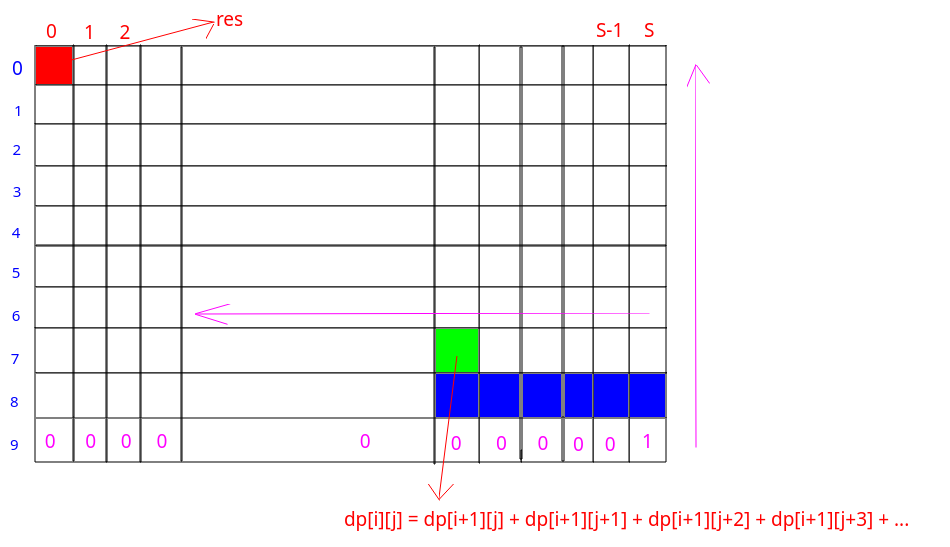
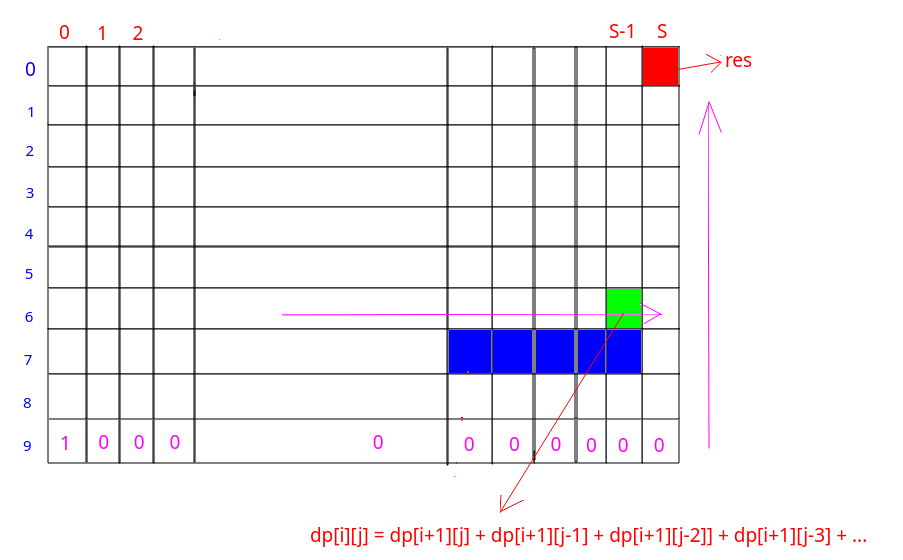

## TimusOJ - 1353. Milliard Vasya's Function(DP)

#### [题目链接](http://acm.timus.ru/problem.aspx?space=1&num=1353)

> http://acm.timus.ru/problem.aspx?space=1&num=1353

#### 题目
求`1`到<font color = red>10<sup>9</sup></font> ( [<font color = red>1, 10<sup>9</sup>]</font> )中各位数字之和为`S`的数有多少个；





#### 解析
**这个题目和[LeetCode - 518. Coin Change 2](https://blog.csdn.net/zxzxzx0119/article/details/81275479)非常的相似。**

递归(记忆化)的写法:

* 总共需要`9`位数字，我们就去递归每一个位置可以累加`0 ~ 9`之间的数；
* 递归终止条件就是当够了`9`个数字的时候，判断现在累加的和是不是`S`即可了；
* 然后递归加上记忆化即可。 

```java
import java.io.BufferedInputStream;
import java.util.Arrays;
import java.util.Scanner;

public class Main {

    static int dp[][];

    static int recur(int pos, int sum, int S) {
        if (pos == 10) // 枚举9位数
            return S == sum ? 1 : 0;
        if (dp[pos][sum] != -1)
            return dp[pos][sum];
        int res = 0;
        for (int i = 0; i <= 9; i++) {
            sum += i;
            res += recur(pos + 1, sum, S);
            sum -= i;
        }
        return dp[pos][sum] = res;
    }

    public static void main(String[] args) {

        Scanner cin = new Scanner(new BufferedInputStream(System.in));
        int S = cin.nextInt();
        dp = new int[10][82];

        for (int i = 0; i < 10; i++)
            Arrays.fill(dp[i], -1);

        int res = recur(1, 0, S);
        if (S == 1) // notice 1000000000
            res += 1;
        System.out.println(res);
    }
}
```

其中递归函数 `sum`值也可以这么写，即不改变`sum`值: 
```java
static int recur(int pos, int sum, int S) {
    if (pos == 10) // 枚举9位数
        return S == sum ? 1 : 0;
    if (dp[pos][sum] != -1)
        return dp[pos][sum];
    int res = 0;
    for (int i = 0; i <= 9; i++)
        res += recur(pos + 1, sum + i, S);
    return dp[pos][sum] = res;
}
```
然后就是递归的反方向了，即改成`dp`动态规划。


转成`dp`数组: 

```java
import java.io.BufferedInputStream;
import java.util.Arrays;
import java.util.Scanner;

public class Main {

    public static void main(String[] args) {

        Scanner cin = new Scanner(new BufferedInputStream(System.in));
        int S = cin.nextInt();
        int[][] dp = new int[10][S+1];

        for (int j = 0; j <= S; j++) // dp[9][S] = 1 , dp[1~S) = 0
            dp[9][j] = j == S ? 1 : 0;
        int sum = 0;
        for (int i = 8; i >= 0; i--) {
            for (int j = S; j >= 0; j--) {
                sum = 0;
                for (int k = 0; k <= 9; k++)
                    if (j + k <= S)
                        sum += dp[i + 1][j + k];
                dp[i][j] = sum;
            }
        }
        if(S == 1)
            dp[0][0]++;
        System.out.println(dp[0][0]);
    }
}
```

***
<font color = red>上面的方式是从 `sum = 0`开始递归的，也可以反方向从`sum = S`开始递归，递归和`dp`的程序如下: 

```java
import java.io.BufferedInputStream;
import java.util.Arrays;
import java.util.Scanner;

public class Main {

    static int dp[][];

    static int recur(int pos, int sum) {
        if (pos == 10) // 枚举9位数
            return sum == 0 ? 1 : 0;
        if (dp[pos][sum] != -1)
            return dp[pos][sum];
        int res = 0;
        for (int i = 0; i <= 9; i++)
            if(sum - i >= 0)
            res += recur(pos + 1, sum - i);
        return dp[pos][sum] = res;
    }

    public static void main(String[] args) {

        Scanner cin = new Scanner(new BufferedInputStream(System.in));
        int S = cin.nextInt();
        dp = new int[10][S+1];

        for (int i = 0; i < 10; i++)
            Arrays.fill(dp[i], -1);

        int res = recur(1, S);

        if (S == 1) // notice 1000000000
            res += 1;
        System.out.println(res);
    }
}

```

同样转换矩阵: 


```java
import java.io.BufferedInputStream;
import java.util.Arrays;
import java.util.Scanner;

public class Main {

    public static void main(String[] args) {

        Scanner cin = new Scanner(new BufferedInputStream(System.in));
        int S = cin.nextInt();
        int[][] dp = new int[10][S+1];

        for (int j = 0; j <= S; j++) // dp[9][S] = 1 , dp[1~S) = 0
            dp[9][j] = j == 0 ? 1 : 0;
        int sum = 0;
        for (int i = 8; i >= 0; i--) {
            for (int j = 0; j <= S; j++) {
                sum = 0;
                for (int k = 0; k <= 9; k++)
                    if (j - k >= 0)
                        sum += dp[i + 1][j - k];
                dp[i][j] = sum;
            }
        }
        if(S == 1)
            dp[0][S]++;
        System.out.println(dp[0][S]);
    }
}

```

