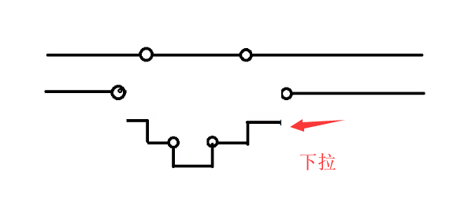

# AcWing-101. 最高的牛

## [题目链接](https://www.acwing.com/problem/content/103/)

> https://www.acwing.com/problem/content/103/

## 题目

有 NN 头牛站成一行，被编队为1、2、3…N，每头牛的身高都为整数。

当且仅当两头牛中间的牛身高都比它们矮时，两头牛方可看到对方。

现在，我们只知道其中最高的牛是第 PP 头，它的身高是 HH ，剩余牛的身高未知。

但是，我们还知道这群牛之中存在着 MM 对关系，每对关系都指明了某两头牛 AA 和 BB 可以相互看见。

求每头牛的身高的最大可能值是多少。

#### 输入格式

第一行输入整数N,P,H,MN,P,H,M，数据用空格隔开。

接下来M行，每行输出两个整数 AA 和 BB ，代表牛 AA 和牛 BB 可以相互看见，数据用空格隔开。

#### 输出格式

一共输出 NN 行数据，每行输出一个整数。

第 ii 行输出的整数代表第 ii 头牛可能的最大身高。

#### 数据范围

1≤N≤100001≤N≤10000,
1≤H≤10000001≤H≤1000000,
1≤A,B≤100001≤A,B≤10000,
0≤M≤100000≤M≤10000

#### 输入样例：

```
9 3 5 5
1 3
5 3
4 3
3 7
9 8
```

#### 输出样例：

```
5
4
5
3
4
4
5
5
5
```

##### 注意：

- 此题中给出的关系对可能存在重复

## 解析

这道题目一个核心要点，就是如何处理这些特殊的关系，也就是两头牛互相看见。

其实题目中已经告诉我们如何处理，因为我们发现，题目中要求牛的身高最高，那么既然如此，我们完全可以将每一组关系(A,B)，看作`[A+1,B−1]`这组牛身高只比`A,B`这两头牛矮1。

各位可以画一个图，来更好的理解这道题目。



因此我们可以可以利用区间处理小操作，也就是前缀和加差分。设一个数组D，`D[i]`为比最高牛矮多少，则`D[P]=0`，那么对于一组关系，我们可以这样操作,`D[A+1]–,D[B]++;`然后从左到右前缀和，就可以求出矮多少。具体可以看代码实现。

```java
import java.io.BufferedInputStream;
import java.io.PrintWriter;
import java.util.HashSet;
import java.util.Objects;
import java.util.Scanner;

public class Main {


    static Scanner in = new Scanner(new BufferedInputStream(System.in));
    static PrintWriter out = new PrintWriter(System.out);

    static class Node{
        int a, b;
        Node(int a, int b){
            this.a = a;
            this.b = b;
        }

        @Override
        public boolean equals(Object o) {
            if (this == o) return true;
            if (o == null || getClass() != o.getClass()) return false;
            Node node = (Node) o;
            return a == node.a &&
                    b == node.b;
        }

        @Override
        public int hashCode() {
            return Objects.hash(a, b);
        }
    }

    public static void main(String[] args) {

        int n = in.nextInt(), p = in.nextInt(), h = in.nextInt(), m = in.nextInt();
        int[] height = new int[n+1];
        height[1] = h; // b数组，可以让所有的牛都是最高
        HashSet<Node> set = new HashSet<>();
        for(int i = 0; i < m; i ++){
            int a = in.nextInt(), b = in.nextInt();
            if(a > b){
                int t = a;
                a = b;
                b = t;
            }
            Node node = new Node(a, b);
            if(!set.contains(node)){
                set.add(node);
                height[a+1]--;
                height[b]++;
            }
        }
        for(int i = 1; i <= n; i++){
            height[i] += height[i-1];
            out.println(height[i]);
        }
        out.close();
    }
}

```

