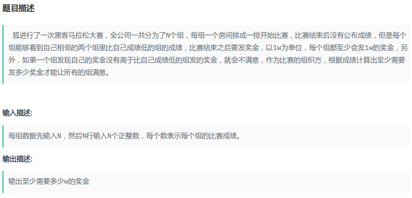
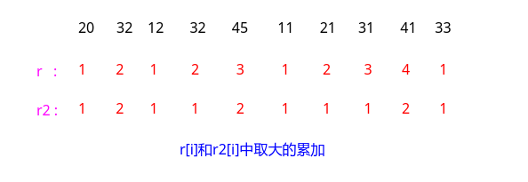

## Nowcoder - 发奖金

#### [题目链接](https://www.nowcoder.com/practice/acb888f7ccee4fc0aab208393d41a552?tpId=49&&tqId=29328&rp=1&ru=/activity/oj&qru=/ta/2016test/question-ranking)

> https://www.nowcoder.com/practice/acb888f7ccee4fc0aab208393d41a552?tpId=49&&tqId=29328&rp=1&ru=/activity/oj&qru=/ta/2016test/question-ranking

#### 题目



样例输入

```c
10
20 
32 
12 
32 
45 
11 
21 
31 
41 
33
```

样例输出:

```c
20
```

### 解析

从前往后和从后往前计算两个数组`r`和`r2`。最后累加结果的时候取大的那个。可以说是贪心吧。



代码:

```java
import java.io.*;
import java.util.*;

public class Main {

    static void solve(InputStream stream, PrintWriter out) {
        Scanner in = new Scanner(new BufferedInputStream(stream));
        while (in.hasNext()) {
            int n = in.nextInt();
            int[] a = new int[n];
            for (int i = 0; i < n; i++) a[i] = in.nextInt();
            int[] r = new int[n];// 从前往后
            r[0] = 1;
            for (int i = 1; i < n; i++) {
                if (a[i] > a[i - 1])
                    r[i] = r[i - 1] + 1;
                else
                    r[i] = 1;
            }
            int[] r2 = new int[n];
            r2[n - 1] = 1;//从后往前
            for (int i = n - 2; i >= 0; i--) {
                if (a[i] > a[i + 1])
                    r2[i] = r2[i + 1] + 1;
                else
                    r2[i] = 1;
            }
            long res = 0;
            for (int i = 0; i < n; i++) res += Math.max(r[i], r2[i]);
            out.println(res);
        }
    }
    
    public static void main(String[] args) {
        OutputStream os = System.out;
        InputStream is = System.in;
        PrintWriter out = new PrintWriter(os);
        solve(is, out);
        out.close(); // 不关闭就没有输出
    }
}

```

