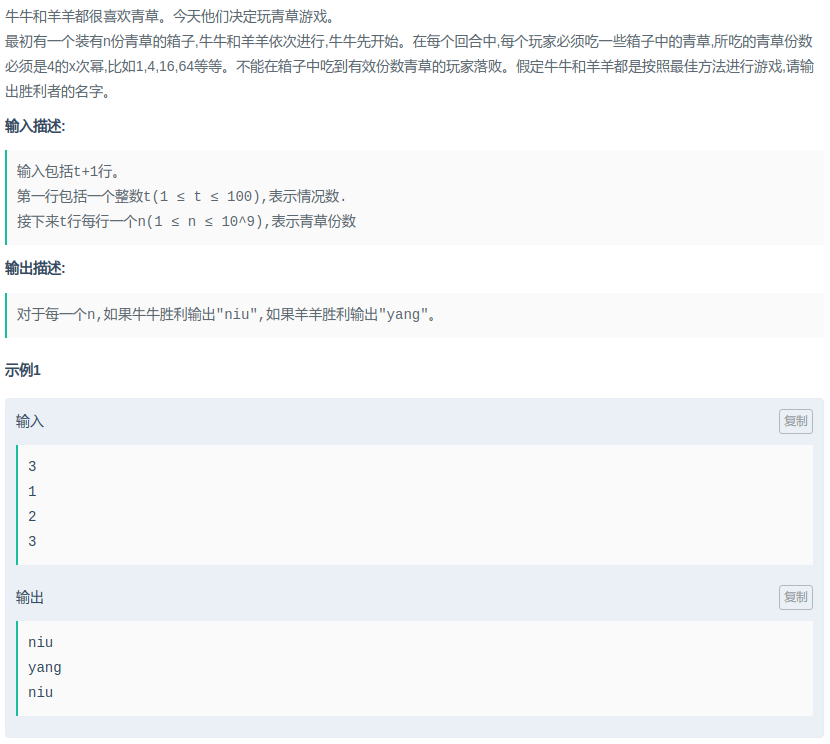

# 爱奇艺-青草游戏

#### [题目链接](https://www.nowcoder.com/practice/ed0334a5e88f4662bb69374b308862d8?tpId=90&tqId=30802&tPage=2&rp=2&ru=/ta/2018test&qru=/ta/2018test/question-ranking)

> https://www.nowcoder.com/practice/ed0334a5e88f4662bb69374b308862d8?tpId=90&tqId=30802&tPage=2&rp=2&ru=/ta/2018test&qru=/ta/2018test/question-ranking

#### 题目



## 解析

博弈dp，先暴力计算出前面几十项，然后发现规律。

```java
import java.io.*;
import java.util.*;

public class Main {

    static int MAX = (int) 1e6; // 1e9
    static boolean[] dp = new boolean[MAX + 5];
    // 求log(4)(MAX)的计算结果
    // 利用换底公式：log(x)(y) =log(e)(x) / log(e)(y)，
    static int strategyN = (int) (Math.log(MAX) / Math.log(4)) + 1;
    static int[] strategies = new int[strategyN];

    static {
        for (int i = 0; i < strategyN; i++)
            strategies[i] = (int) Math.pow(4, i);
        Arrays.fill(dp, false);
    }

    static void test() {
        for (int i = 1; i <= MAX; i++) {
            for (int j = 0; j < strategyN; j++) {
                if (strategies[j] <= i)
                    dp[i] |= !dp[i - strategies[j]];
            }
        }
        // 发现规律
        for (int i = 0; i < 40; i++) System.out.println(dp[i] ? "niu" : "yang");
    }

    static void solve(InputStream stream, PrintWriter out) {
        FR in = new FR(stream);

//        test();
        
        int T = in.nextInt();
        for(int t = 0; t < T; t++){
            int n = in.nextInt();
            out.println( (n%5 == 0 || n % 5 == 2) ? "yang" : "niu");
        }
    }

    /**
     * --------------------------------------------------------------------------------------
     **/

    public static void main(String[] args) {
        OutputStream os = System.out;
        InputStream is = System.in;
        PrintWriter out = new PrintWriter(os);
        solve(is, out);
        out.close();
    }

    static class FR {
        BufferedReader br;
        StringTokenizer tk;

        FR(InputStream stream) {
            br = new BufferedReader(new InputStreamReader(stream), 32768);
            tk = null;
        }

        String next() {
            while (tk == null || !tk.hasMoreElements()) {
                try {
                    tk = new StringTokenizer(br.readLine());
                } catch (IOException e) {
                    e.printStackTrace();
                }
            }
            return tk.nextToken();
        }
        int nextInt() {
            return Integer.parseInt(next());
        }
    }
}
```

