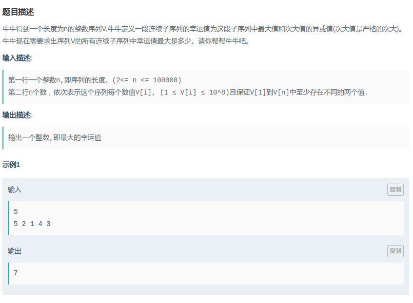

# 爱奇艺-幸运子序列

#### [题目链接](https://www.nowcoder.com/practice/872919272a33406a9c5ddc8b2f7532f4?tpId=90&tqId=30804&tPage=2&rp=2&ru=/ta/2018test&qru=/ta/2018test/question-ranking)

> https://www.nowcoder.com/practice/872919272a33406a9c5ddc8b2f7532f4?tpId=90&tqId=30804&tPage=2&rp=2&ru=/ta/2018test&qru=/ta/2018test/question-ranking

#### 题目



## 解析

单调栈解决。

找到每个数的左右两边比它大的数。记录最大值

代码:

```java
import java.util.*;
import java.io.*;
public class Main{
    public static void main(String[] args){
        Scanner in = new Scanner(new BufferedInputStream(System.in));
        PrintWriter out = new PrintWriter(System.out);
        int n = in.nextInt();
        Stack<Integer> stack = new Stack<>();
        int res = 0;
        for(int i = 0; i < n; i++){
            int x = in.nextInt();
            while(!stack.isEmpty() && stack.peek() <= x)
                res = Math.max(res, x ^ stack.pop());
            if(!stack.isEmpty()) res = Math.max(res, x ^ stack.peek());
            stack.push(x);
        }
        out.println(res);
        out.close();
    }
}
```

