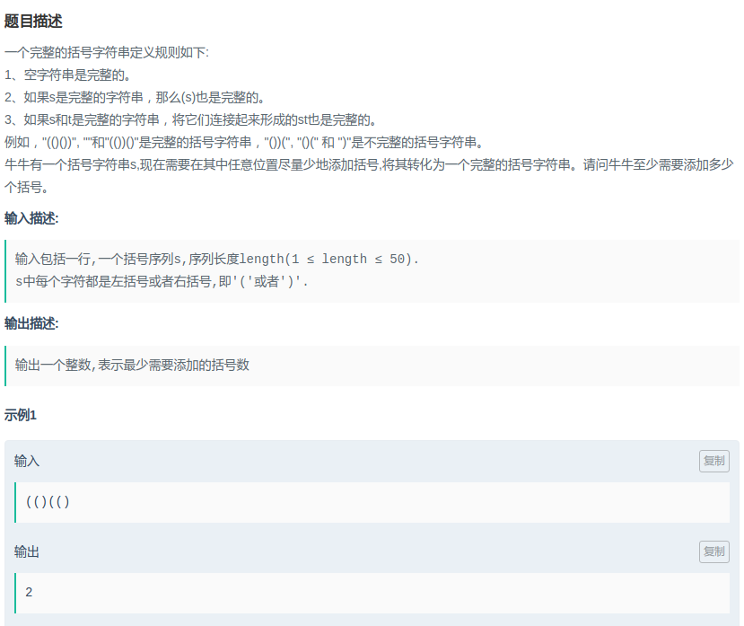

## 爱奇艺-缺失的括号

#### [题目链接](https://www.nowcoder.com/practice/de7d4a4b50f643669f331941afb1e728?tpId=90&tqId=30805&tPage=2&rp=2&ru=/ta/2018test&qru=/ta/2018test/question-ranking)

> https://www.nowcoder.com/practice/de7d4a4b50f643669f331941afb1e728?tpId=90&tqId=30805&tPage=2&rp=2&ru=/ta/2018test&qru=/ta/2018test/question-ranking

#### 题目



## 解析

统计左边的需要匹配的和右边的需要匹配的，累加即可。

代码：

```java
import java.util.*;
import java.io.*;

public class Main{
    
    public static void main(String[] args){
        Scanner in = new Scanner(new BufferedInputStream(System.in));
        PrintWriter out = new PrintWriter(System.out);
        char[] s = in.next().toCharArray();
        Stack<Character> stack = new Stack<>();
        int right = 0;
        for(int i = 0; i < s.length; i++){
            if(s[i] == '('){
                stack.push(s[i]);
            }else {
                if(stack.isEmpty()) right++;
                else if(stack.peek() == '(')
                    stack.pop();
            }
        }
        out.println(stack.size() + right);
        out.close();
    }
}
```

