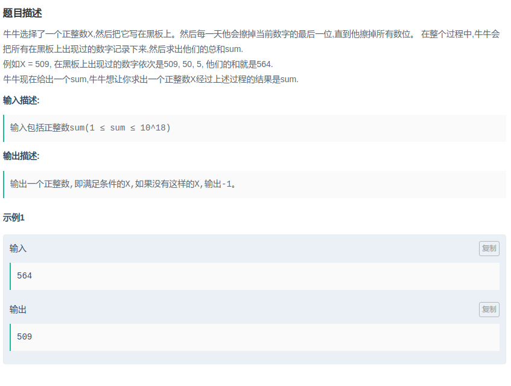

## 爱奇艺-最后一位

#### [题目链接](https://www.nowcoder.com/practice/fae8632cfc64433989720bc01e09f382?tpId=90&tqId=30806&tPage=2&rp=2&ru=/ta/2018test&qru=/ta/2018test/question-ranking)

> https://www.nowcoder.com/practice/fae8632cfc64433989720bc01e09f382?tpId=90&tqId=30806&tPage=2&rp=2&ru=/ta/2018test&qru=/ta/2018test/question-ranking

#### 题目



## 解析

二分即可。

最小从`0`开始，最大从`sum`开始。

代码:

```java
import java.io.*;
import java.util.*;

public class Main {

    static void solve(InputStream stream, PrintWriter out) {
        Scanner in = new Scanner(new BufferedInputStream(System.in));
        long sum = in.nextLong();
        long L = 0, R = sum;
        while (L <= R) {
            long mid = L + (R - L) / 2;
            long midSum = getSum(mid);
            if (midSum == sum) {
                out.println(mid);
                return;
            } else if (midSum < sum) {
                L = mid + 1;
            } else if (midSum > sum) {
                R = mid - 1;
            }
        }
        out.println(-1);
    }

    static long getSum(long n) {
        long res = 0;
        while (n > 0) {
            res += n;
            n /= 10;
        }
        return res;
    }

    /*--------------------------------------------------------------------------------------*/

    public static void main(String[] args) {
        OutputStream os = System.out;
        InputStream is = System.in;
        PrintWriter out = new PrintWriter(os);
        solve(is, out);
        out.close();
    }
}

```

