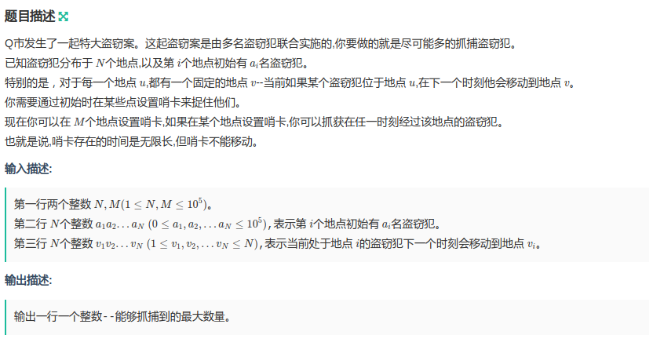
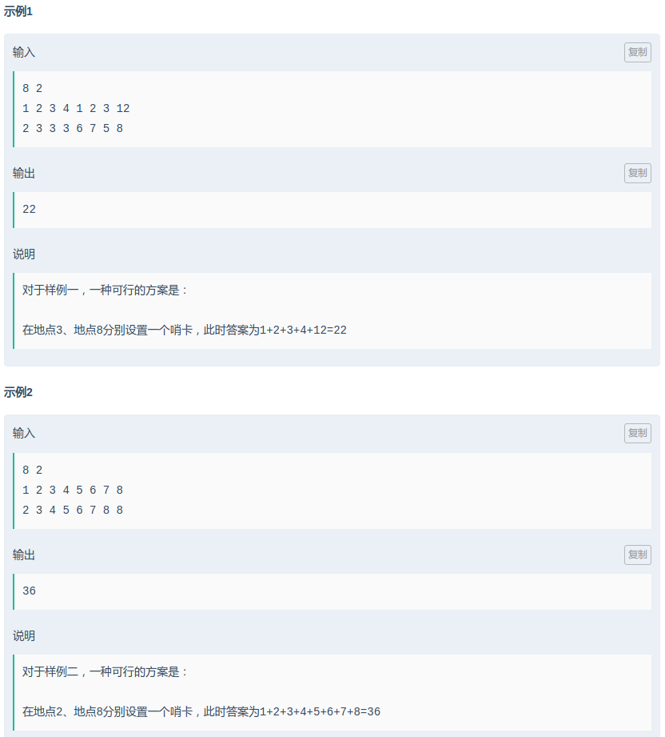

## 牛客练习赛41 - C. 抓捕盗窃犯 (并查集)

#### [题目链接](https://ac.nowcoder.com/acm/contest/373/C)

> https://ac.nowcoder.com/acm/contest/373/C

#### 题目





### 解析

代码:

```java
import java.io.*;
import java.util.*;

public class Main {

    static int[] parent;
    static int[] rank;
    static int n, m;
    static long[] val;//注意val数组要用Long，后面会累加

    static int findRoot(int p) {
        while (parent[p] != p) {
            parent[p] = parent[parent[p]];
            p = parent[p];
        }
        return p;
    }

    static void union(int a, int b) {
        int aRoot = findRoot(a);
        int bRoot = findRoot(b);
        if (aRoot == bRoot)
            return;
        if (rank[aRoot] < rank[bRoot]) {
            parent[aRoot] = bRoot;
        } else if (rank[aRoot] > rank[bRoot]) {
            parent[bRoot] = aRoot;
        } else {
            parent[aRoot] = bRoot;
            rank[bRoot]++;
        }
    }

    public static void main(String[] args) {
        Scanner in = new Scanner(new BufferedInputStream(System.in));
        PrintStream out = System.out;
        n = in.nextInt();
        m = in.nextInt();
        parent = new int[n + 1];
        rank = new int[n + 1];
        val = new long[n + 1];
        for (int i = 1; i <= n; i++){
            val[i] = in.nextInt();
            parent[i] = i;
            rank[i] = 1;
        }
        for (int i = 1; i <= n; i++) {
            int pa = in.nextInt();
            union(i, pa);
        }
        for (int i = 1; i <= n; i++) {
            int root = findRoot(i);
            if (root != i) val[root] += val[i];//只求root != i的
        }
        ArrayList<Long> ans = new ArrayList<>();
        for (int i = 1; i <= n; i++)
            if (parent[i] == i)//注意只要parent[i] = i的
                ans.add(val[i]);
        Collections.sort(ans, (o1, o2) -> o2 - o1 > 0 ? 1 : (o2 - o1 < 0 ? -1 : 0));
        long res = 0;
        for (int i = 0; i < ans.size() && i < m; i++) res += ans.get(i);
        System.out.println(res);
    }
}
```

