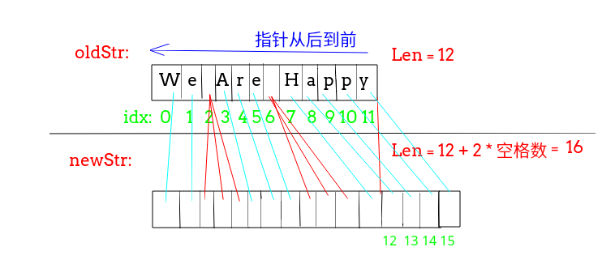

## 剑指Offer - 02 - 替换空格

#### [题目链接](https://www.nowcoder.com/practice/4060ac7e3e404ad1a894ef3e17650423?tpId=13&tqId=11155&tPage=1&rp=1&ru=%2Fta%2Fcoding-interviews&qru=%2Fta%2Fcoding-interviews%2Fquestion-ranking)

> https://www.nowcoder.com/practice/4060ac7e3e404ad1a894ef3e17650423?tpId=13&tqId=11155&tPage=1&rp=1&ru=%2Fta%2Fcoding-interviews&qru=%2Fta%2Fcoding-interviews%2Fquestion-ranking

#### 题目

> 请实现一个函数，将一个字符串中的每个空格替换成`“%20”`。例如，当字符串为`We Are Happy.`则经过替换之后的字符串为`We%20Are%20Happy.`。

### 解析

思路

 - 这个题目如果只是简单的插入的话，插入之后导致后面的元素的移动导致，需要O(n<sup>2</sup>)的复杂度；
 - 这个的解决方法使用两个指针，可以达到`O(n)`复杂度；
 - **首先计算出空格的个数，这样求的新的字符串的长度**；
 - 然后使用两个指针,新的指针`second`指向新的字符串的末尾，老指针`first`指向原来字符串的末尾，每次检查字符串的末尾如果是空格的话，就添加`%20`进去，否则把原来的字符串复制到后面；

如下图:

 

代码:

```java
public class Solution {
    public String replaceSpace(StringBuffer str) {
        int spaceNum = 0;
        for(int i = 0; i < str.length(); i++) if(str.charAt(i) == ' ') spaceNum++;
        int newLen = str.length() + 2*spaceNum;
        int oriPos = str.length() - 1 , newPos = newLen-1;
        str.setLength(newLen);
        for(; oriPos >= 0; oriPos--){
            if(str.charAt(oriPos) == ' '){
                str.setCharAt(newPos--, '0');
                str.setCharAt(newPos--, '2');
                str.setCharAt(newPos--, '%');
            }else {
                str.setCharAt(newPos--, str.charAt(oriPos));
            }
        }
        return str.toString();
    }
}
```