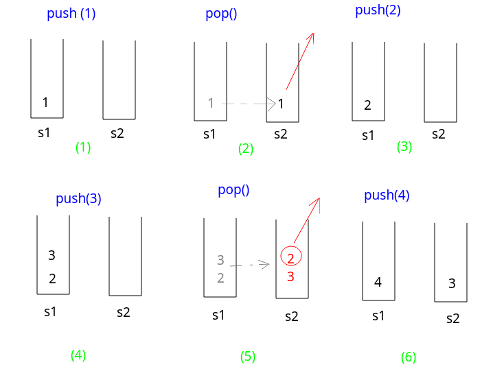
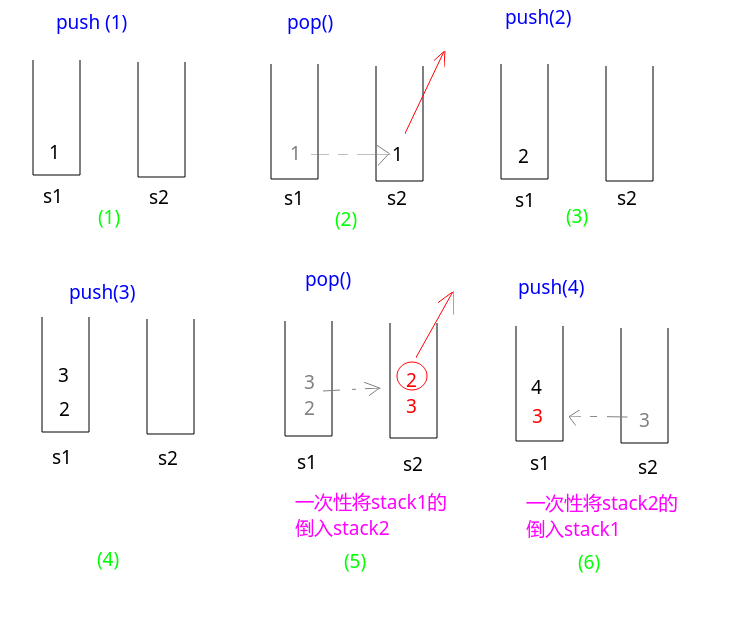

## 剑指Offer - 05 - 用两个栈实现一个队列

#### [题目链接](https://www.nowcoder.com/practice/54275ddae22f475981afa2244dd448c6?tpId=13&tqId=11158&tPage=1&rp=1&ru=%2Fta%2Fcoding-interviews&qru=%2Fta%2Fcoding-interviews%2Fquestion-ranking)

> https://www.nowcoder.com/practice/54275ddae22f475981afa2244dd448c6?tpId=13&tqId=11158&tPage=1&rp=1&ru=%2Fta%2Fcoding-interviews&qru=%2Fta%2Fcoding-interviews%2Fquestion-ranking

#### 题目

> 用两个栈来实现一个队列，完成队列的`Push`和`Pop`操作。 队列中的元素为`int`类型。

### 解析

这题也比较简单。两种思路:

思路一:

* `push`的时候直接放到`stack1`；
* 为了`pop`的操作，当`stack2`空(必须当`stack2`为空)的时候，一次性(必须一次性)要将`stack1`的全部`push`到`stack2`中；
* 然后`pop()`的时候，取的就是`stack2`的栈顶；

看个例子:



代码:

```java
import java.util.Stack;

public class Solution {

    Stack<Integer> stack1 = new Stack<Integer>();
    Stack<Integer> stack2 = new Stack<Integer>();

    public void push(int node) {
        stack1.push(node);
    }

    public int pop() {
        if (stack1.isEmpty() && stack2.isEmpty())
            throw new RuntimeException("Queue is empty!");
        if (stack2.isEmpty()) {   //如果stack2不空的话，就先不要将stack1的内容放进去
            while (!stack1.isEmpty())
                stack2.push(stack1.pop());
        }
        return stack2.pop();
    }
}
```

思路二:

* 每次从队列中取队头元素的时候，都是取`stack2.pop()`(栈顶)，每次`push`都是`push`到`stack1`；
* 当`push`的时候，如果`stack2`不空，就要将`stack2`的全部倒入`stack1`中；然后再`push`新元素；
* 当`pop()`取元素的时候，如果`stack1`不空，就要先全部倒入`stack2`，因为`stack1`最下面的是最早进来的，所以要最先出去，利用`stack2`倒转一下；

看个例子就懂了:



代码:

```java
import java.util.Stack;

public class Solution {
    Stack<Integer> stack1 = new Stack<Integer>();
    Stack<Integer> stack2 = new Stack<Integer>();

    public void push(int node) {
        while (!stack2.isEmpty())
            stack1.push(stack2.pop());
        stack1.push(node);
    }

    public int pop() {
        if (stack1.isEmpty() && stack2.isEmpty())
            throw new RuntimeException("Queue is Empty!");
        while (!stack1.isEmpty())
            stack2.push(stack1.pop());
        return stack2.pop();
    }
}
```

