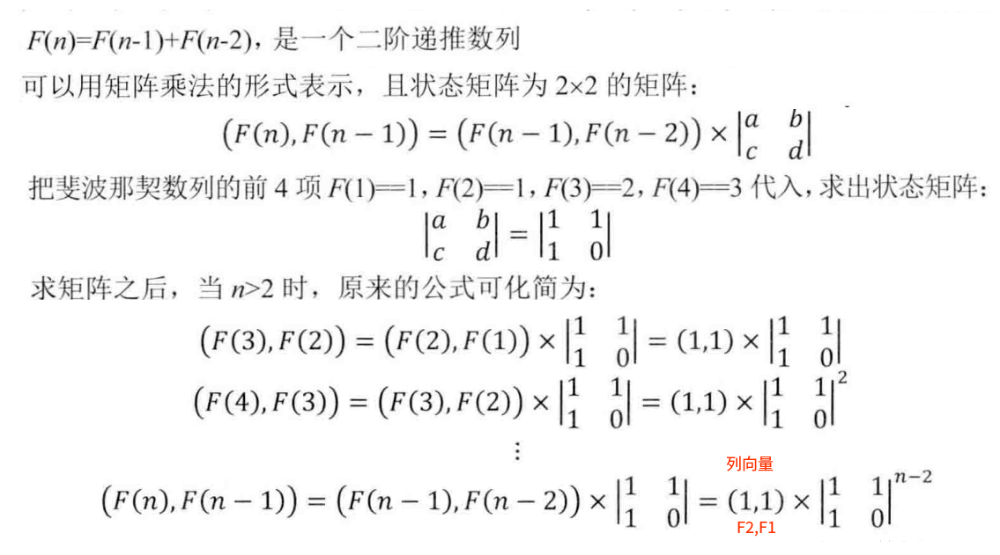

## 剑指Offer - 07 - 斐波那契数列

#### [题目链接](https://www.nowcoder.com/practice/c6c7742f5ba7442aada113136ddea0c3?tpId=13&tqId=11160&tPage=1&rp=1&ru=%2Fta%2Fcoding-interviews&qru=%2Fta%2Fcoding-interviews%2Fquestion-ranking)

> https://www.nowcoder.com/practice/c6c7742f5ba7442aada113136ddea0c3?tpId=13&tqId=11160&tPage=1&rp=1&ru=%2Fta%2Fcoding-interviews&qru=%2Fta%2Fcoding-interviews%2Fquestion-ranking

#### 题目

>  大家都知道斐波那契数列，现在要求输入一个整数n，请你输出斐波那契数列的第n项（从0开始，第0项为0）。n<=39

### 解析

经典的简单题。给出5种做法。

#### 1、递归

```java
public class Solution {
    public int Fibonacci(int n) {
        if (n < 1)
            return 0;
        if (n == 1 || n == 2)
            return 1;
        return Fibonacci(n - 1) + Fibonacci(n - 2);
    }
}
```

#### 2、记忆化

```java
public class Solution {
    public int[] dp;

    public int Fibonacci(int n) {
        dp = new int[n + 1];
        return rec(n);
    }

    public int rec(int n) {
        if (n < 1)
            return 0;
        if (n == 1 || n == 2)
            return 1;
        if (dp[n] != 0)
            return dp[n];
        dp[n] = rec(n - 1) + rec(n - 2);
        return dp[n];
    }
}
```

#### 3、递推(DP)

```java
public class Solution {
    public int Fibonacci(int n) {
        if (n < 1)
            return 0;
        if (n == 1 || n == 2)
            return 1;
        int[] dp = new int[n + 1];
        dp[1] = dp[2] = 1;
        for (int i = 2; i <= n; i++)
            dp[i] = dp[i - 1] + dp[i - 2];
        return dp[n];
    }
}
```

#### 4、滚动优化

上面的`dp[i]`只依赖于`dp[i-1]`和`dp[i-2]`，所以用`f1、f2`两个变量即可。

```java
public class Solution {
    public int Fibonacci(int n) {
        if (n < 1)
            return 0;
        if (n == 1 || n == 2)
            return 1;
        int f1 = 1;
        int f2 = 1;
        int res = 0;
        for (int i = 3; i <= n; i++) {
            res = f1 + f2;
            f1 = f2;
            f2 = res;
        }
        return res;
    }
}
```

#### 5、利用矩阵快速幂

>  矩阵操作可以看[这篇博客](https://blog.csdn.net/zxzxzx0119/article/details/82822588)和[这篇博客](https://blog.csdn.net/zxzxzx0119/article/details/82816131)。



```java
public class Solution {

    static class Matrix {
        public int row;
        public int col;
        public int[][] m;

        public Matrix(int row, int col) {
            this.row = row;
            this.col = col;
            m = new int[row][col];
        }
    }

    static Matrix mul(Matrix a, Matrix b) {
        Matrix c = new Matrix(a.row, b.col); //注意这里

        for (int i = 0; i < a.row; i++) {
            for (int j = 0; j < b.col; j++) {
                for (int k = 0; k < a.col; k++)
                    c.m[i][j] = c.m[i][j] + a.m[i][k] * b.m[k][j];
            }
        }
        return c;
    }

    static Matrix pow(Matrix a, int k) {
        Matrix res = new Matrix(a.row, a.col); // 方阵
        for (int i = 0; i < a.row; i++)
            res.m[i][i] = 1;
        while (k > 0) {
            if ((k & 1) != 0)
                res = mul(res, a);
            a = mul(a, a);
            k >>= 1;
        }
        return res;
    }

    public int Fibonacci(int n) {
        if (n < 1)
            return 0;
        if (n == 1 || n == 2)
            return 1;
        Matrix a = new Matrix(2, 2);
        a.m[0][0] = a.m[0][1] = a.m[1][0] = 1;
        a.m[1][1] = 0;
        Matrix res = pow(a, n - 2); //此时列向量是 F1 = 1, F2 = 1
        return res.m[0][0] + res.m[0][1];
    }
}
```

