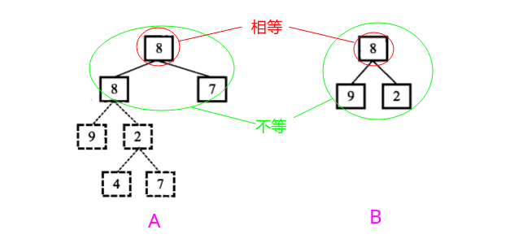
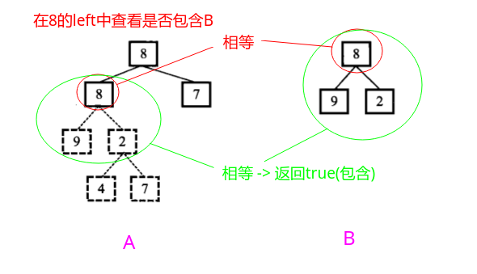

## 剑指Offer - 17 - 树的子结构

#### [题目链接](https://www.nowcoder.com/practice/6e196c44c7004d15b1610b9afca8bd88?tpId=13&tqId=11170&tPage=1&rp=1&ru=%2Fta%2Fcoding-interviews&qru=%2Fta%2Fcoding-interviews%2Fquestion-ranking)

> https://www.nowcoder.com/practice/6e196c44c7004d15b1610b9afca8bd88?tpId=13&tqId=11170&tPage=1&rp=1&ru=%2Fta%2Fcoding-interviews&qru=%2Fta%2Fcoding-interviews%2Fquestion-ranking

#### 题目

> 输入两棵二叉树`A，B`，判断`B`是不是`A`的子结构。（ps：我们约定空树不是任意一个树的子结构）

### 解析

思路:

* 先在`A`里面找到`B`的根的值(某个结点`A.val = B.val`)，然后看看子树是不是都相同(具体来说不是相同，而是`A`是否包含(`A>=B`))，这里判断是另一个函数`AcontainsB()`来判断；
* 如果上述条件不满足，递归在`A.left`或`A.right`中找这个值，然后再递归看子树是不是满足`AcontiansB`；
* 然后看递归函数函数`AcontainsB()`，递归条件`root2`只要达到空，就说明找到了，返回`true`，反之，`root1`达到空，返回`false`，注意这里不是判断两个树完全相等；

看一个例子:



首先我们在树 A 中找到值为8 (树 B 的根结点的值) 的结点。从树 A 的根结点开始遍历，我们发现它的根结点的值就是 8。接着我们就去判断树 A 的根结点下面的子树是不是含有和树 B 一样的结构(如图)。在树 A 中，根结点的左子结点的值是8，而树 B 的根结点的左子结点是 9，对应的两个结点不同。

然后需要继续查找。



因此我们仍然需要遍历树 A，接着查找值为 8 的结点。我们在树的第二层中找到了一个值为 8 的结点，然后进行第二步判断，即判断这个结点下面的子树是否含有和树 B 一样结构的子树 (如图)。于是我们遍历这个结点下面的子树，先后得到两个子结点 9 和 2，这和树 B 的结构完全相同。此时我们在树 A 中找到了一个和树 B 的结构一样的子树，因此树B 是树 A 的子结构。

通过代码:

```java
public class Solution {

    // 判断root2是不是root1的子结构
    public boolean HasSubtree(TreeNode root1, TreeNode root2) {
        if (root1 == null || root2 == null)
            return false;
        boolean res = false;
        if (root1.val == root2.val)
            res = aContainsB(root1, root2);
        if (!res)
            res = HasSubtree(root1.left, root2);//左边有可能包含root2
        if (!res)
            res = HasSubtree(root1.right, root2);//右边也有可能包含root2
        return res;
    }

    //注意不是判断两棵树是不是完全相等，而是判断A是否包含B
    private boolean aContainsB(TreeNode A, TreeNode B) {
        if (B == null)// B遍历完了, 说明可以
            return true;
        if (A == null)
            return false;
        // A != null && B != null 利用短路特性
        return A.val == B.val
                && aContainsB(A.left, B.left)
                && aContainsB(A.right, B.right);
    }
}
```

另外，关于**判断两棵树是否完全相等**的代码也附上:

```java
public class Solution {
    public boolean sameTree(TreeNode T1, TreeNode T2) {
        if (T1 == null && T2 == null)
            return true;
        else {
            return T1 != null && T2 != null
                    && T1.val == T2.val
                    && sameTree(T1.left, T2.left)
                    && sameTree(T1.right, T2.right);
        }
    }
} 
```

