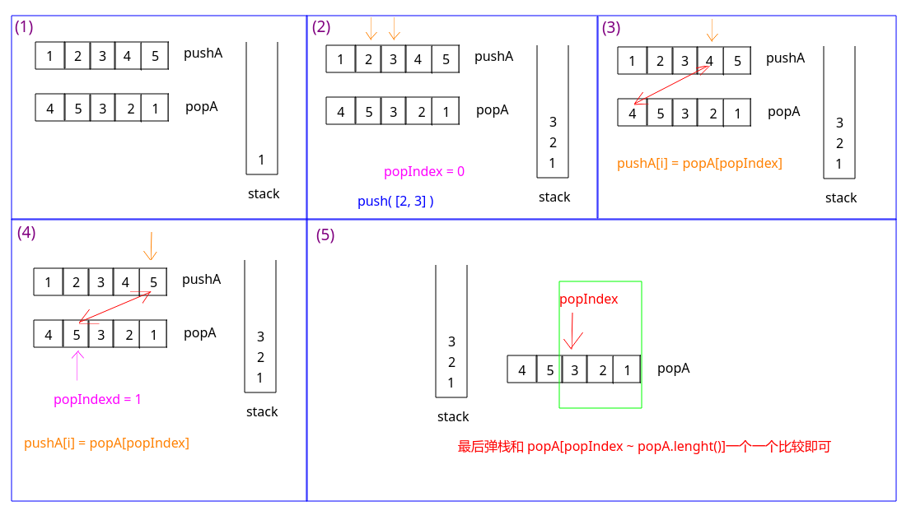
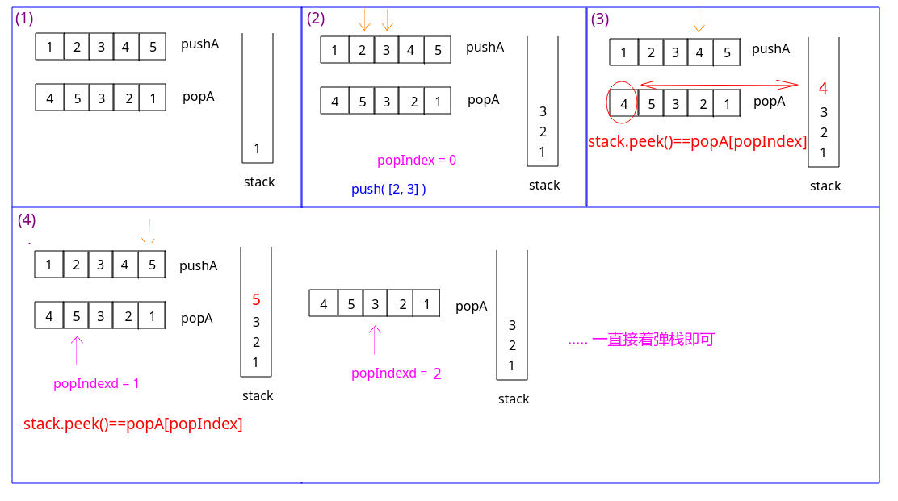

## 剑指Offer - 21 - 栈的压入、弹出序列

#### [题目链接](https://www.nowcoder.com/practice/d77d11405cc7470d82554cb392585106?tpId=13&tqId=11174&tPage=2&rp=1&ru=%2Fta%2Fcoding-interviews&qru=%2Fta%2Fcoding-interviews%2Fquestion-ranking)

> https://www.nowcoder.com/practice/d77d11405cc7470d82554cb392585106?tpId=13&tqId=11174&tPage=2&rp=1&ru=%2Fta%2Fcoding-interviews&qru=%2Fta%2Fcoding-interviews%2Fquestion-ranking

#### 题目

> 输入两个整数序列，第一个序列表示栈的压入顺序，请判断第二个序列是否可能为该栈的弹出顺序。
>
> 假设压入栈的所有数字均不相等。例如序列`1,2,3,4,5`是某栈的压入顺序，序列`4,5,3,2,1`是该压栈序列对应的一个弹出序列，但`4,3,5,1,2`就不可能是该压栈序列的弹出序列。（注意：这两个序列的长度是相等的）

### 解析

还是两种思路，都要借助一个额外的栈。

#### 1、思路一

先看过程:

* 遍历`pushA`，使用一个索引`popIndex`下标记录`popA`走到的位置，如果`pushA[i] = popA[popIndex]`，就`popIndex++`(不处理)；
* 否则(不相等)，就入栈`pushA[i]`；
* 最后全部弹栈，每弹一个，就看`stack.pop() == popA[popIndex]`，如果不等，就返回`false`，否则返回`true`；

看下面这个例子就一目了然了。



代码:

```java
import java.util.Stack;

public class Solution {
    public boolean IsPopOrder(int[] pushA, int[] popA) {
        Stack<Integer> stack = new Stack<>();
        int popIndex = 0;
        for (int i = 0; i < pushA.length; i++) {
            if (pushA[i] == popA[popIndex])
                popIndex++;
            else
                stack.push(pushA[i]);
        }
        while (!stack.isEmpty()) {
            if (stack.pop() != popA[popIndex++])
                return false;
        }
        return true;
    }
}
```

#### 2、思路二

其实也差不多。

* 还是使用一个栈，首先不管，遍历`pushA[i]` 的时候先将`pushA[i]`入栈；
* 然后判断栈`stack`中元素的栈顶(`stack.peek()`)和`pop[popIndex]`是否相等，如果**一直相等就一直弹栈(`while`)**，且`popIndex++`；
* 最后看栈是否为空即可；

也看一个例子。



* 首先`1`入`stack`，此时栈顶`1!=4`；

* 继续入栈`2`，此时栈顶`2!=4`，继续入栈`3`，此时栈顶`3!=4`；

* 继续入栈`4`此时栈顶`4==4`，出栈`4`，**弹出序列向后一位**，`popA[popIndex]`此时为`5`；

* 继续入栈`5`，此时栈项`5=5`，出栈`5`，弹出序列向后一位，此时为`3`， 辅助栈里面是`1,2,3`，然后后面的是`3,2,1`正好满足；


代码
```java
import java.util.Stack;

public class Solution {
    public boolean IsPopOrder(int[] pushA, int[] popA) {
        Stack<Integer> stack = new Stack<>();
        int popIndex = 0;
        for (int i = 0; i < pushA.length; i++) {
            stack.push(pushA[i]);  //先入栈
            while (!stack.isEmpty() && stack.peek() == popA[popIndex]) {
                stack.pop();
                popIndex++;
            }
        }
        return stack.isEmpty();
    }
}
```

