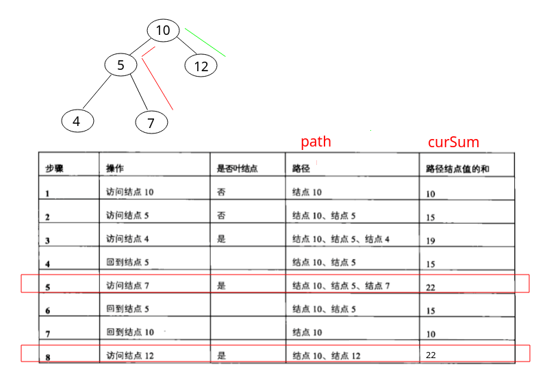

## 剑指Offer - 24 - 二叉树中和为某一值的路径

#### [题目链接](https://www.nowcoder.com/practice/b736e784e3e34731af99065031301bca?tpId=13&tqId=11177&tPage=2&rp=1&ru=%2Fta%2Fcoding-interviews&qru=%2Fta%2Fcoding-interviews%2Fquestion-ranking)

> https://www.nowcoder.com/practice/b736e784e3e34731af99065031301bca?tpId=13&tqId=11177&tPage=2&rp=1&ru=%2Fta%2Fcoding-interviews&qru=%2Fta%2Fcoding-interviews%2Fquestion-ranking

#### 题目

> 输入一颗二叉树的跟节点和一个整数，打印出二叉树中结点值的和为输入整数的所有路径。路径定义为从树的根结点开始往下一直到叶结点所经过的结点形成一条路径。(注意: 在返回值的`list`中，数组长度大的数组靠前)

### 解析

树大部分是递归的套路。递归函数思路如下

* 遍历到当前结点，每次先把当前结点加入`path`中，并累加当前`curSum += node.val`，然后判断是否是叶子而且`curSum == target`，如果没有达到目标，就递归左右子树； 
* 如果到达了叶子且`curSum == target`，就将中间结果`path`存入到总结果`res`中，递归函数中`path`记得要回溯；

看个例子:



代码如下，思路很清晰

```java
import java.util.ArrayList;

public class Solution {

    private ArrayList<ArrayList<Integer>> res;

    public ArrayList<ArrayList<Integer>> FindPath(TreeNode root, int target) {
        res = new ArrayList<ArrayList<Integer>>();
        if (root == null)
            return res;
        ArrayList<Integer> path = new ArrayList<>();
        rec(root, 0, target, path);
        return res;
    }

    private void rec(TreeNode node, int curSum, int target, ArrayList<Integer> path) {
        if (node == null)
            return;
        curSum += node.val;
        path.add(node.val);
        if (curSum == target && node.left == null && node.right == null)  //叶子结点且和 = target
            res.add(new ArrayList<>(path)); //res.add(path);  //这个是不对的
        rec(node.left, curSum, target, path);
        rec(node.right, curSum, target, path);
        // curSum -= node.val; 
        path.remove(path.size() - 1);
    }
}
```

