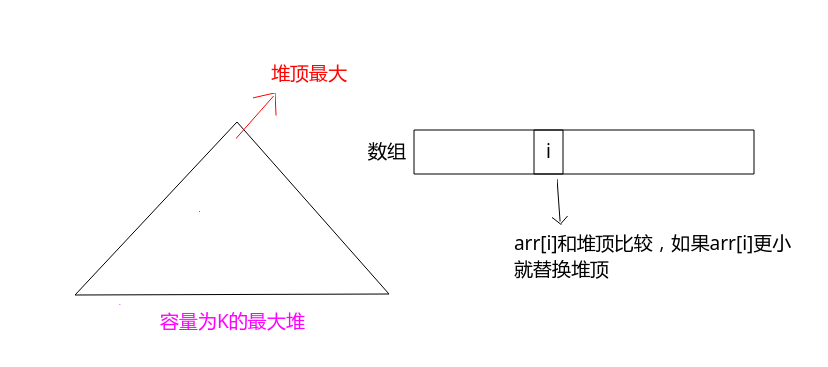

## 剑指Offer - 29 - 最小的K个数

#### [题目链接](https://www.nowcoder.com/practice/6a296eb82cf844ca8539b57c23e6e9bf?tpId=13&tqId=11182&tPage=2&rp=1&ru=%2Fta%2Fcoding-interviews&qru=%2Fta%2Fcoding-interviews%2Fquestion-ranking)

> https://www.nowcoder.com/practice/6a296eb82cf844ca8539b57c23e6e9bf?tpId=13&tqId=11182&tPage=2&rp=1&ru=%2Fta%2Fcoding-interviews&qru=%2Fta%2Fcoding-interviews%2Fquestion-ranking

#### 题目

> 输入n个整数，找出其中最小的K个数。例如输入`4,5,1,6,2,7,3,8`这8个数字，则最小的4个数字是`1,2,3,4`。

### 解析

大体有2种思路，5种写法。使用类似快排的`partition`以及堆。

#### 1、思路一使用类似快排partition

* 使用快速排序类似partition的过程，概率复杂度可以做到O(n)。(BFPRT算法可以稳定做到O(N))；
* 和快排不同的是，这个递归的时候只需要去某一边，但是快排两边都要去；
* 这种方法修改了原数组； 

具体思路

**根据`partition`不停的划分，直到我们的`border`(分界点) = `K-1`，这时，`<=K-1`位置的数就是最小的`K`个数，每次只需要往一边：**

* 如果我们选的划分数很好(在中间): 则`T(N) =  T(N/2) + O(N)` (注意不是2*T(N/2)，因为只需要往某一边走)，根据Master公式可以得到时间复杂度为: O(N)；
* 如果我们选的划分数很差(极端) : 则`T(N) = T(N-1) + O(N) `，根据`Master`公式可以得到，时间复杂度为 O(N<sup>2</sup>)；
* 但是概率平均复杂度为O(N)，或者可以使用BFPRT优化到O(N)；

>  

划分的过程可以写成递归和非递归的:

非递归:

```java
import java.util.ArrayList;

public class Solution {

    public ArrayList<Integer> GetLeastNumbers_Solution(int[] input, int k) {
        ArrayList<Integer> res = new ArrayList<>();
        if (input == null || k <= 0 || k > input.length)
            return res;
        int L = 0, R = input.length - 1;
        int border = partition(input, L, R);
        while (border != k - 1) {//注意第K小的就是划分到k-1(下标)个
            if (k - 1 < border) {
                R = border - 1;
                border = partition(input, L, R);
            } else {
                L = border + 1;
                border = partition(input, L, R);
            }
        }
        for (int i = 0; i < k; i++)
            res.add(input[i]);
        return res;
    }

    private int partition(int[] arr, int L, int R) {
        int less = L - 1;
        int more = R;
        swap(arr, L + (int) (Math.random() * (R - L + 1)), R);//随机选取一个数 用来和arr[R]划分
        int key = arr[R];//选取arr[R]作为划分数
        int cur = L;
        while (cur < more) {
            if (arr[cur] < key) {
                swap(arr, ++less, cur++); //把这个比num小的数放到小于区域的下一个，并且把小于区域扩大一个单位
            } else if (arr[cur] > key) {
                //把这个比num大的数放到大于去余的下一个，并且把大于区域扩大一个单位
                //同时，因为从大于区域拿过来的数是未知的，所以不能cur++ 还要再次判断一下arr[cur]
                swap(arr, --more, cur);
            } else {//否则的话就直接移动
                cur++;
            }
        }
        swap(arr, more, R);//把最后那个数(arr[R](划分数))放到中间
        return more;       //返回的是<=区域的右边界
    }

    private void swap(int[] arr, int i, int j) {
        int t = arr[i];
        arr[i] = arr[j];
        arr[j] = t;
    }
}
```

 递归:

```java
import java.util.ArrayList;

public class Solution {
    
    public ArrayList<Integer> GetLeastNumbers_Solution(int[] input, int k) {
        ArrayList<Integer> res = new ArrayList<>();
        if (input == null || k <= 0 || k > input.length)
            return res;
        rec(input, 0, input.length - 1, k);
        for (int i = 0; i < k; i++)
            res.add(input[i]);
        return res;
    }

    private void rec(int[] arr, int L, int R, int k) {
        int border = partition(arr, L, R);
        if (k - 1 == border)//划分结束 可以返回退出了
            return;
        if (k - 1 < border) {
            rec(arr, L, border - 1, k);
        } else {
            rec(arr, border + 1, R, k);
        }
    }

    private int partition(int[] arr, int L, int R) {
        int less = L - 1;
        int more = R;
        swap(arr, L + (int) (Math.random() * (R - L + 1)), R);//随机选取一个数 用来和arr[R]划分
        int key = arr[R];//选取arr[R]作为划分数
        int cur = L;
        while (cur < more) {
            if (arr[cur] < key) {
                swap(arr, ++less, cur++); //把这个比num小的数放到小于区域的下一个，并且把小于区域扩大一个单位
            } else if (arr[cur] > key) {
                //把这个比num大的数放到大于去余的下一个，并且把大于区域扩大一个单位
                //同时，因为从大于区域拿过来的数是未知的，所以不能cur++ 还要再次判断一下arr[cur]
                swap(arr, --more, cur);
            } else {//否则的话就直接移动
                cur++;
            }
        }
        swap(arr, more, R);//把最后那个数(arr[R](划分数))放到中间
        return more;     //返回的是<=区域的右边界
    }

    private void swap(int[] arr, int i, int j) {
        int t = arr[i];
        arr[i] = arr[j];
        arr[j] = t;
    }
}
```

#### 2、思路二使用堆

* 使用最大堆维护K个数(堆顶最大)，一直保持堆中有K个最小的数；
* 堆顶元素就是`K`个数中的最大数，然后每次和外面的比较，如果有更小的，就替换堆顶即可；
* 时间复杂度N*logK，也可以使用最小堆来做；



代码:

```java
import java.util.*;

public class Solution {

    public ArrayList<Integer> GetLeastNumbers_Solution(int[] input, int k) {
        ArrayList<Integer> res = new ArrayList<>();
        if (input == null || k <= 0 || k > input.length)
            return res;
        // 维护了一个最大堆(堆顶是最大的)
        PriorityQueue<Integer> maxHeap = new PriorityQueue<>(
                (o1, o2) -> {
                    return o1 < o2 ? 1 : (o1 == o2 ? 0 : -1);
                    //return -o1.compareTo(o2);
                }
        );
        for (int i = 0; i < input.length; i++) {
            if (maxHeap.size() < k) {//不足k个数，直接加入堆
                maxHeap.add(input[i]);
            } else if (input[i] < maxHeap.peek()) {
                maxHeap.poll();
                maxHeap.add(input[i]);
            }
        }
        for (Integer item : maxHeap)
            res.add(item);
        return res;
    }
}
```

也可以手写一个堆:

```java
import java.util.ArrayList;

public class Solution {

    public ArrayList<Integer> GetLeastNumbers_Solution(int[] input, int k) {
        ArrayList<Integer> res = new ArrayList<>();
        if (input == null || k <= 0 || k > input.length)
            return res;
        int[] kHeap = new int[k];
        for (int i = 0; i < k; i++) // 先用k个数建成一个最大堆
            siftUp(kHeap, input[i], i);
        for (int i = k; i < input.length; i++) {
            if (input[i] < kHeap[0]) {
                kHeap[0] = input[i];
                siftDown(kHeap, 0, k);
            }
        }
        for (int i = 0; i < k; i++)
            res.add(kHeap[i]);
        return res;
    }

    //非递归，上浮  //这是最大堆 
    private void siftUp(int[] arr, int num, int i) {
        arr[i] = num;
        while (arr[i] > arr[(i - 1) / 2]) {
            swap(arr, i, (i - 1) / 2);
            i = (i - 1) / 2;
        }
    }

    //非递归调整 下沉 //这是最大堆
    private void siftDown(int[] arr, int i, int heapSize) {
        int L = 2 * i + 1;
        while (L < heapSize) {
            int maxIdx = L + 1 < heapSize && arr[L + 1] > arr[L] ? L + 1 : L;//选出左右孩子中最大的
            maxIdx = arr[i] > arr[maxIdx] ? i : maxIdx;
            if (maxIdx == i)
                break;
            swap(arr, maxIdx, i);
            i = maxIdx;
            L = 2 * i + 1;
        }
    }

    private void swap(int[] arr, int i, int j) {
        int t = arr[i];
        arr[i] = arr[j];
        arr[j] = t;
    }
}
```

优化插入过程:

* 上面的方法是自己重新建了一个堆(开了O(k)的额外的空间)，其实也可以直接在input数组中建堆(修改了原数组)；

* 建堆的时候，直接从第一个**非叶子结点**开始建，也就是`heapfiy`的加速过程，这样就不需要`siftUp`的过程，一开始就是从第一个非叶子`( (k-1)-1) / 2`结点直接`siftDown`；
* 且这里下沉过程写成递归的；

```java
import java.util.ArrayList;

public class Solution {

    public ArrayList<Integer> GetLeastNumbers_Solution(int[] input, int k) {
        ArrayList<Integer> res = new ArrayList<>();
        if (input == null || k <= 0 || k > input.length)
            return res;
        //一个k个数的堆，从第一个非叶子结点开始调整 (k-1-1)/2 本来是(k-1)/2,但是下标是k-1 
        for (int i = (k - 1 - 1) / 2; i >= 0; i--)
            siftDown(input, i, k);
        for (int i = k; i < input.length; i++) {
            if (input[i] < input[0]) {
                swap(input, i, 0);
                siftDown(input, 0, k);
            }
        }
        for (int i = 0; i < k; i++)
            res.add(input[i]);
        return res;
    }

    //递归调整 下沉 //这是最大堆
    private void siftDown(int[] arr, int i, int heapSize) {
        int L = 2 * i + 1;
        int R = 2 * i + 2;
        int maxIdx = i;
        if (L < heapSize && arr[L] > arr[maxIdx]) maxIdx = L;
        if (R < heapSize && arr[R] > arr[maxIdx]) maxIdx = R;
        if (maxIdx != i) {
            swap(arr, i, maxIdx);
            siftDown(arr, maxIdx, heapSize);//继续调整孩子
        }
    }

    private void swap(int[] arr, int i, int j) {
        int t = arr[i];
        arr[i] = arr[j];
        arr[j] = t;
    }
}
```

