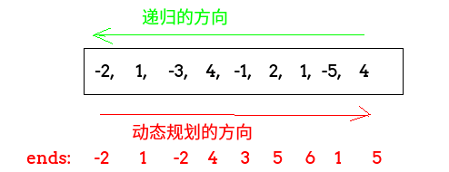

## 剑指Offer - 30 - 连续子数组的最大和

#### [题目链接](https://www.nowcoder.com/practice/459bd355da1549fa8a49e350bf3df484?tpId=13&tqId=11183&tPage=2&rp=1&ru=%2Fta%2Fcoding-interviews&qru=%2Fta%2Fcoding-interviews%2Fquestion-ranking)

> https://www.nowcoder.com/practice/459bd355da1549fa8a49e350bf3df484?tpId=13&tqId=11183&tPage=2&rp=1&ru=%2Fta%2Fcoding-interviews&qru=%2Fta%2Fcoding-interviews%2Fquestion-ranking

#### 题目

> HZ偶尔会拿些专业问题来忽悠那些非计算机专业的同学。今天测试组开完会后,他又发话了:在古老的一维模式识别中,常常需要计算连续子向量的最大和,当向量全为正数的时候,问题很好解决。但是,如果向量中包含负数,是否应该包含某个负数,并期望旁边的正数会弥补它呢？例如:`{6,-3,-2,7,-15,1,2,2}`,连续子向量的最大和为8(从第0个开始,到第3个为止)。给一个数组，返回它的最大连续子序列的和，你会不会被他忽悠住？(子向量的长度至少是1)

### 解析

也是经典的简单dp题。和[**LeetCode53**](https://github.com/ZXZxin/ZXNotes/blob/master/%E5%88%B7%E9%A2%98/LeetCode/DP/LeetCode%20-%2053.%20Maximum%20Subarray(%E6%9C%80%E5%A4%A7%E5%AD%90%E5%BA%8F%E5%92%8C)(%E4%B8%80%E7%BB%B4dp).md)一样。

#### 1、思路一递归

* 我们可以从数组的最后开始往前看，对于当前数`nums[i]`，以这个`nums[i]`结尾的最大值一定是你前面的所有数求出一个最大的子序和(但是由于是子数组，所以必须是判断前一个数)`+`我自己(`nums[i]`)，
* 所以这是一个递归的过程，边界条件就是`i = 0`时，最大子序和就是自己。

```java
public class Solution {

    private int res;

    public int FindGreatestSumOfSubArray(int[] array) {
        if (array == null || array.length == 0)
            return 0;
        res = array[0];
        rec(array, array.length - 1);
        return res;
    }

    private int rec(int[] arr, int i) {
        if (i == 0)
            return arr[0];
        else {
            int pre = rec(arr, i - 1); //你先给我求出前面的最大子序和
            int cur = pre > 0 ? pre + arr[i] : arr[i];
            res = Math.max(res, cur);
            return cur;
        }
    }
}
```

#### 2、思路二dp

动态规划就是从小问题到大问题，递归相反的方向，我们可以正向的保存一个以每一个数结尾的最大子序和的数组，然后递推到最后一个，其中使用个`max`保存最大值。



代码:

```java
public class Solution {
    //最大连续子序列的和
    public int FindGreatestSumOfSubArray(int[] array) {
        if (array == null || array.length == 0)
            return 0;
        int[] ends = new int[array.length];
        ends[0] = array[0];
        int res = array[0];
        for (int i = 1; i < array.length; i++) {
            ends[i] = ends[i - 1] > 0 ? ends[i - 1] + array[i] : array[i];
            res = Math.max(res, ends[i]);
        }
        return res;
    }
}
```

滚动数组，只需要前一个位置。

```java
public class Solution {
    public int FindGreatestSumOfSubArray(int[] array) {
        if (array == null || array.length == 0)
            return 0;
        int res = array[0];
        int preMax = array[0];
        for (int i = 1; i < array.length; i++) {
            preMax = preMax > 0 ? array[i] + preMax : array[i];
            res = Math.max(res, preMax);
        }
        return res;
    }
}
```

#### 3、思路三分治

分治的思路:

- 找到中间位置，所求子串不是在中间位置的左边，就是右边，还有中间位置两边；
- 中间位置左边右边的和最大的子串可以递归地求得；
- 再求中间位置往左挨个加的最大和以及中间位置往右挨个数的最大和，这两个和就是子串跨越中间位置时的最大和；
- 这三个最大和中的最大值就是所求最大值；
- 这里要注意`LMax = rec(arr,L,mid)`，这里的右边界不是`mid-1`，而是`mid`，因为边界是`L==R`的时候返回`arr[L]`，而且我们计算`crossMax`的时候包括了`arr[mid]`，就不需要再加上`arr[mid]`。

分治写法:

```java
public class Solution {
    
    public int FindGreatestSumOfSubArray(int[] array) {
        if (array == null || array.length == 0)
            return 0;
        return rec(array, 0, array.length - 1);
    }

    //返回这个之间的最大子序和
    private int rec(int[] arr, int L, int R) {
        if (L == R)
            return arr[L];
        int mid = L + (R - L) / 2;
        int LMax = rec(arr, L, mid);
        int RMax = rec(arr, mid + 1, R);
        int sum = 0, LSumMax = Integer.MIN_VALUE, RSumMax = Integer.MIN_VALUE;
        for (int i = mid; i >= L; i--) {
            sum += arr[i];
            if (sum > LSumMax) {
                LSumMax = sum;
            }
        }
        sum = 0;
        for (int i = mid + 1; i <= R; i++) {
            sum += arr[i];
            if (sum > RSumMax) {
                RSumMax = sum;
            }
        }
        int crossMax = LSumMax + RSumMax;
        //compare crossMax、LMax,RMax
        if (LMax >= RMax && LMax >= crossMax)
            return LMax;
        if (RMax >= LMax && RMax >= crossMax)
            return RMax;
        return crossMax;
    }
}
```

