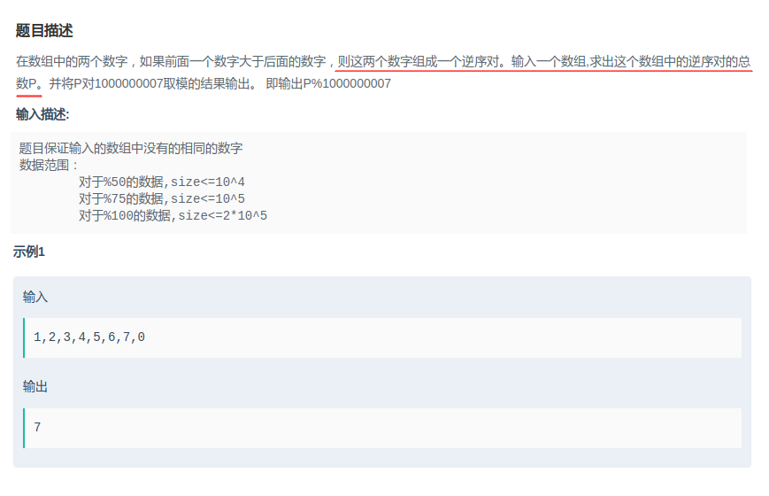
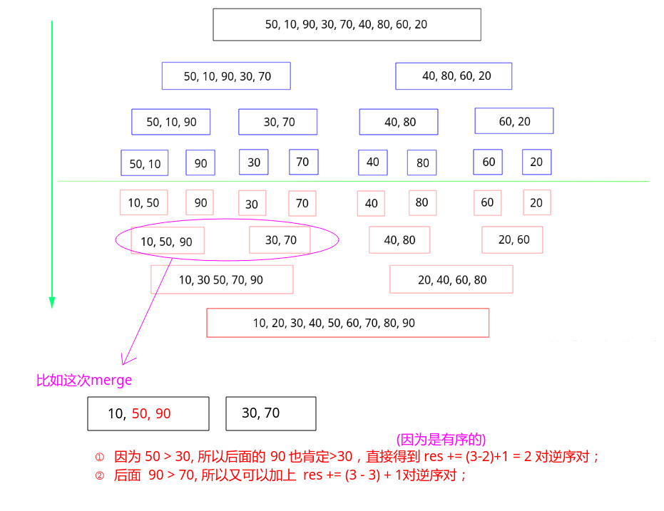

## 剑指Offer - 35 - 数组中的逆序对

#### [题目链接](https://www.nowcoder.com/practice/96bd6684e04a44eb80e6a68efc0ec6c5?tpId=13&tqId=11188&tPage=2&rp=1&ru=%2Fta%2Fcoding-interviews&qru=%2Fta%2Fcoding-interviews%2Fquestion-ranking)

> https://www.nowcoder.com/practice/96bd6684e04a44eb80e6a68efc0ec6c5?tpId=13&tqId=11188&tPage=2&rp=1&ru=%2Fta%2Fcoding-interviews&qru=%2Fta%2Fcoding-interviews%2Fquestion-ranking

#### 题目



### 解析

经典的利用归并排序解决的问题。

首先你得知道归并排序，关于排序可以看[**这篇博客**](https://github.com/ZXZxin/ZXNotes/blob/master/%E6%95%B0%E6%8D%AE%E7%BB%93%E6%9E%84%E7%AE%97%E6%B3%95/Algorithm/Sort/%E5%90%84%E7%A7%8D%E6%8E%92%E5%BA%8F%E7%AE%97%E6%B3%95%E6%80%BB%E7%BB%93(%E5%85%A8%E9%9D%A2).md#%E5%BD%92%E5%B9%B6%E6%8E%92%E5%BA%8F)。

利用归并排序的每次`merge()`过程：

* 因为`merge()`过程，处理的两个范围都是有序的，即`[L, mid]`有序， `[mid+1, R]`有序；
* 我们可以在这里做手脚，当两部分出现`arr[p1] > arr[p2]`的时候，结果直接可以累加`mid - p1 + 1`个，这样就可以利用归并来降低复杂度；

看结合归并的一个例子:



>  注意这个过程明显会修改输入的数组`array`。

代码:

```java
public class Solution {

    private final int mod = 1000000007;

    public int InversePairs(int[] array) {
        if (array == null || array.length <= 1)
            return 0;
        return mergeRec(array, 0, array.length - 1);
    }

    public int mergeRec(int[] arr, int L, int R) {
        if (L == R)
            return 0;
        int mid = L + (R - L) / 2;
        return ((mergeRec(arr, L, mid) + mergeRec(arr, mid + 1, R))%mod + merge(arr, L, mid, R))%mod; // 正确
//        return ((merge(arr, L, mid, R) + mergeRec(arr, L, mid))%mod + mergeRec(arr, mid + 1, R))%mod; // 错误
    }

    // [L, mid]有序， [mid+1, R]有序
    public int merge(int[] arr, int L, int mid, int R) {
        int[] help = new int[R - L + 1];
        int k = 0, sum = 0;
        int p1 = L, p2 = mid + 1;
        while (p1 <= mid && p2 <= R) {
            if (arr[p1] <= arr[p2]) {
                help[k++] = arr[p1++];
            } else {  //arr[p1] > arr[p2], 此时p2~R都小于arr[p1, mid]之间的元素，从这里求得逆序数
                sum += (mid - p1 + 1);
                sum %= mod;
                help[k++] = arr[p2++];
            }
        }
        while (p1 <= mid) help[k++] = arr[p1++];
        while (p2 <= R) help[k++] = arr[p2++];
        for (int i = 0; i < k; i++) arr[L + i] = help[i];
        return sum;
    }
}
```

