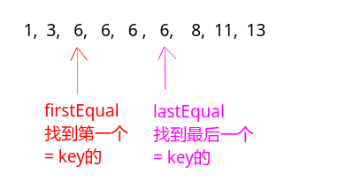

## 剑指Offer - 37 - 数字在排序数组中出现的次数

#### [题目链接](https://www.nowcoder.com/practice/70610bf967994b22bb1c26f9ae901fa2?tpId=13&tqId=11190&tPage=2&rp=1&ru=%2Fta%2Fcoding-interviews&qru=%2Fta%2Fcoding-interviews%2Fquestion-ranking)

> https://www.nowcoder.com/practice/70610bf967994b22bb1c26f9ae901fa2?tpId=13&tqId=11190&tPage=2&rp=1&ru=%2Fta%2Fcoding-interviews&qru=%2Fta%2Fcoding-interviews%2Fquestion-ranking

#### 题目

> 统计一个数字在排序数组中出现的次数。

### 解析

因为数组是排序的，所以O(N)的方法肯定不是好方法，所以想到二分。

其实思路很简单，我们只需要利用二分找到**第一个等于key的和最后一个等于key**的位置，就能得到key出现的次数。

而用二分得到这两个位置也很简单。具体可以看[**这篇博客**](https://github.com/ZXZxin/ZXNotes/blob/master/%E6%95%B0%E6%8D%AE%E7%BB%93%E6%9E%84%E7%AE%97%E6%B3%95/Algorithm/BinarySearch/%E4%BA%8C%E5%88%86%E6%9F%A5%E6%89%BE%E7%9A%84%E6%80%BB%E7%BB%93(6%E7%A7%8D%E5%8F%98%E5%BD%A2).md)介绍。



代码(非递归第一种写法)

```java
public class Solution {

    public int GetNumberOfK(int[] array, int k) {
        if (array.length == 0 || array == null)
            return 0;
        int L = firstEqual(array, k);
        int R = lastEqual(array, k);
        if (L != -1 && R != -1)
            return R - L + 1;
        return 0;
    }

    private int firstEqual(int[] arr, int key) {
        int L = 0, R = arr.length - 1; //在[L,R]查找第一个>=key的
        int mid;
        while (L <= R) {
            mid = L + (R - L) / 2;
            if (arr[mid] >= key)//因为要找第一个=的，所以也往左边
                R = mid - 1;
            else
                L = mid + 1;
        }
        if (L < arr.length && arr[L] == key)
            return L;
        return -1;
    }

    private int lastEqual(int[] arr, int key) {
        int L = 0, R = arr.length - 1;
        int mid;
        while (L <= R) {
            mid = L + (R - L) / 2;
            if (arr[mid] <= key)//因为要找最后一个，所以=往右边
                L = mid + 1;
            else
                R = mid - 1;
        }
        if (R >= 0 && arr[R] == key)
            return R;
        return -1;
    }
}
```

第二种非递归写法，主要就是`firstEqual`和`lastEqual`两个函数的另一种写法，主函数没变:

```java
public class Solution {

    public int GetNumberOfK(int[] array, int k) {
        if (array == null || array.length == 0)
            return 0;
        int L = firstEqual(array, k);
        int R = lastEqual(array, k);
        if (L != -1 && R != -1)
            return R - L + 1;
        return 0;
    }

    // 找到第一个=key的第二种写法
    public int firstEqual(int[] arr, int key) {
        int L = 0, R = arr.length - 1;
        while (L <= R) {
            int mid = L + (R - L) / 2;
            if (arr[mid] == key) {
                if ((mid > 0 && arr[mid - 1] != key) || (mid == 0))
                    return mid;  //注意这里一定要先判断下标，不然会越界访问
                else
                    R = mid - 1;
            } else if (arr[mid] < key)
                L = mid + 1;
            else
                R = mid - 1;
        }
        return -1;
    }

    // 找到最后一个=key的第二种写法
    public int lastEqual(int[] arr, int key) {
        int L = 0, R = arr.length - 1;
        while (L <= R) {
            int mid = L + (R - L) / 2;
            if (arr[mid] == key) {
                if ((mid < arr.length - 1 && arr[mid + 1] != key) || (mid == arr.length - 1))
                    return mid;
                else
                    L = mid + 1;
            } else if (arr[mid] < key)
                L = mid + 1;
            else
                R = mid - 1;
        }
        return -1;
    }
}
```

还有一种递归的写法，其实也差不多，就是将`while(L <= R)`改成递归。

```java
public class Solution {

    public int GetNumberOfK(int[] array, int k) {
        if (array.length == 0 || array == null)
            return 0;
        int L = firstEqual(array, k, 0, array.length - 1);
        int R = lastEqual(array, k, 0, array.length - 1);
        if (L != -1 && R != -1)
            return R - L + 1;
        return 0;
    }

    private int firstEqual(int[] arr, int key, int L, int R) {
        if (L > R) // 对应循环 L <= R时继续
            return -1;
        int mid = L + (R - L) / 2;
        if (arr[mid] == key) {
            if ((mid > 0 && arr[mid - 1] != key) || (mid == 0))
                return mid;
            else
                R = mid - 1;
        } else if (arr[mid] < key)
            L = mid + 1;
        else
            R = mid - 1;
        return firstEqual(arr, key, L, R);
    }

    private int lastEqual(int[] arr, int key, int L, int R) {
        if (L > R)
            return -1;
        int mid = L + (R - L) / 2;
        if (arr[mid] == key) {
            if ((mid < arr.length - 1 && arr[mid + 1] != key) || (mid == arr.length - 1))
                return mid;
            else
                L = mid + 1;
        } else if (arr[mid] > key)
            R = mid - 1;
        else
            L = mid + 1;
        return lastEqual(arr, key, L, R);
    }
}
```

