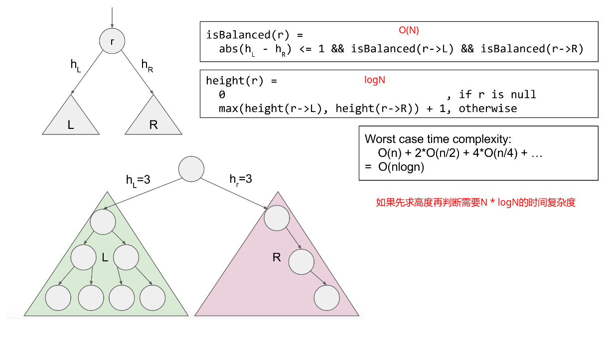
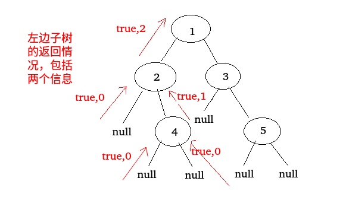

## 剑指Offer - 39 - 平衡二叉树

#### [题目链接](https://www.nowcoder.com/practice/8b3b95850edb4115918ecebdf1b4d222?tpId=13&tqId=11192&tPage=2&rp=1&ru=%2Fta%2Fcoding-interviews&qru=%2Fta%2Fcoding-interviews%2Fquestion-ranking)

> https://www.nowcoder.com/practice/8b3b95850edb4115918ecebdf1b4d222?tpId=13&tqId=11192&tPage=2&rp=1&ru=%2Fta%2Fcoding-interviews&qru=%2Fta%2Fcoding-interviews%2Fquestion-ranking

#### 题目

> 输入一棵二叉树，判断该二叉树是否是平衡二叉树。

### 解析

这题在[**LeetCode**](https://github.com/ZXZxin/ZXNotes/blob/master/%E5%88%B7%E9%A2%98/LeetCode/Tree/LeetCode%20-%20110.%20Balanced%20Binary%20Tree(%E5%88%A4%E6%96%AD%E4%B8%80%E6%A3%B5%E6%A0%91%E6%98%AF%E5%90%A6%E6%98%AF%E5%B9%B3%E8%A1%A1%E4%BA%8C%E5%8F%89%E6%A0%91).md)中也写过了。两种解法。

#### 1、解法一

思路

- 首先我们知道平衡二叉树**是一棵空树或它的左右两个子树的高度差的绝对值不超过1，并且左右两个子树都是一棵平衡二叉树**；
- 我们可以使用一个获取树的高度的函数`depth()`。然后递归比较左右子树是不是平衡二叉树且左右子树的高度不超过`1`即可。
- 这里获取高度需要`logN`复杂度，主函数`isBalance`需要`O(N)`，所以总的时间复杂度为`N*logN`；



代码:

```java
public class Solution {
    
    public boolean IsBalanced_Solution(TreeNode root) {
        if(root == null)
            return true;
        return IsBalanced_Solution(root.left) && IsBalanced_Solution(root.right) 
                && Math.abs(depth(root.left) - depth(root.right)) <= 1;
    }
    
    private int depth(TreeNode node) {
        if (node == null)
            return 0;
        return Math.max(depth(node.left), depth(node.right)) + 1;
    }
}
```

#### 2、解法二

上面的方法需要先求高度，然后再判断是不是平衡二叉树，能否一起做呢?

所以假如我们要判断一个以`x`开头的结点是否为一颗平衡二叉树，则要满足以下几点 :

- 它的左子树要给它一个左子树本身是不是平衡二叉树的信息；
- 它的右子树要给它一个右子树本身是不是平衡二叉树的信息；
- 它的左子树要给它左子树高度的信息；
- 它的右子树要给它右子树高度的信息；

所以我们知道上面的几点之后，可以完全按照上面写出一个递归结构函数，因为子树返回的信息中既包含高度信息，又包含子树是不是也是一颗平衡二叉树的信息，所以这里把这个信息封装成一个结构。

**这里和`O(n*logn)`方法不同的是，我们求的是一个结构体，递归函数同时返回了两个信息: 高度和子树是否平衡，如果不平衡，我们就不再判断直接false了)。**



代码:

```java
public class Solution {

    //返回两个值 高度和子树是否平衡
    private class ReturnData{
        public int h;
        public boolean isB;
        public ReturnData(int h,boolean isB){
            this.h = h;
            this.isB = isB;
        }
    }
    public boolean IsBalanced_Solution(TreeNode root) {
        if(root == null)
            return true;
        return balanced(root).isB;

    }
    private ReturnData balanced(TreeNode node){
        if(node == null)
            return new ReturnData(0,true);
        ReturnData L = balanced(node.left);
        if(!L.isB)
            return new ReturnData(0,false);
        ReturnData R = balanced(node.right);
        if(!R.isB)
            return new ReturnData(0,false);
        return new ReturnData( Math.max(L.h,R.h)+1, Math.abs(L.h - R.h) <= 1 );
    }
}
```

上面的代码可以优化，函数可以返回一个，另一个写在全局更新即可。

```java
public class Solution {

    public boolean res;

    public boolean IsBalanced_Solution(TreeNode root) {
        if (root == null)
            return true;
        res = true;
        height(root);
        return res;
    }

    private int height(TreeNode node) {
        if (node == null)
            return 0;
        int LH = height(node.left);
        if (!res)
            return 0;
        int RH = height(node.right);
        if (!res)
            return 0;
        if (Math.abs(LH - RH) > 1)
            res = false;
        return Math.max(LH, RH) + 1;
    }
}
```

还一种更加简写的方式:

```java
public class Solution {

    public boolean IsBalanced_Solution(TreeNode root) {
        if (root == null)
            return true;
        return height(root) > -1;
    }

    private int height(TreeNode node) {
        if (node == null)
            return 0;
        int LH = height(node.left);
        int RH = height(node.right);
        if (Math.abs(LH - RH) > 1 || LH == -1 || RH == -1)
            return -1;
        return Math.max(LH, RH) + 1;
    }
}
```

