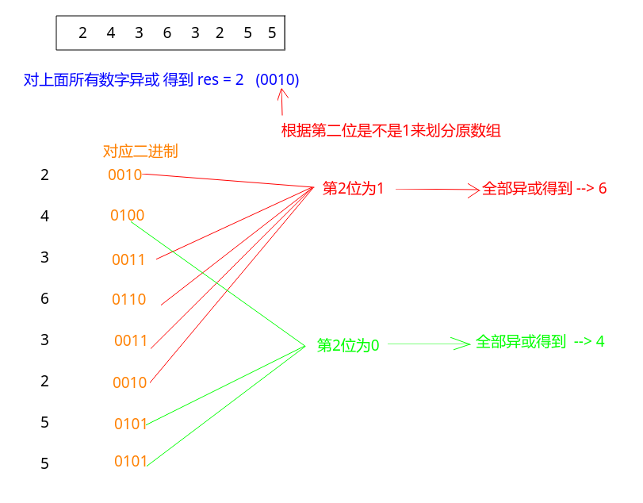

## 剑指Offer - 40 - 数组中只出现一次的数字

#### [题目链接](https://www.nowcoder.com/practice/e02fdb54d7524710a7d664d082bb7811?tpId=13&tqId=11193&tPage=2&rp=1&ru=%2Fta%2Fcoding-interviews&qru=%2Fta%2Fcoding-interviews%2Fquestion-ranking)

> https://www.nowcoder.com/practice/e02fdb54d7524710a7d664d082bb7811?tpId=13&tqId=11193&tPage=2&rp=1&ru=%2Fta%2Fcoding-interviews&qru=%2Fta%2Fcoding-interviews%2Fquestion-ranking

#### 题目

> 一个整型数组里除了**两个数字**之外，其他的数字都出现了偶数次。请写程序找出这两个只出现一次的数字。

### 解析

这题好方法是用位运算来做。

首先

* 任何一个数异或自身等于`0`，任何一个数异或`0`等于自身；
* 所以在一个数组中，如果只有一个数字出现了一次，其他出现了两次，那么我们直接全部异或一遍，最终结果就是答案；

但是这一题的要求是有两个数字出现了一次。我们的做法是**将原数组按照某种方式划分成两个子数组，使得每个子数组包含其中一个只出现一次的数字，而其他数字都成对出现两次，如何分别对两个子数组异或即可**。

**按照什么方式呢划分呢**?

我们还是从头到尾依次异或数组中的每一个数字，那么最终得到的结果就是两个只出现一次的数字的异或结果。

由于这两个数字肯定不一样，那么异或的结果肯定不为`0`，也就是说在这个结果数字的二进制表示中至少就有一位为 `1`。我们在结果数字中**找到第一个为 1 的位的位置**，记为第 `n` 位。现在我们以第 `n`位是不是 `1` 为标准把原数组中的数字分成两个子数组。

第一个子数组中每个数字的第`n` 位都是 `1`，而第二个子数组中每个数字的第 `n` 位都是 `0`。

> 由于我们分组的标准是数字中的某一位是 `1` 还是 `0`， 那么出现了两次的数字肯定被分配到同一个子数组。因为两个相同的数字的任意一位都是相同的，我们不可能把两个相同的数字分配到两个子数组中去，于是我们已经把原数组分成了两个子数组，每个子数组都包含一个只出现一次的数字，而其他数字都出现了两次。

举个例子，假设输入数组`{2, 4, 3, 6, 3, 2, 5, 5}`。



过程:

* 每一个数字做异或运算之后，得到的结果用二进制表示是 `2 `(二进制0010)；

* 根据数字的倒数第二位是不是 1 分为两个数组。第一个子数组`{2, 3, 6, 3, 2}`、第二个子数组`{4, 5, 5}`；

* 分别对这两个子数组求异或，第一个子数组中只出现一次的数字是`6`，而第二个子数组中只出现一次的数字是 `4`。

代码
```java
public class Solution {
    // num1[0], num2[0]是返回的两个只出现一次的数
    public void FindNumsAppearOnce(int[] array, int num1[], int num2[]) {
        if (array.length < 2)
            return;
        int res = 0;
        for (int i = 0; i < array.length; i++)
            res ^= array[i];
        int digit = 1;
        while ((digit & res) == 0) digit *= 2; // digit的最高位为1
        for (int i = 0; i < array.length; i++) {
            if ((array[i] & digit) == 0)  //第一组 (第一个子数组)
                num1[0] ^= array[i];
            else                          //第二组 (第二个子数组)
                num2[0] ^= array[i];
        }
    }
}
```

