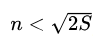

## 剑指Offer - 41 - 和为S的连续正数序列

#### [题目链接]()

> https://www.nowcoder.com/practice/c451a3fd84b64cb19485dad758a55ebe?tpId=13&tqId=11194&tPage=3&rp=1&ru=%2Fta%2Fcoding-interviews&qru=%2Fta%2Fcoding-interviews%2Fquestion-ranking

#### 题目


### 解析

两种做法，双指针和数学。

#### 1、解法一

双指针思路:

* 两个指针 `small `和 `big` 分别表示序列(窗口)的最小值和最大值。
* 首先把 `small` 初始化为 1，`big` 初始化为 2。
* 如果从` small `到 `big` 的序列的和大于 `s`，我们可以从序列中去掉较小的值，也就是增大 `small `的值。
* 如果从 `small` 到 `big` 的序列的和小于 `s`，我们可以增大`big`，让这个序列包含更多的数字。

**因为这个序列至少要有两个数字，我们一直增加 `small` 到 `(1+s)/2` 为止**。

看一个例子，`S = 9, mid = 5`。

| 步骤 | small | big  | 序列       | 序列和 | 与S相比 | 下一步操作        |
| ---- | ----- | ---- | ---------- | ------ | ------- | ----------------- |
| 1    | 1     | 2    | 1, 2       | 3      | 小于    | 增大big           |
| 2    | 1     | 3    | 1, 2, 3    | 6      | 小于    | 增大big           |
| 3    | 1     | 4    | 1, 2, 3, 4 | 10     | 大于    | 增大small         |
| 4    | 2     | 4    | 2, 3, 4    | 9      | 等于    | 打印序列，增大big |
| 5    | 2     | 5    | 2, 3, 4, 5 | 14     | 大于    | 增加small         |
| 6    | 3     | 5    | 3, 4, 5    | 12     | 大于    | 增加small         |
| 7    | 4     | 5    | 4, 5       | 9      | 等于    | 打印序列          |

> 过程:
>
> 先把 small 初始化为 1，big 初始化为2。此时介于 small 和 big 之间的序列是`{1， 2}`，序列的和为 3，小于9，记以我们下一步要让序列包含更多的数字。我们把 big 增加 1 变成 3，此时序列为`{1，2,， 3}`。由于序列的和是 6，仍然小于 9，我们接下来再增加big 变成4，介于 small 和 big 之间的序列也随之变成`{1, 2, 3, 4}`。由于序列的和 10 大于 9，我们要删去去序列中的一些数字，于是我们增加 small 变成2，此时得到的序列是`{2, 3, 4}`，序列的和正好是 9。我们找到了第一个和为 9 的连续序列，把它打印出来。接下来我们再增加 big，重复前面的过程， 可以找到第二个和为 9 的连续序列`{4, 5}`。

代码:

```java
import java.util.ArrayList;

public class Solution {

    private ArrayList<ArrayList<Integer>> res;

    public ArrayList<ArrayList<Integer>> FindContinuousSequence(int sum) {
        res = new ArrayList<>();
        int small = 1, big = 2;
        int mid = (sum + 1) / 2;
        int curSum = small + big;
        while (small < mid) {
            if (curSum == sum)
                packing(small, big);
            while (curSum > sum && small < mid) {//还要去找别的可能的连续序列
                curSum -= small;
                small++;
                if (curSum == sum) packing(small, big);
            }
            big++;
            curSum += big;
        }
        return res;
    }

    private void packing(int small, int big) {
        ArrayList<Integer> tmp = new ArrayList<>();
        for (int i = small; i <= big; i++)
            tmp.add(i);
        res.add(tmp);
    }
}
```

#### 2、解法二

数学的方法，讨论区看到的。

由于我们要找的是和为`S`的连续正数序列，**因此这个序列是个公差为1的等差数列，而这个序列的中间值代表了平均值的大小。假设序列长度为n，那么这个序列的中间值可以通过（S / n）得到**。(这点很重要)。

* 满足条件的n分两种情况：

  * n为奇数时，序列中间的数正好是序列的平均值，所以条件为：`n % 2  == 1 && sum % n == 0`；
  * n为偶数时，序列中间两个数的平均值是序列的平均值，我们第一个是`sum/n`，第二个是`sum/n+1`，则应该满足(`(sum/n + sum/n + 1 ) * n/2 == sum`)。(或者中间两数的平均值的小数部分为`0.5`，所以条件为：`(sum % n) * 2 == n`)。
* 我们需要确定`n`的遍历范围。根据等差数列的求和公式：`S = (1 + n) * n / 2`，得到，我们从这个数从大到小遍历即可；

一个例子，假设输入`sum = 100`，我们只需遍历`n = 13 ~ 2`的情况（因为要从小的序列开始，所以从大到小遍历），`n = 8`时，得到序列`[9, 10, 11, 12, 13, 14, 15, 16]`；`n  = 5`时，得到序列`[18, 19, 20, 21, 22]`。

代码:

```java
import java.util.ArrayList;

public class Solution {

    public ArrayList<ArrayList<Integer>> FindContinuousSequence(int sum) {
        ArrayList<ArrayList<Integer>> res = new ArrayList<>();
        for(int n = (int) Math.sqrt(2 * sum); n >= 2; n--){
//            if( (n%2 == 1 && sum%n == 0) || (n%2 == 0 && (sum%n)*2 == n)) { // 也可以
            if( (n%2 == 1 && sum%n == 0) || (n%2 == 0 && (sum/n + sum/n+1)*n/2 == sum)) {// 奇数的情况 | 偶数的情况
                ArrayList<Integer> tmp = new ArrayList<>();
                int start = sum/n-(n-1)/2;
                for(int k = start; k < start + n; k++) tmp.add(k);
                res.add(tmp);
            }
        }
        return res;
    }

    public static void main(String[] args){
        System.out.println(new Solution().FindContinuousSequence(100));
    }
}
```

